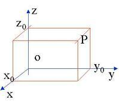
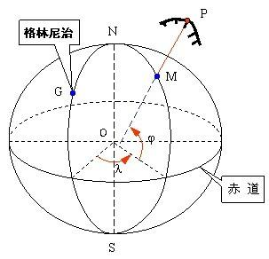
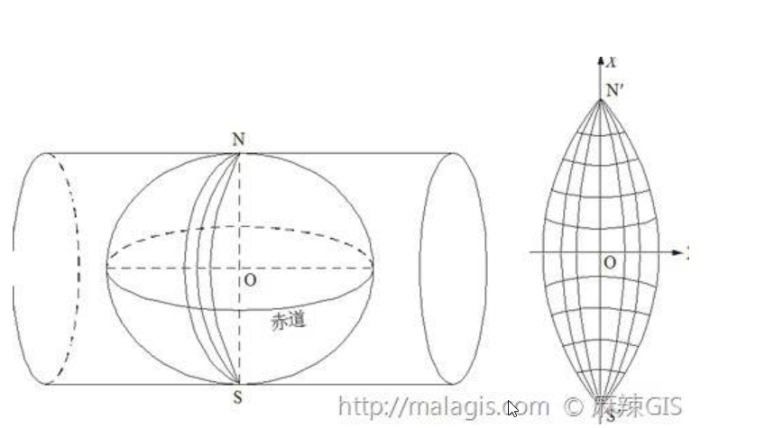
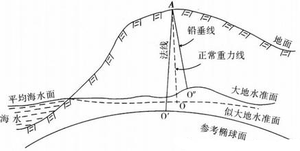

# 不同的坐标的概念

## 空间坐标与平面坐标

### 1. 空间坐标系（地理坐标系）

描述三维球面的空间位置关系，分为

- 地心坐标：如WGS84，国家2000坐标，原点在地球质心
- 参心坐标：如北京54，西安80以及各种地方坐标；原点在参考椭球的球心（一般与质心不重合）；

#### 表示方式

1. 空间直角坐标系(x, y, z)：基于球面；坐标原点位于参考椭球的中心，Z轴指向参考椭球的北极，X轴指向起始子午面与赤道的交点，Y轴位于赤道面上切按右手系于X轴呈90度夹角  

   单位是m，一般是为了同其他坐标进行转化时才出现；

2. 大地坐标系（B, L, H)：**BLH分别是纬度、经度、大地高**；基于球面；大地坐标系是采用大地纬度、经度和大地高程来描述空间位置的。纬度是空间的点与参考椭球面的法线与赤道面的夹角；经度是空间的点与参考椭球的自转轴所在的面与参考椭球的起始子午面的夹角；大地高程是空间的点沿着参考椭球的法线方向到参考椭球面的距离

   单位是度，

3. 两者之间的转换

大地坐标和空间直角坐标之间可以相互转化，其转化公示及参数是公开。

### 2. 平面坐标系（投影坐标系）

描述平面上的位置关系；

为了测绘及制图展示等需求，常常需要把三维的球面投影到二维的平面上，就需要用到地图投影，投影后的坐标采用平面直角坐标来表示。

#### 表示方式

平面直角坐标（x, y, h)，**x, y, h分别表示北向，东向和正常高**；单位是m，**注意：这里的平面直角坐标和空间直角坐标虽然表示方法类似，但是他们是不同的坐标。**

#### 投影

为了把球面转换到平面，就需要用到投影。

**常见投影包括：**

- 高斯克里格投影（国家54，西安87坐标系）
- UTM投影
- 墨卡托投影
- web墨卡托投影（google地图）。

## 常见数据的投影

- GPS数据：WGS84坐标系，无投影
- 国内地形图：一般是北京54或西安80坐标，以平面直角坐标（米）展现，高斯克里格投影。
- 互联网地图：WGS84坐标（google earth、google map）、加密WGS84坐标（对WGS84坐标进行加密，如GCJ-02坐标或百度坐标），web墨卡托投影。
- 市政管线数据：地方坐标，以平面直角坐标（米）展现，高斯克里格投影。

### 高斯-克里格投影

简称高斯投影，是我国最常用的一种投影。

#### 定义：

从几何概念上分析，它是一种横轴等角切圆柱投影。我们把地球看成是地球椭球体，假想用一个椭圆筒横套在其上，使筒与地球椭球的某一经线（称为中央经线）相切，椭圆筒的中心轴位于赤道上，按等角条件将地球表面投影到椭圆筒上，然后将椭圆筒展开成平面。

#### 特点：

- 中央经线和赤道投影成垂直相交的直线
- 投影后没有角度变形，那么经纬线投影后仍正交
- 中央经线没有长度变形

#### 投影分带

- 在1：2.5万到1：50万时，6度分带

- 在大于1：1万地形图中：3度分带

1. 6度分带法：从格林尼治零度经线起,自东半球向西半球,每经差60分为一个投影带,即东经0～6,6～12,12～18,….174～180,用阿拉伯数字1,2,3,4….60表示投影带号,全球共分为60个投影带。
2. 3度分带法：从东经1°30′ 算起，自东半球向西半球每3°为一带，将全球划分为120个投影带，1°30′−4°30′， 4°30′−7°30′….其中央经线的位置为3°,6°,9°,15°…180°,−177°…−3°

#### 超过6度

建议用兰伯特投影，或墨卡托投影。

## 坐标的转换

### 1. 同一椭球的转换

二维转换：如：北京54<——>地方坐标（该地方坐标是基于北京54建立的），常采用四参数法。

#### 特点：

转换是严密的，同一椭球不同坐标（如大地坐标到平面坐标）之间的转换参数是公开的；

#### 转换方式

常用四参数法

### 2. 不同椭球的转换

三维转换：如：WGS84<——>北京54, WGS84<——>西安54, 西安54<——>北京54。常采用七参数法、三参数法。

#### 特点

转换是不严密的，转换参数不是公开的。

#### 转换方式

常用七参数法（大区域）；三参数法（小区域），不同区域对应的参数不同，不能通用。

## 通用转换流程

以WGS84——>北京54——>地方坐标为例：

1. （B，L，H）84——（X，Y，Z）84，空间大地坐标到空间直角坐标的转换。

2. （X，Y，Z）84——（X，Y，Z）54，坐标基准的转换，即Datum转换。通常有三种转换方法：七参数、简化三参数、Molodensky。
3. （X，Y，Z）54——（B，L，H）54，空间直角坐标到空间大地坐标的转换。
4. （B，L）54——（x，y）54， 高斯投影正算。
5. （x，y）54——（x0，y0）54，地方坐标转换，常用四参数法。
1、3、4步骤需要的参数都是公开的。
2、4的参数是非公开的，需要找测绘部门去转换申请，或利用同名点求取转换的参数，步骤2，采用三参数（1个点）或七参数（3个点）；步骤4，采用四参数（2个点），如果同名点多可以采用最小二乘法拟合，求取最佳参数。

## 转换工具
- argGIS：自带了6个区域的北京54——WGS84坐标的转换七参数，参见：[使用ArcGIS实现WGS84经纬度坐标到北京54高斯投影坐标的转换——新浪博客](http://blog.sina.com.cn/s/blog_a9091a330101aeal.html)
- COORD GM(小黄脸)

## 转换误差
1. 对于不同椭球下的坐标系之间的转换，如WGS84——北京54，使用七参数转换，精度比较高；
   若是对于精度要求不高或者没有相应的参数，可以之间进行无参数转换（小黄脸可以实现）；误差可以达到几十米（不确定，来源于网络）。
2.  若对同一个点通过高斯-克吕格投影到不同基准面上（北京54和WGS84）；误差达到几十米；两者投影结果在南北方向差距约63米(见下表）

|             | 输入坐标（度） | 北京54 高斯投影（米） | WGS84 高斯投影（米） |
| ----------- | -------------- | --------------------- | -------------------- |
| 纬度值（X） | 32             | 3543664               | 3543601              |
| 经度值（Y） | 121            | 21310994              | 21310997             |

## 高程系统

正高、正常高于大地高

#### 正高：

定义：地面点沿该点的**重力线**（铅垂线）到 **大地水准面**的距离。 
使用：是**天文地理坐标(Ψ，λ，Hg)**的高程分量。

#### 正常高

定义：一地面点沿过此点的**正常重力线**到**似大地水准面**的距离

使用：**我国的高程系统**

似大地水准面：从地面点沿正常重力线量取正常高所得端点构成的封闭曲面。似大地水准面严格说**不是水准面，但接近于水准面，只是用于计算的辅助面**。**它与大地水准面不完全吻合，差值为正常高与正高之差。但在海洋面上时，似大地水准面与大地水准面重合。** 

#### 大地高

定义：一点沿**椭球法线**到**椭球面**的距离。

使用：GPS的高程

#### 三者的区别图示

#### 参考资料

1. [坐标、投影及坐标转换--知乎](https://zhuanlan.zhihu.com/p/34662114)
2. [空间直角坐标系、大地坐标系和平面坐标系--CSDN](https://blog.csdn.net/KKKDING/article/details/8278551)
3. [关于坐标系--CSDN](https://blog.csdn.net/xiting_tick/article/details/50749970)
4. [大地高、正高与正常高——CSDN博客](https://blog.csdn.net/u010202270/article/details/52346740)
5. [正高、正常高与大地高的区别——CSDN博客](https://blog.csdn.net/liuguobo/article/details/47093629)
6. [GPS高程与正常高的转换——百度文库](https://wenku.baidu.com/view/00ec80c26137ee06eff918ed.html)
7. [常用投影之高斯-克吕格投影——麻辣GIS](https://malagis.com/map-projection-gauss-kruger-projection-gauss-kruger.html)

