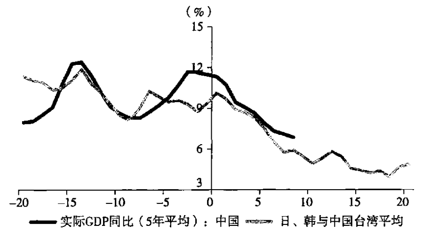
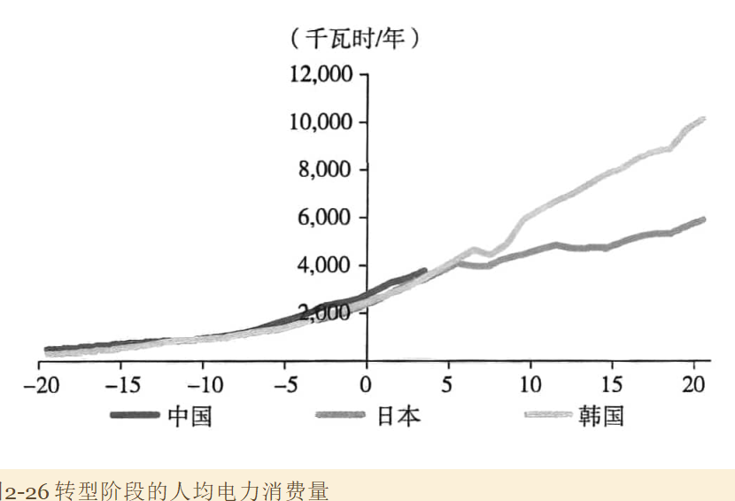
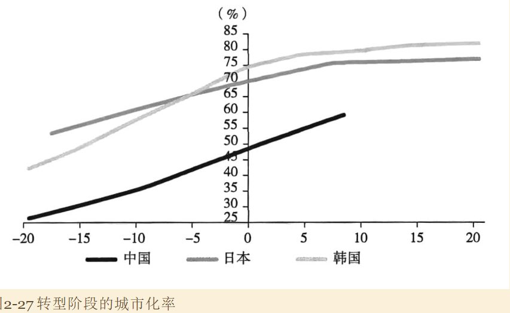
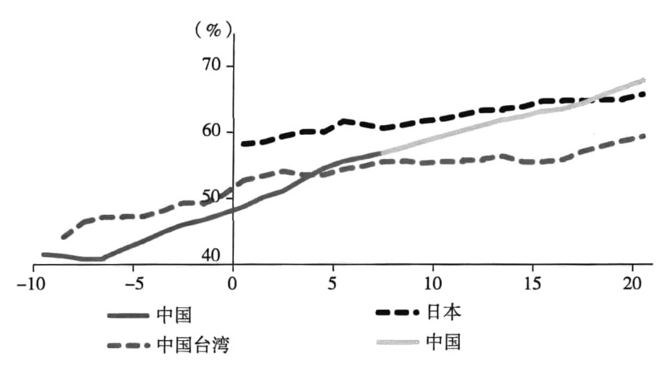
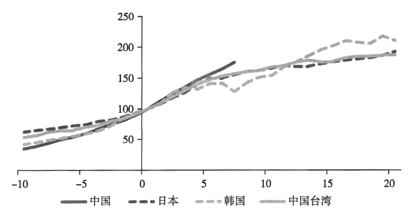
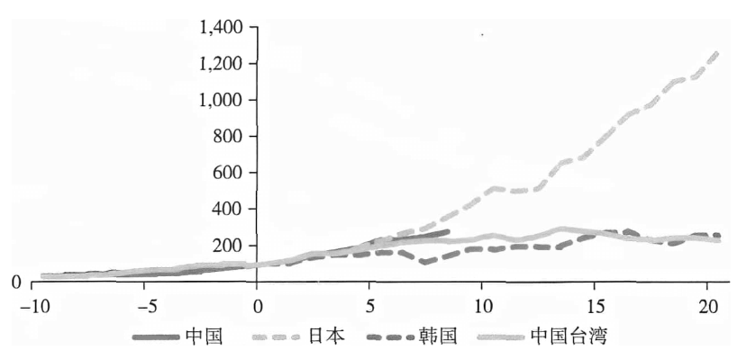
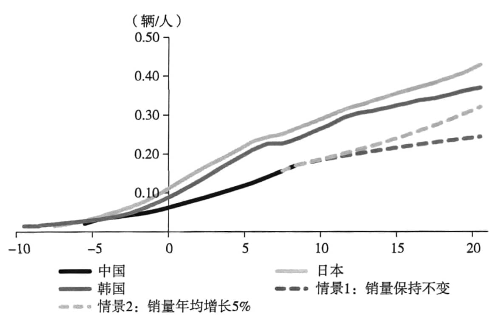
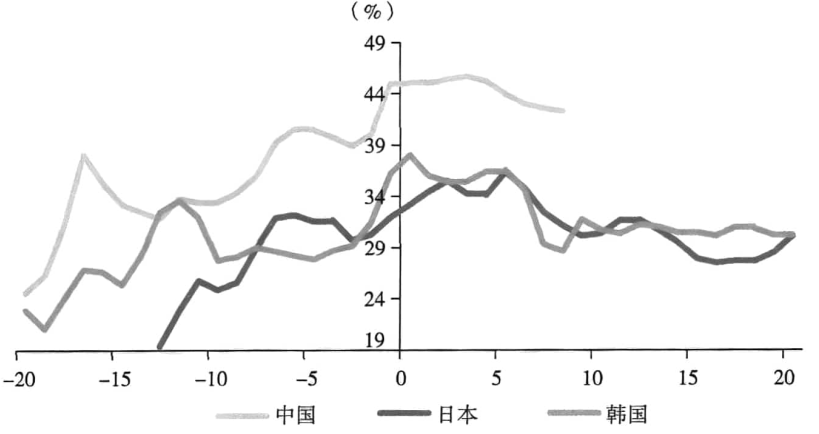
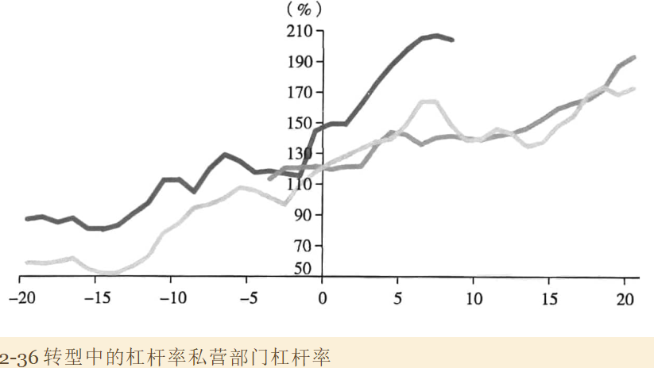
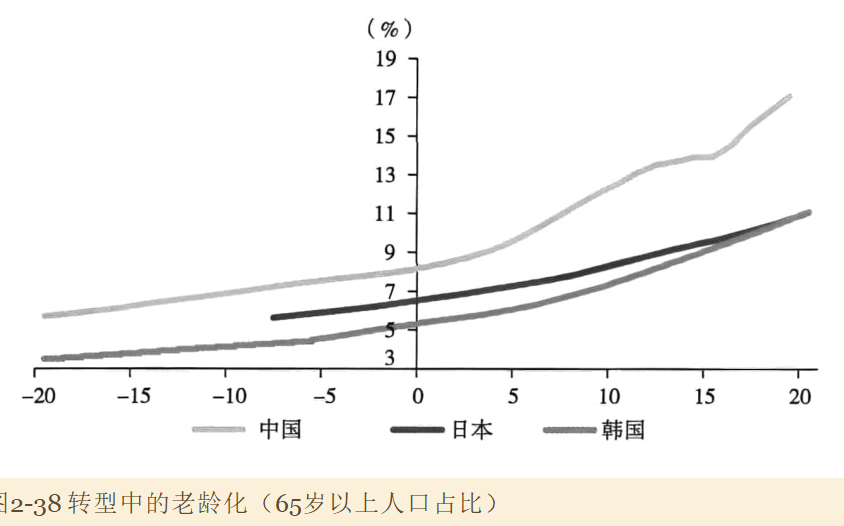

中国经济总体走在长期波动下行的趋势中，背后的重要原因在于：随着经济发展和收入水平提高，我国逐步从模仿和追赶驱动的模式转入自主创新驱动的模式，逐步从依靠出口和投资转入**依靠消费和服务来拉动经济**。

为了放入国际视角比较，使用两个指标：

- 人均GDP，转化为美元水平，并对币值在历史序列上调整（购买力？）
- 观察经济体内部第二产业相对第三产业占比的变化

认为中国2010年的经济发展程度、人均收入和生活水平大致接近日本1968年前后、韩国1991年前后、台湾1987年前后的水平。

从数据来看，日韩和台湾在转型结束后平均增速在4%~5%之间，

同样思路，对比**人均电力消费量**，与对标阶段的东亚经济体十分接近。

另一个指标是城市化率。中国户籍政策、老龄化可能都影响了这一指标。

非农业就业人口占全部适龄劳动人口的比重

#### 可贸易部门竞争力

依靠廉价劳动力驱动的加工贸易在过去8年大幅萎缩，但依靠技术进步和自主创新的一般贸易出口份额大幅提升。从这一角度，我国经济转型后所经历的国际竞争力的提升处于正常水平。

工资指数：

调整汇率升值的影响

人均汽车保有量：以2014年（基点后移4年）对应日本1968和韩国1991的话比较接近，但人均保有量上升速度明显偏慢。

对标年限调整的理由：人均收入水平相似的背景下，中国的收入分配茶具更大，使得有能力购买汽车的人群数量相对下降。上升速度慢的理由可能在于成本的上升（石油、环保）。

历史上，汽车市场和房地产市场是支撑中国经济高速增长非常重要的力量。随着高速城镇化趋于结束，房地产作用大幅弱化；而随着汽车市场不如存量时代，汽车消费增长的支持也在显著弱化。因此经济减速过程存在深刻的结构性原因，并且这一减速过程很有可能还没有结束。

#### 投资率

为什么经济转型阶段我国杠杆率的提升幅度如此之大？

主要源于频繁且大幅度使用基建、房地产等逆周期政策来刺激经济，从而维持了相对更高的投资率，在一定意义上积累了风险。

因此，尽管转型中我国增长率比其他经济体略高，但这是建立在投资率较高、投资率缓慢下降，且杠杆率大幅抬升的基础上，它的可持续性是存疑的。

#### 老龄化

