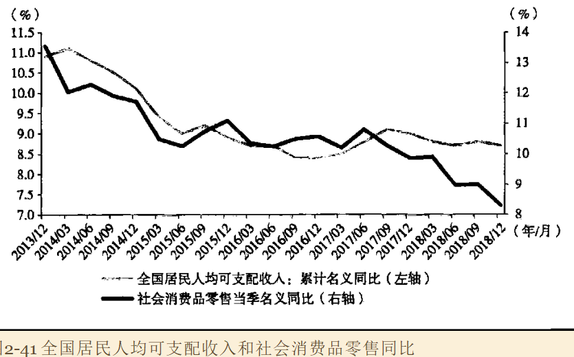
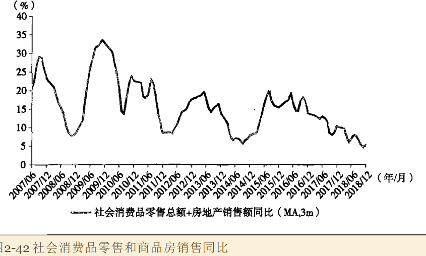
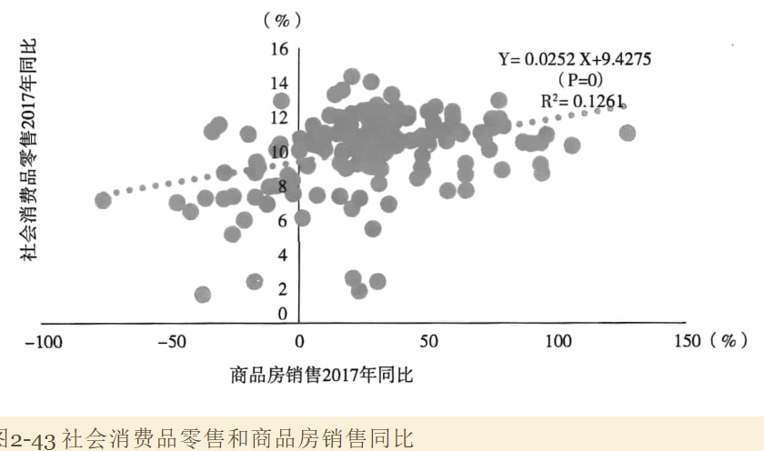
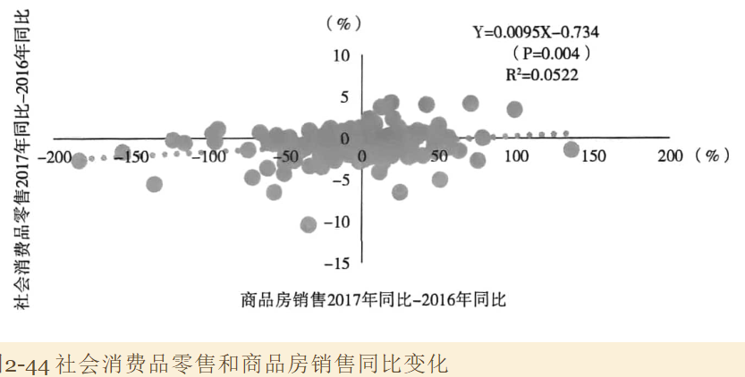
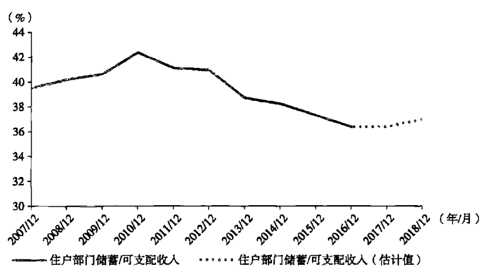
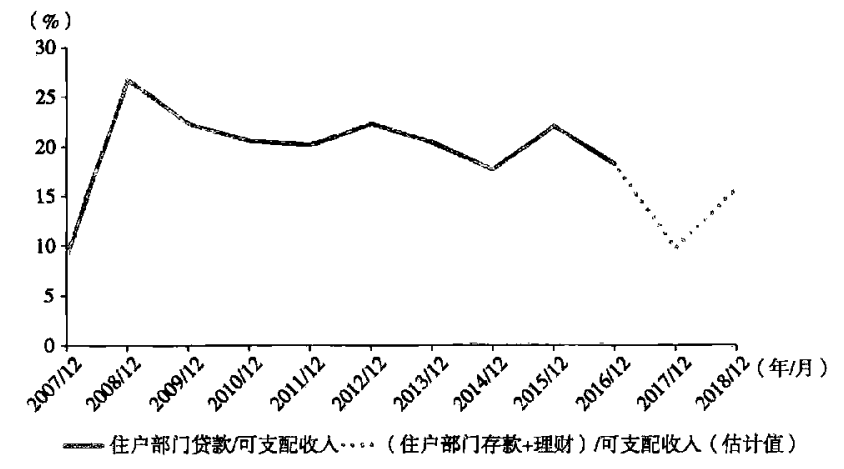
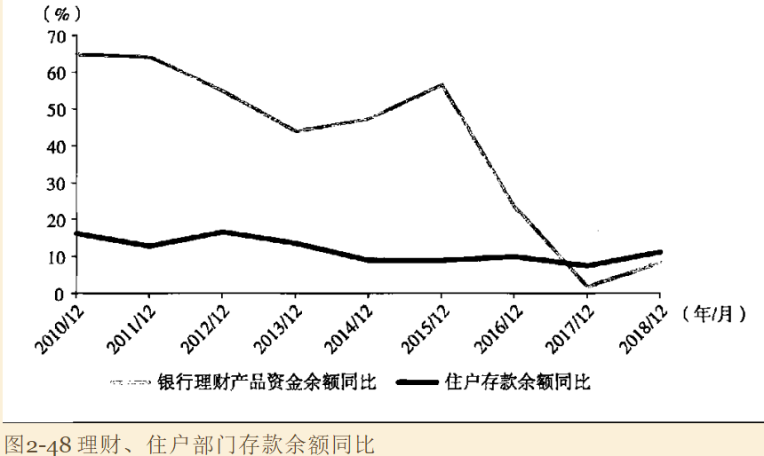

### 1. 消费降级现象

全国人均可支配收入和社会消费品零售嫉妒同比增速在2017年依赖背离程度越来越大，市场参与者将其笼统归结为房价上涨造成的挤压，或者汽车销售放慢带来的拖累。

### 2. 房价上涨是否挤压了居民消费

通常认为房价上升和销售放大会带动居民消费的扩张。一方面因为形成了财富效应，并且改善了居民获得信贷的能力；另一方面因为房屋销售会伴随着装修、家具家电购买等开支的扩大；

但是对于新购房者以及潜在购房者，房价上涨会导致实际收入缩水，从而被迫减少消费，表现出挤压效应。

所以关键在于：财富效应和挤压效应相比，孰大孰小。一般认为财富效应是主导，历史其他时期房价上涨过程中，投资者也一般认为财富效应更大。

#### 2.1 消费品和房地产加总

首先，把社会消费品零售总额与房地产销售额加在一起，计算加总指标的总比增速。*如果房地产销售当真挤压了社会消费品零售，那么加总数据应该没有持续减速的趋势*。

上图表明：加总指标单边减速一九存在，甚至更强烈。

#### 2.2 查看相关度

其次，把160个城市商品房销售增速和社会消费品零售的增速放散点图观察

可以看到，两者在2017年的横截面上呈现为显著的正相关关系，解释变量的T检验的显著性水平很高。这支持传统财富效应的看法。

#### 2.3 差分处理

差分后的指标是房地产销售、消费品拎手增速的变化，而不是增速本身。

这相当于**建立了一个简单的固定效应面板模型，从而拍出来城市的特质等因素的影响**

回归结果表明，T检验显著性水平很高，依然存在正相关关系。

### 3. 货币和理财增速一场下降

住户部门的储蓄行为是比较平滑和稳定的。尽管2011年依赖储蓄率有趋势性下花，但没有证据表明储蓄率大幅下滑。因为如果储蓄率大幅下滑，一定会表现为消费率大幅上升。而实际上消费反而是在减速的。

观察下图的金融交易情况，可以看到金融储蓄出现大幅下滑

#### 排除购房产生储蓄下降

住宅购买上升了4.7%，中长期贷款上升了3.3%，理论上金融储蓄会下降1.5%，但实际上下降了12%，所以排除住房挤压得可能性

#### 解释

可能在解释是：过去几年得金融整顿，导致住户部门持有得金融储蓄出现了非意愿的下降，为了重建金融储蓄，减少了消费。（那么损失的那一部分去哪里了？类似于资产价格下降吗？）

证据之一：广义货币供应明显减速，同时理财产品得利率大幅上升。