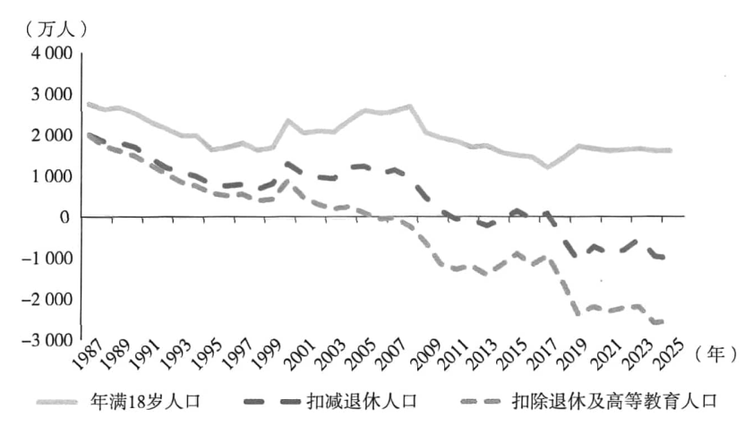
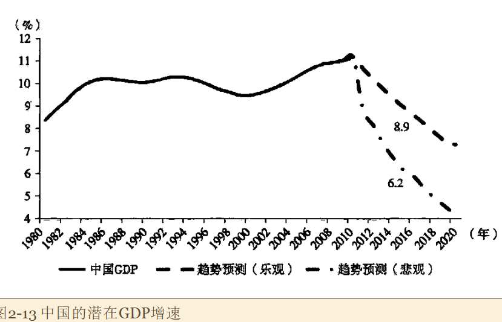

主要讨论2010-2020中国经济潜在增速的变化及其影响。

预计2015年可能下落到7%左右，2020年进一步下降到5.5%。

经济潜在增速下降的主要风险在于：这一调整过程往往伴随着宏观政策的剧烈摆动乃至经济或金融危机。因为以逆周期政策应对结构性变化，使经济表现与潜在趋势之间的裂口越来越大，最终导致难以忍受的通货膨胀或资产泡沫，随后的政策紧缩会相应地导致经济衰退或资产泡沫破裂，其表现通常是一场危机。

### 1. 劳动力供应转折

扣减退休人口后，新增劳动力将在2011年前后进入零增长区间。

2003年以来，CPI和CPI-食品之间出现明显裂口，且越来越大；2006年以来，农名工工资年均增速也在20%。因此做出论断，中国在2007年前后已经走过了`刘易斯拐点`。

> 刘易斯拐点：即乡村劳动力投身[制造业](https://zh.wikipedia.org/wiki/製造業)导致乡村劳动力减少，并导致[农民工](https://zh.wikipedia.org/wiki/农民工)和非熟练工人的工资上涨。这种现象通常由劳动力短缺引起。直到再次达到劳动力剩余的状态后工资不再上涨。该术语由经济学家[威廉·阿瑟·刘易斯](https://zh.wikipedia.org/wiki/威廉·阿瑟·刘易斯)提出，故名刘易斯拐点。在刘易斯拐点发生后，意味著经济需要平衡发展。[[1\]](https://zh.wikipedia.org/zh-hans/刘易斯拐点#cite_note-economic-1) Piazza认为，一个快速发展的经济体到达刘易斯拐点后，会导致金融动荡和增长前景的持续下降。

### 2. 负向冲击

增长趋势在劳动力投入、资本投入、技术进步和资本系数四个方面可能都会受到负向冲击

### 3. 负向冲击的四个维度

#### 1. 劳动力投入

未来十年劳动力供应的减少和老龄化的趋势格外陡峭，人口红利转为人口负债的拐点和刘易斯拐点距离很近。

#### 2. 资本投入

在投资层面，中国受到两个结构性因素的不利影响。

- 中国走过刘易斯拐点和人口红利即将消失。伴随着劳动力供应的趋势性收紧以及人口结构的不利变化，可用于资本积累的资金和资源将向非生产性支出倾斜配置。也就是劳动力供应收紧将同时导致**工资收入提高、投资占比下降、消费占比上升**。
- 中国重工业化进程可能已经接近尾声。自2002年来中国经历了和日本20世界60年代类似的重工业化。
- 

投资占比提高通常伴随着经济增速的平台上升。

2002年之后，随着投资占比上升，居民消费占比下降，但在2009年开始逆转，预计消费占比的提升僵尸未来十年的一个趋势。

从国际比较来看，消费占比提升、投资占比下降往往伴随着经济增速的平台下降。

中国的重化工业加速发展的时期已经接近尾声，因为中国的重化工已经实现了大量净进口到大量净出口的过程，这表明行业具有国际竞争力。此后这一行业的增长将更多取决于较慢的全球经济增长与技术进步。

#### 3. 技术进步

中国技术进步相当大一部分来自制度红利，以及追赶红利。

#### 4. 资本系数

劳动力供应收紧对经济增速还有一个更复杂的影响，即**经济增长对资本存量弹性的下降**，或称`资本系数冲击`。一种理解是，在劳动力增长放缓甚至负增长的情况下，资本的边际产出下降，设备投资对经济增速的贡献缩小。另一种理解是：资本的议价能力随着劳动力供应的抽紧足部小时，如2010年本田下属工厂的罢工事件。

### 4. 中国经济增速的趋势转折

### 5. 潜在经济增速下降的风险

#### 1. 经验事实

为何放缓？常见解释有人口结构的变动、技术进步的放缓等。

美国经济在2002年后再次出现中长期下降趋势，技术进步和设备投资都有所放缓。为了调控美国的经济下降趋势，挑选了房地产市场作为新的经济增长点，最终催生了一个很难控制的金融泡沫。

20世纪90年代初日本第二次跳台阶之前的几年中，日本也出现了非常严重的金融资产泡沫。从宏观政策是叫，80年代中期日元升值是产业界和舆论对于“日元升值萧条”的担忧非常剧烈，国内采取了多种刺激内需的政策，反而使泡沫剧烈膨胀，最终决策者对泡沫难以忍受，采取了紧缩政策，对经济增速产生了破坏性后果。

#### 2. 潜在增速下降与调整的一般模式

1. 放缓往往来自技术进步减缓、人口结构变动、自然资源耗尽或贬值、政治体制转变或领导人更迭等结构性因素
2. 潜在增速下降趋势的拐点或初期，从企业到政策制定者往往不能意识到经济增速趋势性下降的真正原因，因此采取的应对政策通常是逆周期政策，而非结构性政策
3. 这种北京滚下反周期宏观政策会将经济增速暂时维持在相对较高的水平上，同时导致金融资产泡沫或难以遏制的通货膨胀
4. 在宏观政策刺激下，经济增速与潜在增速之间的裂口越来越大，经济在趋势之上运行越多，后果越严重
5. 在外生冲击或决策者主动收缩政策的背景下，经济增速出现台阶式下降，这往往伴随着经济或金融危机
6. 危机之后，经济增速回归到潜在增速附近

经济增速本身并不可怕，从美日经验来看，高速增长期资本市场表现平淡；反而是在经济增速经过台阶式下降后会出现较长时期的繁荣

**风险在于调整的过程往往伴随着宏观政策的剧烈摆动和经济或金融危机；反周期的政策是的经济表现与其潜在趋势之间裂口渐行渐远，最终导致难以忍受的同伙膨胀或资产泡沫；随后的政策收缩会相应地导致经济衰退或资产泡沫破裂，其表现通常式一场危机。**

