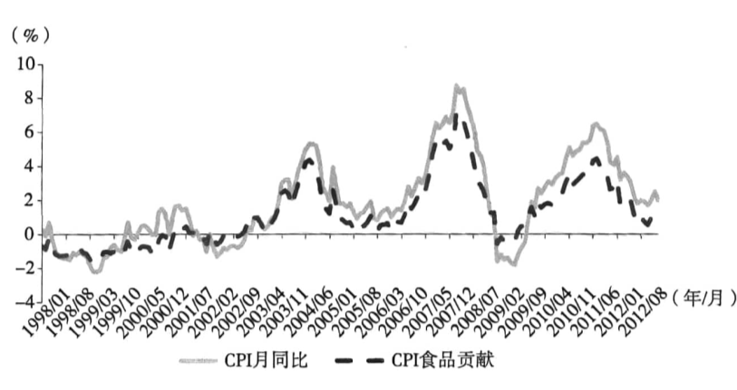
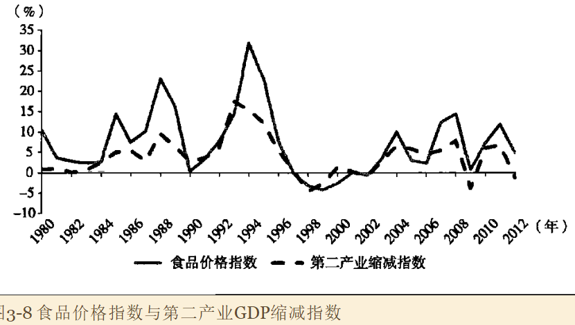
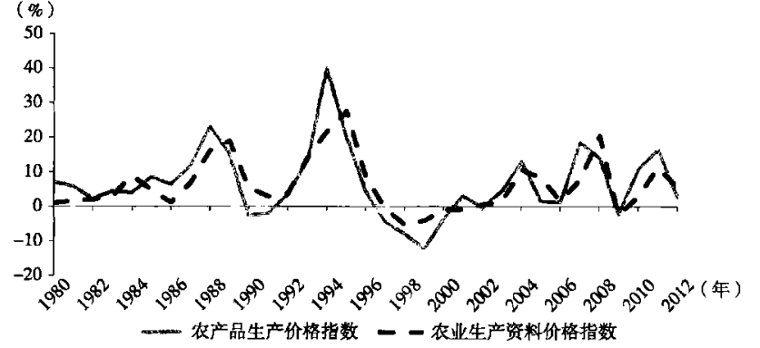
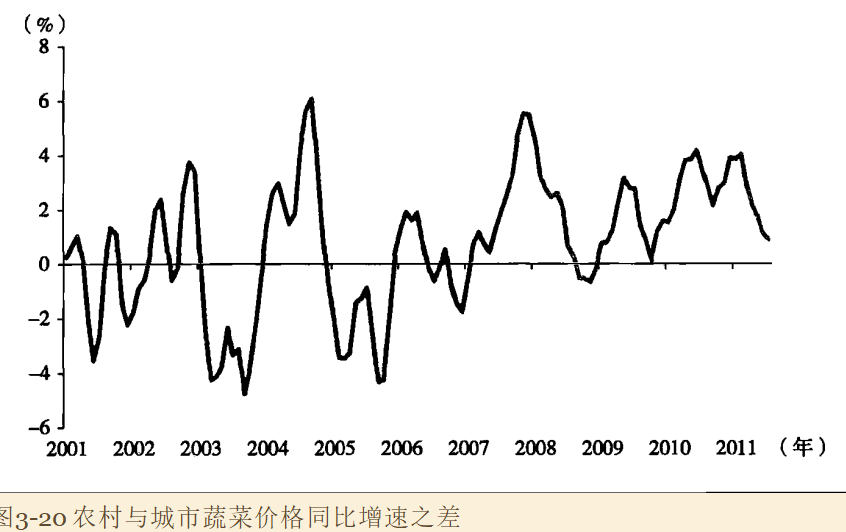

## 可贸易部门的通货膨胀

### 1. 全球生产者价格同步性

工业品大部分是可贸易品（相对服务业而言），要遵从一价定律。

> 一价定律：“[假设其他条件不变](https://zh.wikipedia.org/wiki/假設其他條件不變)，在[有效率市场](https://zh.wikipedia.org/wiki/效率市場假說)的情况下，任何同质物品的价值应该等同。”不考虑其产成方法或生产地等因素，即是忽略所有[交易成本](https://zh.wikipedia.org/wiki/交易成本)，如运输费用、保险费等。

### 2. 主导PPI波动的因素

全球制造业需求的变化以及中国需求的强弱对PPI波动具有重要影响。此外，美元汇率波动、大宗商品市场的冲击以及全球总供应层面的变化也是值得关注的。

## 中国食品通货膨胀

### 1. 食品和总物价的趋同性

消费物价指数的波动主要为食品价格所主导。

但奇怪的是，中国食品价格的波动与工业部门的通货膨胀高度同步。

如下图所示，CPI波动主要来自于食品价格的波动贡献

代表工业部门的第二产业GDP缩减指数和食品类价格指数表现出强烈的同步性，在最近的15年，其相关系数高达0.85

逻辑上这一现象暗含了三种可能的作用（对照A和B相关的三种解释）：

1. 食品通货膨胀引发了工业品的涨价，从而主导整体经济的冷热
2. 一些因素在引发食品通货膨胀的同时，引发了整体经济的冷热变化
3. 工业品的价格变化诱发了食品类的同伙碰撞

第一种可能是缺乏说服力的，前文说过，生产资料价格具有全球同步性；

第二种可能对于中国这样庞大复杂的经济体很难成立（？）

第三种比较合理。

### 2. 影响机制

整体经济的冷热如何影响食品价格，除了供需层面，还可能的两种机制：

1. 成本传导，食品生产成本（农药化肥）上升，影响了粮食价格
2. 通货膨胀预期：农户观察到成本上升，产生了通货膨胀预期，同时出现了保值需求，此时会减少货币现金的持有量而增加其他资产的持有量。比较容易调整的是粮食和生猪等，进而导致供应减少价格上升。

对比农产品价格指数和农业生产资料价格指数（？）

如果农产品价格上涨来源于成本压力，那生产资料价格的涨幅应该明显大于农产品涨幅，但实际上在最严重时（峰值），农产品价格涨幅更大。

因此用通货膨胀预期假说容易理解。

#### 为何农产品价格受通货膨胀预期决定

因为该市场存在贸易壁垒且相对封闭，同时初级农产品较为标准化，需求的价格刚性较强，生产对价格反应具有滞后性，这些都使得通货膨胀预期和库存调整能够左右价格波动方向。

## 刘易斯拐点和食品通货膨胀

### 1. 刘易斯拐点

刘易斯把发展中国家的经济区分为现代部门和传统部门，现代部门以制造业为代表，传统部门以农业为代表。

- 制造业存在持续技术进步，一利润最大化为导向，资本存量是唯一约束。企业家将大部分利润用于储蓄和投资，整个部门不断壮大

- 农业部门是一个维持自身生存需要的部门，生产方式落后，劳动生产率地下。整个部门存在大量的剩余劳动力，包括零值劳动力（边界产出为零）和不充分就业（边际产出不为零但小于最低生存费用）。

在农业部门存在大量过程劳动力的情况下，农业部门的低收入决定了制造业的低工资，一方面是工业部门总可以按照不变的工资水平雇到需要的劳动力（劳动力供给无限）；另一方面保证了企业家的利润份额以及整个制造业部门的扩张。

当劳动部门的剩余劳动力被充分吸纳就业的时候，劳动力在农业上的编辑产出开始高于维持生计的水平，此时制造业部门的劳动力供给曲线由水平匾额我i向右上方倾斜，工资水平随着就就业扩张而快速上涨。这就是所谓的刘易斯拐点。

### 4. 为什么农村地区蔬菜涨价比城市更快

蔬菜价格上涨的原因：包括生产者成本、物流和摊位进场等。

对比农村和城市价格，发现农村蔬菜价格涨幅更高（2-3个百分点），这暗示价格上涨更多地来自生产者价格上涨，而非中间流通成本的上升。

### 5. 种粮终于可以赚到钱

农民从事农业生产的机会成本上升。

## 通货膨胀中枢抬升

农民工工资快速上升，推升了通货膨胀。

国外的零利率和量化宽松，以及国内的通货膨胀和更高的利率中枢，进一步拉大了国内外利差，带来了资本流入。