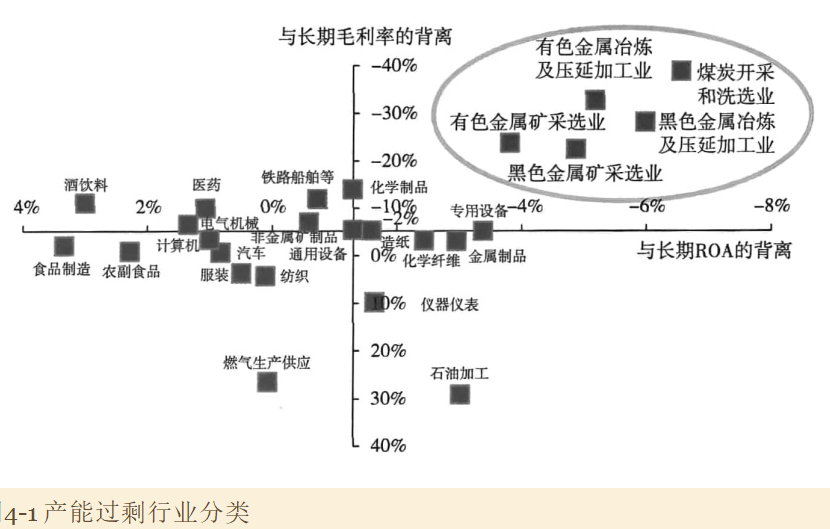
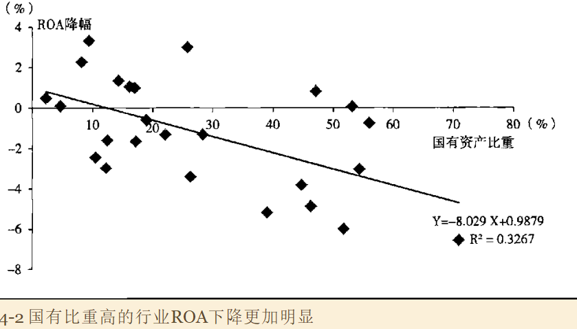
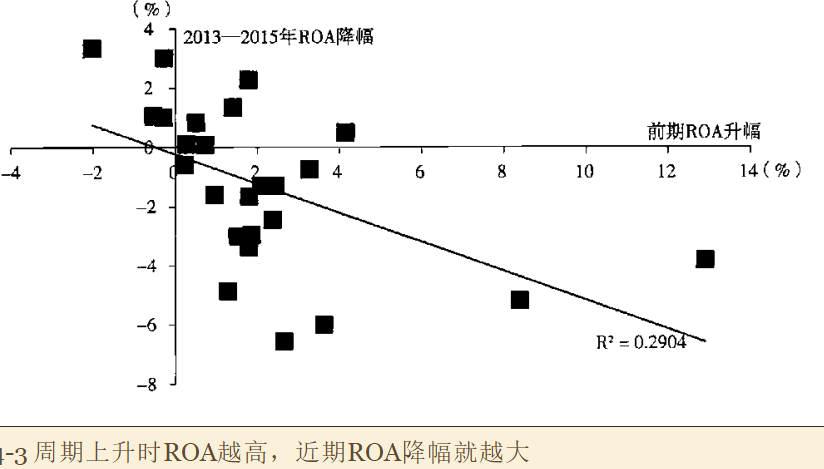

## 产能过剩原因以及表现

### 1. 产能过剩的测度

关键一点在于使行业的盈利收到了系统性的抑制。如果每一个企业的盈利都很好，则认为是不存在产能过剩的，或者说这种产能过剩是没有经济意义的。

使用两个指标考察企业盈利：

- ROA（资本回报率）
- 行业毛利率

如果一个行业的盈利在两个维度上都显著低于长期历史均值，则认为存在严重产能过剩。如上图中，越右上方的行业，盈利降幅越大。

这5个行业占工业行业的比重在10%~20%，行业内部国资占比平均在51%；

### 2. 产能过剩的原因

从两个维度研究横断面。

第一个维度：

- 横轴：不同行业国资占比
- 纵轴：行业ROA与长期历史均值的背离

表明：一个行业国资越集中，行业盈利收到的抑制就越大。

第二个维度：横轴选择行业最赚钱时期行业盈利与长期历史均值的背离（这意味着行业在顶部的时候越赚钱，在底部就越亏钱）

这表明，中国的产能过剩问题一定程度上是一种周期性现象。由于在经济景气、周期上升时，有一部分行业太赚钱，引入资本太多，所以在底部时产能过剩更为严重。

在中国，还有一个重要原因：部分行业存在国资过度集中的现象。

进一步验证。

把重化产业链两类：产能过剩类和其他，两者在就业、工业增加值和纳税指标差不多。但在过剩行业，国资占比在50%以上；另一组则为17%。

继续对比几个行业，如黑色、有色和化工。从体谅上，化工更大，从盈利恶化，黑色和有色更严重。化工行业国资占比19%，而黑色和有色为48%和41%。

## 去产能政策

