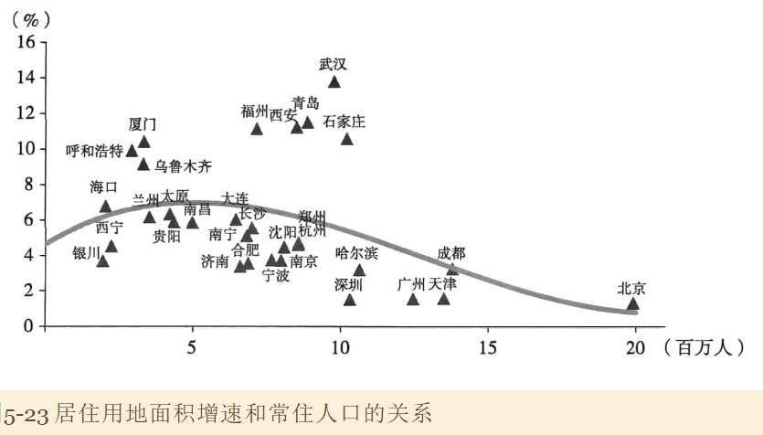

## 反腐让房地产加速回归正常化

### 1. 事实

把城市分两组：

- 有主要官员因为腐败被查处（11个，目标组），南京、无锡、温州、昆明、太原、呼和浩特、宁波、福州、济南、南宁、贵阳
- 无冲击（25个）：天津、石家庄、沈阳、大连、长春等

上图为目标组见对照组的房价定基数的差值；2014年（反腐）之前，目标组的房价涨幅更小，且与对照组差距扩大；但反腐冲击后，目标组房价出现了系统性加速，两者插值开始收窄。

从房地产销售表现来看，2014年之前，两组销售增速的插值在正负10%之间波动，但2014年之后，这一差值回落到0，随后反弹到10%。即目标组的地产销售在后期更强。（但是从图像看也可能是系统波动？）

一个可能是目标组房地产市场出现了更彻底的存货去化；即发福导致政府受冲击，系统性减少市场上土地供应，地产商减少开工，使得存货被动加速去化，在房地产周期上行的时候通过房价快速上涨、交易量快速放大表现出来。

另一种是目标组城市人口流入和经济增长在加速

### 2. 存货去化的对照

观察房地产新开工情况

反腐前，目标组新开工增速始终高于对照组，但之后，这一差值回落到零以下超过10个百分点。

### 3. 人口经济对比

对比两组城市居民可支配收入

目标组居民可支配收入增速始终更慢，很难支持目标组房地产表现更强。

人口情况，以小学在校生人数作为指标（数据质量高）

对照组小学生人数增长更快

### 4. 总结

从刚性需求、人口城市化等角度来看，过去很多年以来，中国的城市化以及城市化对房地产市场需求的推动始终保持在一个比较稳定的状态。从人口变化来看，人口结构以及城市化所推动的房地产需求在未来一段时间会出现一段逐步强化的过程。这种强化表现在一线人口大量涌入。在可预见的未来，二线城市也将涌入大量人口。

*在这一背景下，房地产市场的核心问题是去存货*

## 中国城市化与房地产市场

现实：中国房地产价格普遍上升，并在后期出现巨大分化，尽管中国仍是一个中高收入国家，但北上一线城市的房价已经赶上甚至超过许多高收入国家的水平，引发对于房地产泡沫的忧虑，并造成代与代之间严重的财富鸿沟。

同时，大量三四线城市的房价却维持在相当合理和可以负担的水平上，与一线城市的情况形成鲜明的对比和巨大的反差。

### 1. 中国城市化的转折：从城镇化到都市化

可以将房地产市场划分为两个阶段，

- 2013年以前，一二三线城市房地产涨幅始终比较接近
- 2013年至今，出现显著分化。一线城市始终高歌猛进，二线也出现上行，但三四线城市始终处于微涨或下跌状况

2012年至今，三四线房价涨幅明显低于居民收入增速，甚至低于通货膨胀涨幅；

同时，北上一线城市的房屋价格已经赶上和超过许多高收入国家。

因此简单将房价上涨归结于金融危机后的宽松货币政策和争渡刺激经济的措施是不够全面的。

常住人口这个指标存在不足（如包括很多农民工等，他们基本不参与房地产市场），最终决定使用小学在校生人数（数据质量高）

观察小学生人数增速（2013-2015）和房价（2013-2016）涨幅之间的关系，

进一步扩展数据的时间序列长度，横轴为2009到2015年小学生人数增速，纵轴是2009到2016房价涨幅

将房价涨幅的城市分为两组

- 房价涨幅排名前十（查看小学生人数增速）
- 后十名

2011年之后，房价涨幅前十城市的小学人数增速超过后十名

观察两组城市的住宅销售面积增速差

2011年之后，前十的城市超过后十。

2011-2012年之后，以小学生人数增速为代表的中国青壮年人口开始集中流入一部分城市。这种变化首先在小学在校生数据上体现，**同步**在住宅销售市场，并几乎同步在新宅开工面积。经过一段时间之后，2015年下半年开始在房价中体现

为何有两三年的滞后？为何人口集中流入？

研究两组城市居民可支配收入的情况，可以看到：2011年之后，人口集中流入的城市居民可支配收入增速明显弱于对照组。

**该结果表明：人口流向变化于经济机会的差异没有关联！**（maybe，人们对收入的绝对值感知更明显，对于增速感知没那么明显？）

一个可能的解释是，教育资源在不同城市之间存在差异。

所谓都市化，是指人口的流动开始表现初很强的选择性，人口开始集中流入一部分大城市和特大城市。

都市化过程中，人口集中流入了哪些城市呢？北方主要是背景和郑州；西南向成都；东南向深圳、广州、厦门以及长江中下游城市群

### 2. 城镇化与土地供应

在国有制度下，土地供应是垄断性的。面对大量人口流入，城市土地供应难以快速扩大，这样人口流入压力更多地体现为地价和房价地上升。

如果政府切实大量增加供地，从而导致地价和房价下跌，几乎确定地会收到银行和大量社会中产阶层的反对；如果政府严格控制供地，进而导致地价和房价上升，折优惠收到刚进入城市的年轻人以及没有住房的低收入者的反对。

### 1. 居住用地比例低于国际水平

标\*是数据调整为扣除校区绿地和道路后居住用地占比，与国际比较口径一致。

海港城市，日本居住用地占比44%，纽约38%，深圳19%，香港18%。

内陆型城市，首尔和伦敦分别为57%和55%，北京和天津19%，

这体现在房价收入比。

### 2. 居住用地供应对房价的影响

使用2008-2014年城市居住用地年化增速来衡量土地供应。
$$
\text{房价涨幅} = \beta\text{小学生增速}+\gamma\text{居住用地增速}+\delta
$$
上面的变量结果分别为：9.96、-2.207、49.453

建立回归方程，表明小学生增速对房价涨幅为证，居住用地增速影响为负，符合预期。值得注意的是前述结果的常数项，其经济含义似乎可以为：即使小学生增速为0，不增加用地，房屋在这7年间也会涨49.5%，年化5.3%。对比同一时期经济发展速度，GDP名义增速平均11.2%，实际同比增速为8.3%。房屋价格的自然趋势增速明显低于GDP增速。

期间，非私营单位平均工资涨幅11.2%，人均可支配收入名义平均同比增速10%。房屋价格趋势业低于居民收入增速。

同期，中国CPI平均同比涨幅2.3%，提出通货膨胀，房屋自然涨幅约3%，这也显示出房价上涨不完全受通货膨胀影响，具有投资属性。

与同期的投资回报率相比，6个月理财产品收益率平均4.42%，两年内非证券投资收益8.2%。房屋价格自然趋势增速略高于理财收益率，低于信托产品。即使考虑房租可以产生每年3%的汇报，投资房产的收益也仅仅与信托相当，而且流动性和刚性兑付远远不如。**这表明房屋的自然趋势增速处在大体合理水平。如果观察到过度上涨，要么是人口大量流入，要么是受到政府土地供应制度的限制。**

但是反过来，房价上涨也可能刺激政府增加土地供应

- 土地供应的潜在竞争。假定政府是经济人，追求长期收入流的最大化，包括财政税收和卖地收入。如果把土地供应控制得很近，那么卖地会提高，但是高的土地价格会引发高的工商业成本，从而使税收下降。这样的制约意味着存在一个最有平衡点。
  - 一个地方的竞争力越不依赖于可贸易部门，越不依赖于中低端制造业，那么土地供应就可以控制得越紧。比如若某个中小城市依赖于制造业和中低端服务业，这样城市间存在明显晶振，推高土地价格回时人口和工商业活动流向其他中小城市。
  - 但是大城市更多依赖高端制造业和现代服务业，再加上公共资源红区方面的独特地位，这些经济活动缺乏竞争，难以转移，因此政府控制土地供应所承担的经济成本相对较小
- 决策和认知习惯。政府倾向于认为i大城市有诸多外部性，如：交通拥堵、噪声、环境污染等，希望控制大城市人口规模，并重点发展中小城市，导致政府倾向于减少大城市土地供应，并增加中小城市供地

因此，我们选择人均第三产业GDP和常住人口数量作为变量。前者反映了城市对**不可贸易经济活动**的依赖程度，后者代表了政府限制城市人口规模的努力。

当人均第三产业GDP规模在2万~4万时，城市居住用地供应速度逐步抬升；

但当规模超过5万时，城市居住用地供应速度快速下降。

此外，还根据城市常驻人口规模，拟合土地供应情况

当人口低于500万时，随着人口增加土地供应是明显上升的，

但超过这一阈值后，土地供应开始下降，在达到2000万时，土地供应增速异常低。

### 3. 房地产库存

2012年后，企业试图通过提高周转率水平来维持合理的投资回报率，房地产市场进入去库存变化，这也解释了21-15年部分大城市小学在校生增速显著上升，但直到三年后，才出现房价大幅上涨的情况。

对于房价涨幅靠前的二线城市，2011-2012以后青壮年人口持续大量流入，首先带来的是库存快速消化，当库存大幅下花到零一下时，房价立即出现猛烈的上涨。

房价涨幅靠后的二线城市以及涨幅广泛的三四线城市，青壮年人口流入的速度明显要慢一些，因此存货的去化也更慢。但由于开发商大量减少新开工，在2014年后也开始持续下降。

2016年由于刺激政策的影响和需求透支，房地产的存货去化无疑非常快。2017年以来，棚改货币化按值比例进一步上升，对商品房销售继续形成重要支持，迄今商品房市场的降温速度远慢于预期。

随着库存去化，一些三线城市房价也开始出现上涨势头。

上市房地产公司存货数据也现实，我们距离存货去化基本完成的时间点并不遥远。

以20实际80年代后期日本呢，2005年以后美国以及2010年的中国情况来看，房地产泡沫的一个关键特征是：房地产投资的快速扩大和随后存货的大量积累。实际上，正式由于存货的快速堆积和难以处置，在房价泡沫破灭后才形成了银行坏账、产能过剩和价格调整等问题。

从这个角度来看，2016年以来部分二线城市房价快速上升时，供应快速扩大和存货记类并不明显。房价上升主要反映了供求严重失衡，表现在非合意存货大幅低于零的水平。

综上，2009-2011年中国经历了全面的房地产价格的快速上涨和泡沫化，刺激了供应的过度增长，随后导致库存的大量积累。2012年后，多数城市房价上涨开始低于通货膨胀和收入的上升速度。最晚2014年开始，全国范围房地产坤村的绝对水平开始高位持续快速回落。但由于人口流向变化，不同城市的存货去化速度呈现显著差异，导致2016年以来不同城市之间房价排浪式上升。

在过去2~3年努力下，重点城市房地产库存已经完成去化，其他中小城市库存水平仍然偏高。

持续的城市化进程也许时2014年以来中国房地产顺利完成存货去化的关键，使得房地产市场得以出清。

### 4. 结论

不具备泡沫化的关键特征。
