## 交易费用与余额宝

### 1. 交易费用造成不同市场的分割

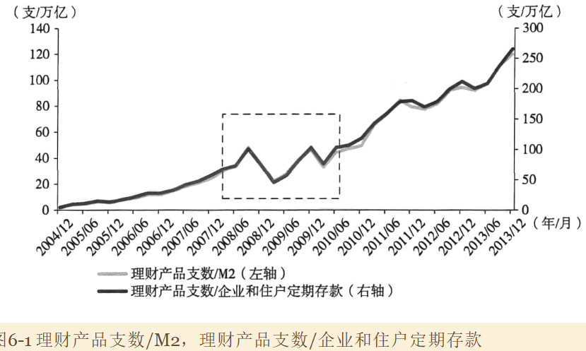

理财产品/M2，一定程度上能够反映理财产品余额相对于M2的比例，可以看到2008-2010年理财产品相对于M2的比例结束了此前的攀升势头，可能**意味着理财产品市场阶段性地发展成熟**。2010年下半年后，利差重新扩大，信贷类理财产品爆发式增长，理财产品才相对于M2猛烈上涨。

货币基金对企业和住户存款尤其是货期存款形成替代。

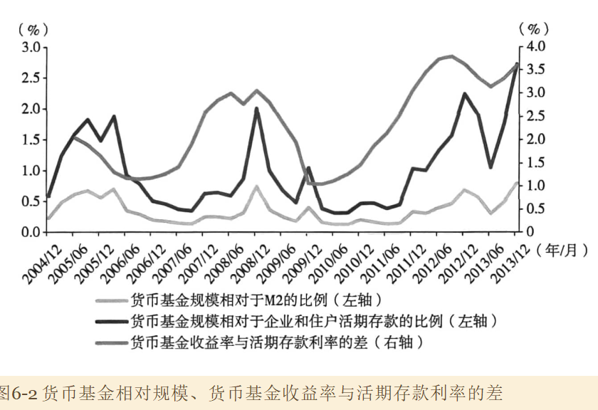

历史上每一次货币基金与活期存款利差扩大，都带来货币基金相对于M2或活期存款地比例上升。

2010年以前，货币基金相对定期存款比例波动稳定在0.9%附近，为什么在有200BP地利差下，货币基金相对规模会稳定下来停止扩张？

从**一价定律**来考虑，在存在60BP和200BP利差的北京下，理财产品和货币基金相对规模能够稳定，有两种可能：

- 彼此间差异足够大，可以支持显著的价格差异，如隐含本金保证等
- 交易费用

活期存款与货币基金以及定期存款与理财产品在相互转换过程中，至少产生如下四项交易费用：

- 学习成本，理解货币基金和理财产品
- 银行网点办理
- 银行网点的等待
- 去银行的机会成本

假定交易成本时固定的（假定300元），当利差保持200BP时，资金在1.5万元以下的会放弃申购货币基金；当利差在60BP时，资金5万以下的会放弃。

可以看到，交易成本的存在不影响大额资金的跨市场套利，却对小额账户构成了制约，这导致了金融市场的分割。

据此推断，理财产品持有人户均余额大于货币基金，而货币基金又大于银行储蓄。这与实际情况吻合。2013年底某大行理财产品持有人户均余额为40万人民币；过去十年传统货币基金户均持有规模平均值为13.3万，银行储蓄胡军规模在1万以下。

### 2. 余额宝的意义

余额宝的前端是一个标准的货币基金，与其他货币基金没有明显不同。其后端时互联网渠道，这是与传统货币基金的重大差异，互联网实现了交易费用的下降。

余额宝的互联网渠道使前面讨论的交易费用大幅下降至数十元甚至更低的水平，小额资金的跨市场套利活动因此变得有利可图，从而降低了金融市场的分割。

截至2014年2月底，余额宝用户数量在8100万左右，户均余额6000元，远低于传统货币基金的13.3万。

余额宝通过渠道变革实现了交易费用的大幅度下降，从**长期**来看至少带来五个方面的影响：

1. 更多让偏低收入者获益，改善收入分配。以目前的规模水平上，以稳态收益率差2%计算，低收入者获得了至少100亿元的收入。
2. 降低全社会储蓄动员成本和资金价格。余额宝通过虚拟网络渠道收集存款的成本要比传统银行的网点要低得多，这在长期内有助于降低全社会资金价格
3. 在现有制度安排下提高货币乘数。余额宝将银行货期存款转换为非银行金融机构在银行的同业存款，节约了商业银行的存款准备金，增加了信贷市场可用资金量，降低了信贷和同业市场的利率水平，提高了货币乘数。
4. 家属金融市场融合，家具利率市场化的紧迫性。余额宝通过降低交易费用，使小额储户能够自由地在存款和货币基金之间跨市场套利，加速了零售存款市场与银行同业市场融合
5. 削弱渠道熔断，促进大小银行更公平地竞争。传统上，大银行利用其更密集网点获得成本更低且稳定性更好的储蓄资金。中小银行网点少，高成本的批发存款占比高，在竞争中处于不利地位。余额宝的出现使原本沉淀在大银行的小额储蓄可以转而以同业存款的形式，被中小银行以竞争性的利率获得，客观上促进了金融体系的公平竞争。

## 影子银行体系的兴起与变迁

### 1. 影子银行的兴起

#### 1. 影子体系规模快速膨胀

从银行理财资金越来反映影子银行体系的话，2008年其规模不足1万亿，占M2比重不足1%，到2016年底，理财资金余额近30万亿，扩张了30倍，占M2比重近20%。

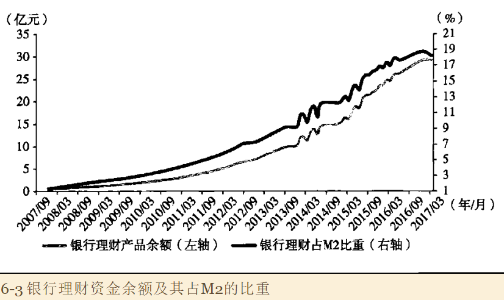

#### 2. 基于金融自由化改革无法合理解释

很多分析归因于金融自由化以及监管套利；但忽视了背后更为深刻的宏观经济背景

在银行负债方业务中，有两个子市场比较特别，意识保本理财，而是大额协议存款市场。其共同点是很早实现了市场化定价，利率叫定期存款灵敏。差异在于，前者疏雨银行表外业务，后者属于表内，面临的监管不同。前者面向零售端客户，后者面向社保基金、保险公司等。

在影子银行体系快速扩张的七八年时间里，保本理财与同期限定期存款的利差中枢明显扩张

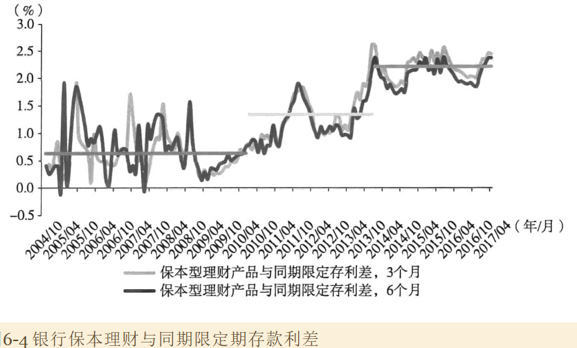

理论上，假定其他因素不变，单纯利率管制放开、金融自由化或监管套利推动理财规模扩张的同时，会使理财与定存利差显著收窄或者至少维持不变。但利差中枢不降反升表明淡出的金融自由化的解释是不完备的。

观察大额协寸与保本理财利差。由于监管环境和期限不同，两者有加大差异。

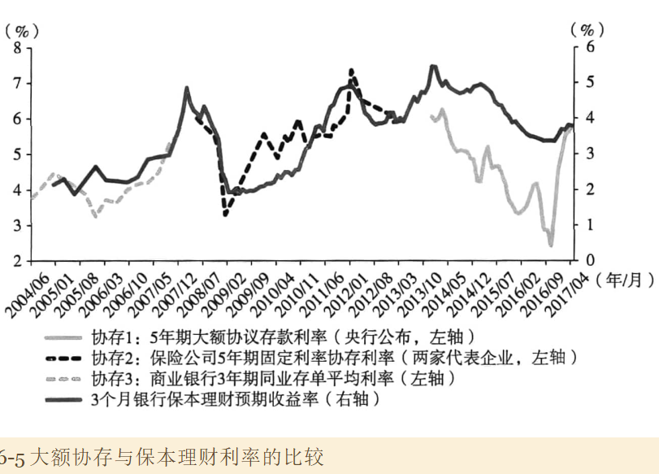

可以看到，在2014年之前，两者利率走势非常同步，变化幅度也高度接近。但在2014年以后，大额协寸利率出现较大幅度回落，市场规模的萎缩可能也比较显著。然而银行保本理财利率的下行要明显温和得多。

为何2014年前两者走势趋同，而之后走势发生明显分化？

#### 2010-2013年银行的影子

2014年之前，影子银行规模快速扩张，但核心是围绕规模放贷。实体部门大量融资需求无法在表内房贷渠道得到充分的对接，这就引发了整个金融体系的重要变化和应对。

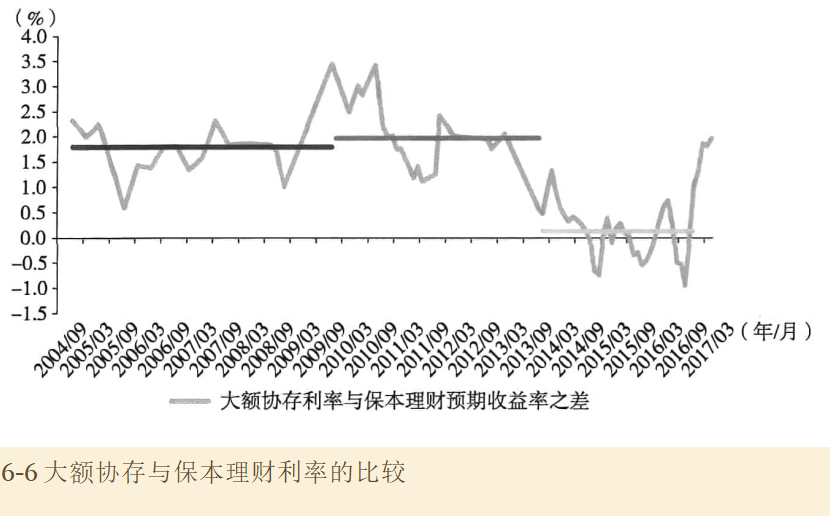

第一个变化是：整个经济和金融体系的市场化利率中枢大幅抬升。例如，无论看票据、一般贷款还是信用债发行，平均利率都维持在非常高的平台之上，与经济增速的下行不匹配。

第二个变化是：在利率最大化的驱动下，商业银行通过各种方法扩大对实体部门的信用供应，至少发展了以下三种方法：

- 在大额协议存款市场上用更大高的利率组织资金。部门金融机构借助保险通道将同业存款变为协议存款
- 将贷款转入表外的资产池，并由表外的理财资金来对接。
- 通过同业或自营科目发放贷款。一个见到那方法是借用信托公司为通道，或商业银行之间相互腾挪，将对企业贷款转化为对金融机构的放款。

从经济分析角度，**在均衡条件下**，上述三种方法对银行是等价的，导致获得的收益是接近的，利率上升的压力也是接近的。所以2010-2013年影子体系规模快速膨胀的同时，保本理财与定期存款的利差还在扩大，原因在于背后表外旺盛的实体融资需求的支撑。同样地，由于大额协存和保本理财面对地是相同地业务述求。

#### 4.2014-2016真正地影子银行

2014年以后，此前实体部门无法在表内得到充分对接地大量融资需求逐渐萎缩。这同样受到多因素影响。：

1. 地方政府开始清理平台债务，同时开展债务置换，平台融资需求下降
2. 房地产企业全面转向去库存，投资需求下滑
3. 央行货币政策转向，基础货币投放增加，存款准备金下调
4. 存贷比约束减轻，并最终在2015年下半年废除。

这样，影子体系最初爆发式增长地关键驱动力消失了。

在原有驱动力消失后，影子银行体系借助监管空白，通过委外、对接结构化产品等方式，将大量资金转入债券、股票和私募股权市场，实现理财规模地进一步扩张。2015年股灾之前，理财资金对接大量两融收益权和结构化证券产品，具有高收益低风险特征，催化和加大了故事泡沫，增加了整个金融体系所承担的风险。

## 影子银行与宏观杠杆问题

2014年中开始，中国实际上已经转入财政去杠杆的调整路径，并推动中国宏观杠杆率在2016年后稳中有降，但2018年以来，伴随严监管的深入推进，以影子银行快速搜索为特征的金融去杠杆一度占据主导地位

### 1. 宏观杠杆率测算

杠杆率的快速上升主要集中在企业部门，且绝对水平在国际比较中高居前列。

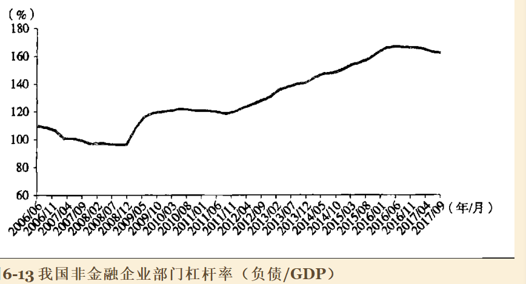

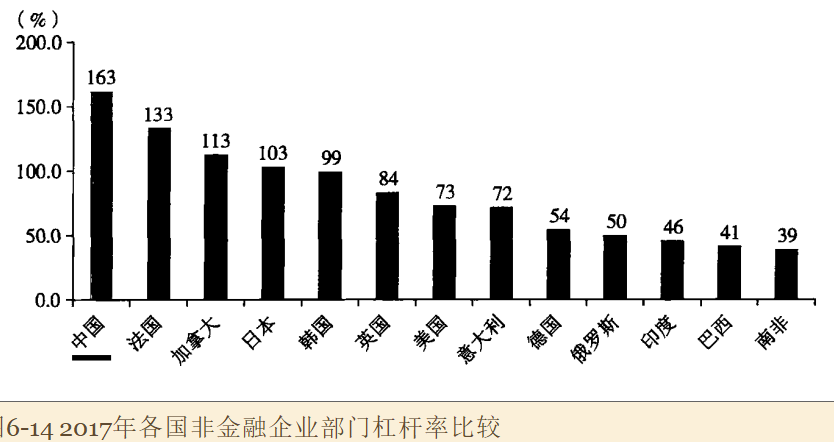

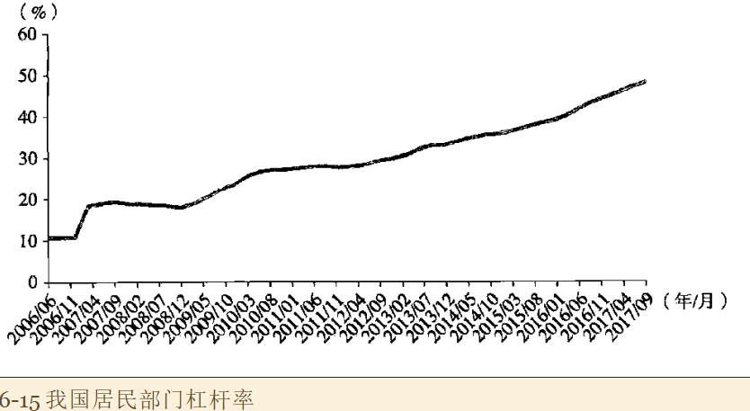

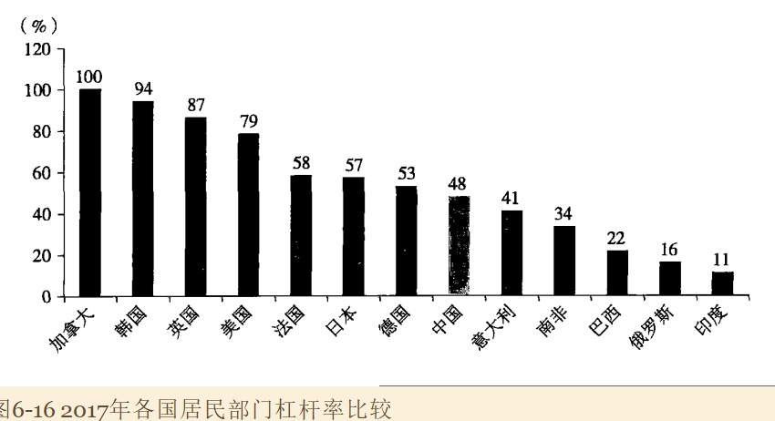

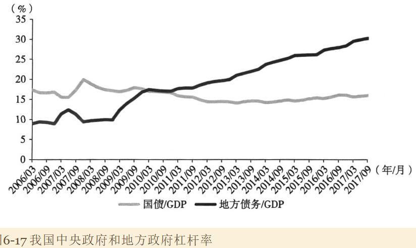

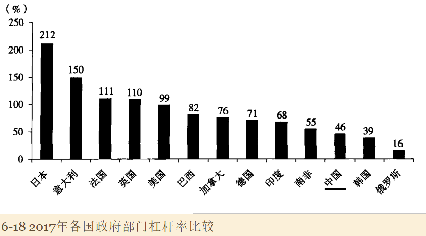

需要明确：地方融资平台的很多债务在计算中被统计为企业部门的债务。

无论工业企业还是非金融上市公司，以资产负债率形式体现的杠杆上升主要集中在国有企业。金融危机以来，民营企业的杠杆率总体没有上升。

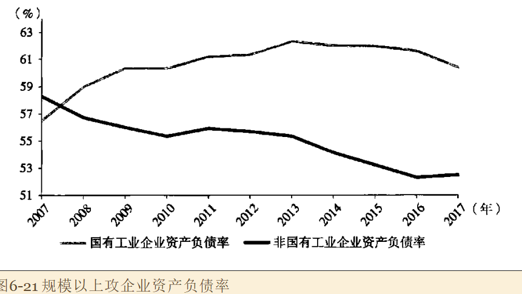

更细致的行业分类显示：杠杆率上升主要集中在周期类板块，以及电力、交通运输和建筑等具有周期色彩的行业。其他板块的企业总体上也没有精力杠杆率的提高。

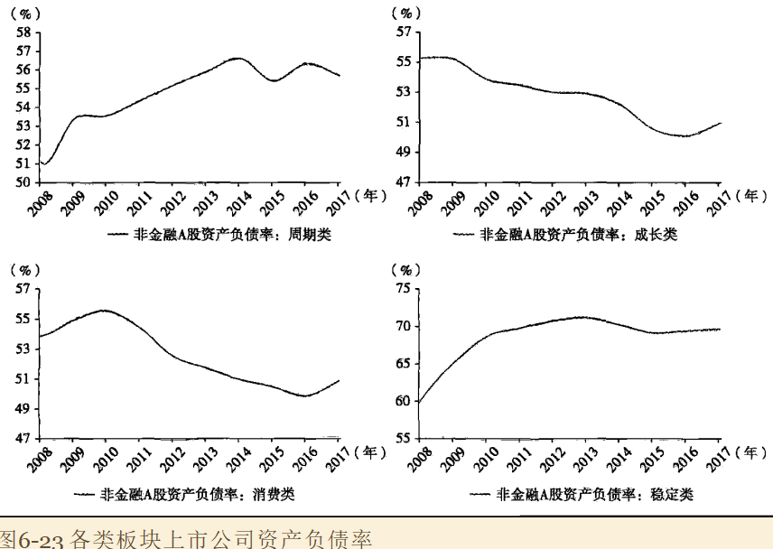

从资产负债率过度到宏观杠杆率的重要桥梁是资产周转率。把宏观杠杆率分解为三个微观指标：资产负债率、资产周转率的倒数、和增加值率的倒数

债务/GDP=（总负债/总资产）x（总资产/销售收入）x（销售收入/GDP）=总资产负债率 x 资产周转率倒数 x 增加值率倒数

最后一个没有经济含义，仅是统计上的系数，用于衡量没产生一单位销售收入，会有多少计入GDP。

从经济含义，杠杆问题可以拆分为两个部分：一个是资产负债率，另一个是资产周转率。所以，杠杆的上升要么是资产负债率在上升，要么是资产周转率在下降。资产周转率可以理解为产能利用率的某种度量。

不同口径的企业资产周转率显示：2**011年以来，所有类别的企业周转率都经历了持续和大幅度下降，并在2016年达到前所未有的水平，成为推动宏观杠杆率上升的重要原因。**

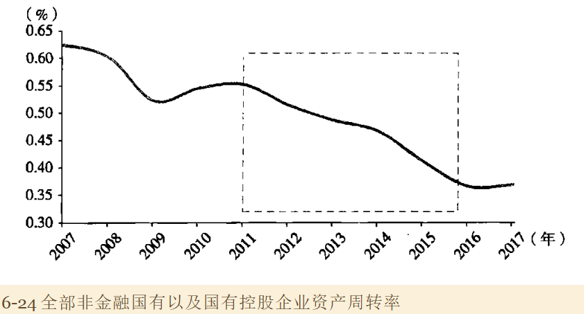

从这个角度看，宏观杠杆率上升与产能过剩是一个问题的两个方面。

资产周转率下降或产能过剩加剧最明显的原因是总需求减速。非常重要的事实是，受一系列结构性和周期性因素的应先给，无论名义增速还是实际增速，中国自2011年以后的经济放缓幅度大、持续时间长，这是周转率恶化和宏观杠杆率上升十分重要的背景。

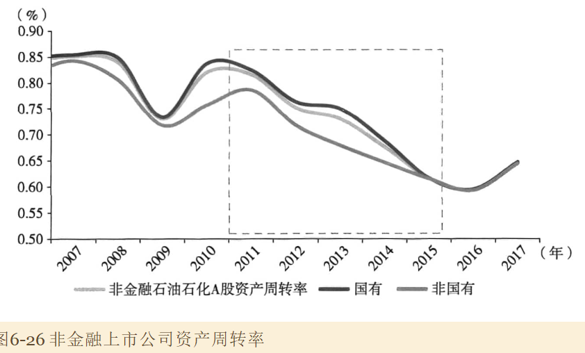

但是，处于分母位置的总资产增速在周转率的变化过程发挥着微妙的作用。宏观上总资产增速与固定资产投资等活动紧密关联。如果固定资产投资大幅下降，这可以推动随后的总资产增速快速走低或新增产能快速减少，这也会带来短期总需求的显著走低。

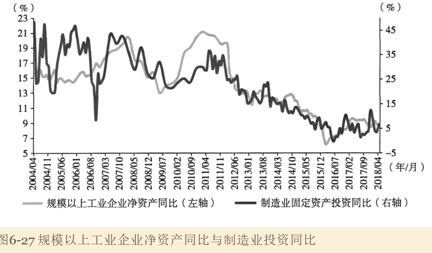

### 2. 去杠杆的两种操作

- 财政去杠杆：财政部门责令和督促地方政府和国有企业减少借贷，加快修复资产负债表
- 金融去杠杆：金融部门减少房贷，迫使企业和地方政府加快修复资产负债表

两种方法均着眼于减少经济活动中的债务积累，但存在以下重要差异：

1. 信贷市场上，信贷总量下降的同时，财政去杠杆将伴随着利率的下降，金融去杠杆将伴随着利率的上升。
2. 外汇市场上，财政去杠杆将带来资本流入的减少和汇率贬值倾向，金融去杠杆将带来资本流入的增加和汇率升值倾向
3. 实体经济领域，财政去杠杆和信贷利率的下降将造成民营投资被挤入市场，金融去杠杆将导致i政府、国企和民营企业的投资均被挤出市场
4. 出口领域，财政去杠杆通过引导汇率贬值进而可以刺激出口，金融去杠杆通过引导汇率升值将抑制出口
5. 尽管都倾向于直接减少总需求，财政去杠杆通过对出口和民营投资的积极影响，倾向于缓和以及稳定经济活动，金融去杠杆则倾向于通过硬质出口和民营投资进一步造成紧急萎缩
6. 如果信贷试产给存在隐形担保记忆所有制歧视，财政去杠杆将减少和缓和这些扭曲，但金融去杠杆将加剧扭曲，造成民营经济更显著受到信贷减少的影响
7. 财政去杠杆通过诱导利率下降、信贷扭曲环节和出口以及民间投资改善，有助于稳定权益市场。金融去杠杆通过迫使利率上升、加剧信贷扭曲、抑制出口和民间投资活动，从而进一步抑制权益市场的表现。

2014年以后，中国实际上走上了财政去杠杆的道路，并持续到2017年底。自2018年以来，由于严监管等一系列政策，实际上转向了金融去杠杆。

### 3. 关于财政去杠杆

### 4. 关于金融去杠杆

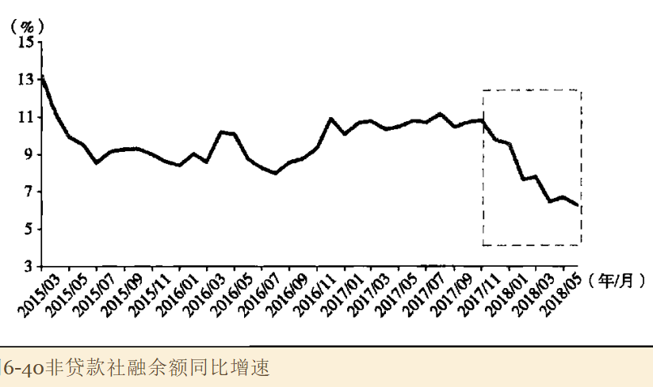

随着社会融资增速，特别是表外融资增速的下降，信贷市场利率上升，人名币对一揽子汇率上升，在国有企业和高评级融资平台利率大体稳定的条件下，民营企业和低评级平台利率水平的大幅上升。

宏观看，去杠杆的主题是国有企业和地方政府；从金融市场看，去杠杆的压力集中在民营企业和低评级的融资平台，政策指向于政策效果之间存在的偏离值得关注。

更重要的是，汇率升值倾向于一直出口，再加上贸易摩擦的影响，出口滑坡的风险也值得警惕。此外，假以时日，信贷紧缩对民间投资的挤出效也可能表现出来，这可能造成固定资产投资的进一步减速，造成国进民退。

批评意见认为，这是对国企民营企业加杠杆的惩罚。但是从微观视角有更多信息。

1. 看到的民营企业负债率数据是否存在系统性偏差，微观层面的经验观察到底代表了民营企业的一小部分，还是更精确地刻画了总体
2. 国有企业和地方政府平台的杠杆率是否过高，他们是不是过去中国经济加杠杆的主题？低利率在多大程度反映了政府隐形担保，多大程度反映了政府出色盈利能力和风险控制能力？惩罚坏的民营企业是否可以督促和加速国有企业去杠杆？如何惩罚和约束地方政府和国有企业领域存在的激进加杠杆行为？
3. 随着违约潮的蔓延，信贷市场是否普遍收紧了针对民营企业的房贷活动？是否存在误伤？
4. 对于高杠杆民企，是否应该区分流动性缺失和清偿能力丧失的情况
5. 更一般的看，一个人干坏事是品德问题，一群人干坏事是制度问题。单个民营企业激进的加杠杆，遭遇紧缩压力不值得同情。相当多的民营企业存在激进加杠杆的行为，是否应该检讨制度安排？
