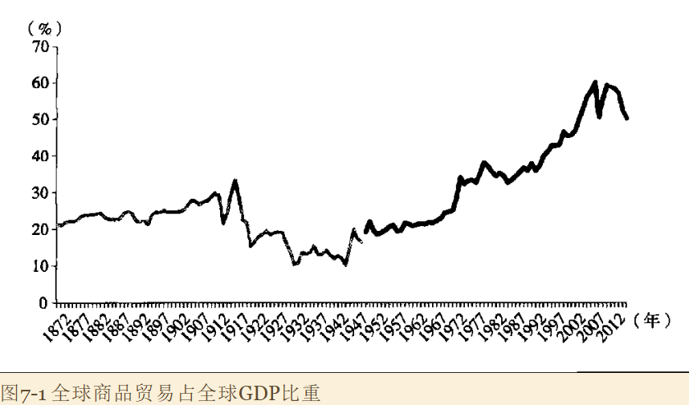
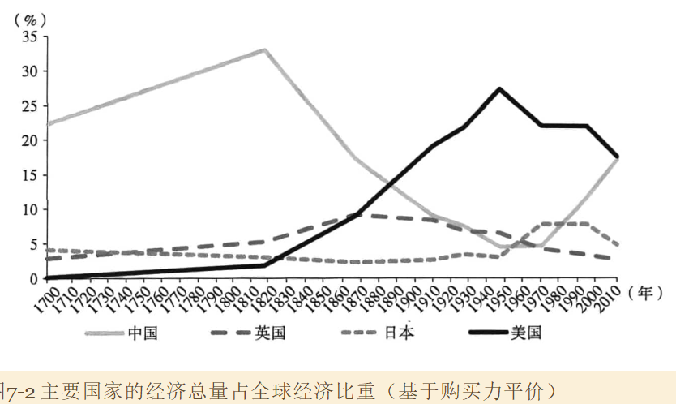
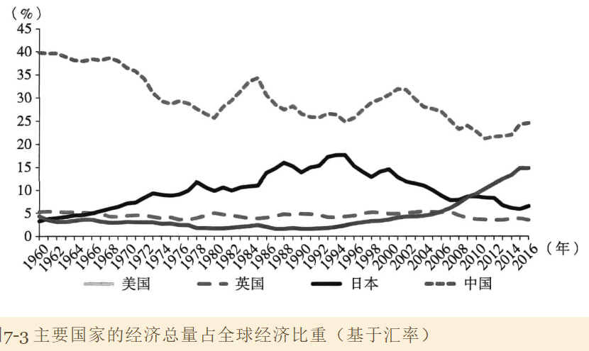
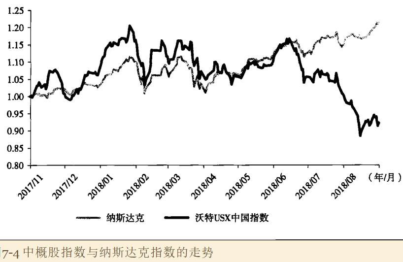
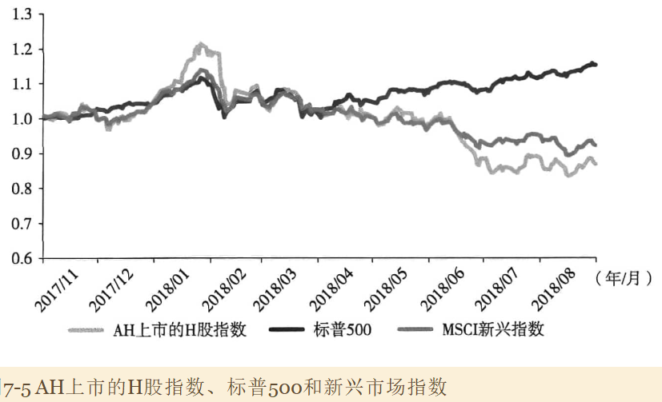

## 国际贸易摩擦的由来和前景

### 1. 国际贸易摩擦的来源

市场经济的关键因素：

1. 市场经济制度通过自由交换促进了专业分工，每一个人集中做自己最擅长的事，通过市场实现商品或服务的交换
2. 促进充分的竞争，充分的竞争既能刺激分工的深化，又能促进技术的进步、专业知识的积累。

市场经济制度不是自发形成的，需要一系列极其重要的制度安排来支持：

1. 保护私有产权，包括知识产权，这是市场经济制度得以高效率运行的关键
2. 破除垄断、抑制强权，保证公平和充分的竞争；市场在竞争过程中很容易形成垄断，这些垄断有可能转化为政治上的强权。
3. 便利的交易

因此市场需要一些强制力量来保证。同时市场自发的力量会跨过一国的边界，这两点在本质上是相互冲突的。跨国贸易的有效性和可得性面临困难

### 2. 全球贸易发展的历史

为什么1920年会出现严重的倒退和收缩？

1900-1920年的全球化没有一个相对应的全球治理结构去维持它。市场力量需要一些基础的制度安排去维持，需要保护产权、促进竞争以及国际汇兑等一系列的制度安排。而这一轮全球化没有这样一种制度去安排和支持它，完全是由市场力量自发形成的全球化。

这种自发形成的全球化在上升浪潮时，每一个人都获益。但是当经济衰退到来时，每一个国家的反应都是要保护本国产业，竞争性加税，因此跨国贸易基本就被阻断了。除了加关税，另一个方法时对货币进行竞争性贬值，导致国际汇兑体系极其混乱，加剧经济衰退和收缩。

为什么二战结束后，全球化能取得这么大的成就

### 3. 以美国为中心的全球经济治理体系

（上图图例有问题？）

国球治理体系由一系列的支柱构成。

- 贸易层面，最早的关税与贸易总协定，以及后来的WTO，引导各国单向、几乎不可逆地降低关税。

- 国际汇兑安排上，国际货币基金组织总体上维持了国际汇兑体系地稳定；
- 政治上，联合国虽然不是一个特别有效率地政治组织，但是比国联更有力量。还有世界银行等。

### 4. 新时期美国维持全球经济治理体系的愿望和能力都在下降

中国经济实力快速提升，到2030年，中国的经济总量将比美国还要大。美国维持目前全球经济治理体系的愿望和能力都在下降，至少边际上在下降。

美国的国家利益是什么？

1. 维护自己的意识形态、价值观念和生活方式，并在全球范围之内对此推广
2. 保证在核心技术和军事能力上拥有领先甚至压倒性优势。
3. 让美国商人在全球范围内能够自由地做生意

但是在所有三个仿麦呢，中国都对美国构成了不可忽视地挑战。

### 5. 中美关系的不确定

1992-2012年，美国希望把中国纳入美国为主导的经济体系，经贸关系是中美关系的重要压舱石。

2012年以来，这些基石都动摇了。

## 国际贸易环境对金融市场的影响

定量分析上最大的困难在于无法直到如果没有贸易摩擦，金融市场会是怎样的。

### 1. 从资本市场反应来观察贸易摩擦的影响

首先观察上证指数。

在贸易摩擦早期，2018年3月至5月底，中国金融市场一般性看法，中美贸易摩擦的威胁只是说说而已，没有做好充足的思想准备。到了6月中旬，认识到中美摩擦是一个严肃的威胁，市场出现极大幅度的下跌。

再看美国市场。

管擦美国市场的好处在于，参与美国市场上中概股交易的主要是美国本土的投资者，不受中国去杠杆政策的影响。在3月到5月中概股指数与纳斯达克指数的走势非常接近。但在中美双边关税正式落地时，两个指数却出现了巨大的分化和反向运动：纳斯达克指数指数不断创新高，中概股指数却出现了大幅度下跌。

最后再观察企业在香港上市的H股指数，其包含大量国际投资者和一部分国内投资者。第一，总体而言，中美贸易摩擦爆发前，H古指数更受MSCI新兴市场指数的一般影响；在中美互征关税后，市场出现了剧烈的调整。

### 2. 贸易摩擦对资本市场影响的定量估计

第一，对制造业相关标的的影响进行粗略检验。把涉及的全部行业构造成一个成分值，然后用中证500指数解释这个成分值。发现解释力超过90%

但如果把中美两轮互征关税之间市场产生明显担忧并左除调整的阶段鼓励出来，并用一些虚拟变量控制，就可以得到一个非常明确的结果：这些虚拟变量不显著。也就是说：投资者担心的不是标的行业会受到抑制，也不是中国制造业的升级或崛起会受到抑制。

第二，定量估计贸易摩擦对市场影响大小。

### 3. 几点评论

