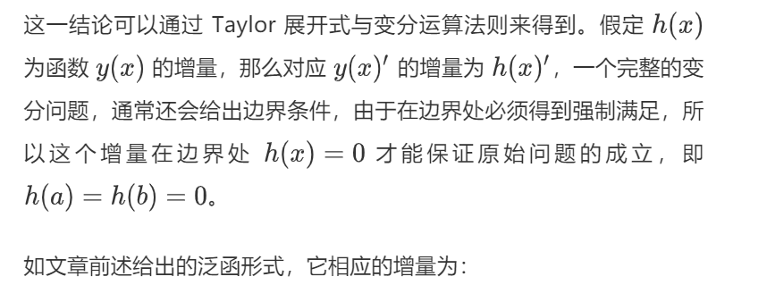
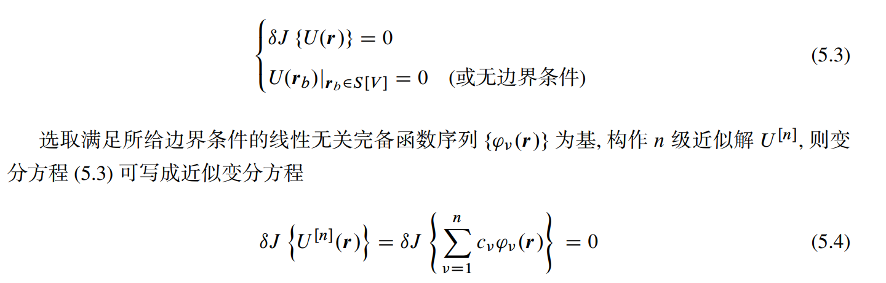
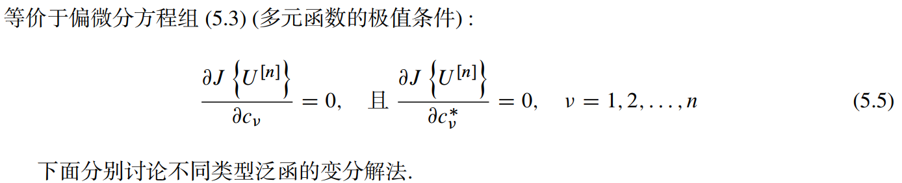

### 变分算子$\delta$

一个函数$y(x)$的变分记作$\delta y$，意义为：当独立变量（自变量）**x保持不变时**（因为自变量变化程度为 0，即为一个定值，所以记为$\delta x=0$），函数$y(x)$产生的一个微笑的变化，即为$\delta y$。

**在函数的微积分中，我们知道函数值的变化量是由于函数自变量的变化引起的，而在泛函中，自变量保持不变，那么应变量的变化只能是函数形式发生改变而引起的**

$$I[y(\cdot)] = \int_a ^b F(x, y, y')dx$$

$I$就是一个泛函。可以把变分符号当作微分符号来处理。多元函数全微分的意义在于给出自变量变化引起的函数值变化的大小，本质上为某一方向（变量）上，单位长度引起的函数值变化（一阶导数或斜率）与这一方向（变量）的变化量的乘积。依据全微分的概念，可以很好地理解泛函的变化量$\delta I$。

1)由于y变化(从$y\rightarrow y+\delta y$)$y'$时函数的一阶导，其变化几位$\delta y'$，那么被积函数$F$的变化量为：

$$\partial F = \frac{\partial F}{\partial y} \delta y + \frac{\partial F}{\partial y'} \delta y'$$

2)函数**全微分**的定义为：

$$\mathrm{d}F = \frac{\partial F}{\partial x} \mathrm{d}x + \frac{\partial F}{\partial y} \mathrm{d}y + \frac{\partial F}{\partial y'} \mathrm{d}y'$$

对比变分与微分可知，他们呢运算基本相同，唯一不同的时自变量x，在泛函中，$\delta y$是在保持自变量x不变的情况下定义的，所以$dx=0$，即2）中右边第一项为0

### 变分运算法则

$$
\delta (F_1 \pm F_2) = \delta F_1 \pm \delta F_2\\
\delta(F_1 F_2) = F_2 \delta F_1 + F_1\delta F_2\\
\delta(F_1)^{n} = n(F_1)^{n - 1} \delta F_1\\
\frac{\mathrm{d}}{\mathrm{d}x} \delta = \delta(\frac{\mathrm{d}y}{\mathrm{d}x})
$$

### 变分取极值

类似于函数的极值，泛函取得极值的条件时：

$$\delta I = 0$$

$$
\begin{aligned}
\Delta I = I(y + h) - I(y)
= \int_a ^b [F(x, y + h, y' + h') - F(x, y, y')]\mathrm{d}x
\end{aligned}
$$
Taylor展开：
$$
\Delta I = \int_a ^b [F_y (x, y, y') h - F_{y'}(x, y, y') h'] \mathrm {d} x + 高阶项 \\
= \Delta I + o (h^2)
$$
忽略高阶项，并使用分部积分法：
$$
\Delta I = \int_a ^b [\frac{\partial F}{\partial y} - \frac{\mathrm{d}}{\partial x}(\frac{\partial F}{\partial y'})]h \mathrm{d}x + \frac{\partial F}{\partial y'}h|_{x=0} ^{x =b}
$$
**得到泛函取极值的条件**：
$$
\frac{\partial F}{\partial y} - \frac{\mathrm{d}}{\partial x}(\frac{\partial F}{\partial y'}) = 0
$$

### 意义

**变分问题与微分方程描述的问题是可以相互转化的（PDE 转化为泛函极值**

在实际中，因为微分方程的边界条件的限制、以及方程本身，基本无法得到解析求解，所以，将积分形式转换为微分形式进行求解不是一个明智的选择；更为普遍的是把微分方程通过变分法得到其等效积分形式，按照泛函极值问题来确定，**因为极值问题的求解代价相比于 PDE 的求解要小的多**，这也是为什么要研究泛函的原因，其价值在于能够为 PDE 的求解带来方便。

### 求解

以ritz法为例

参考：http://www.pynumerical.com/archives/48/

https://www.jlao.net/wp-content/uploads/2012/05/Chap5.pdf