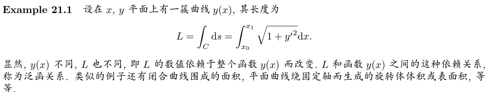
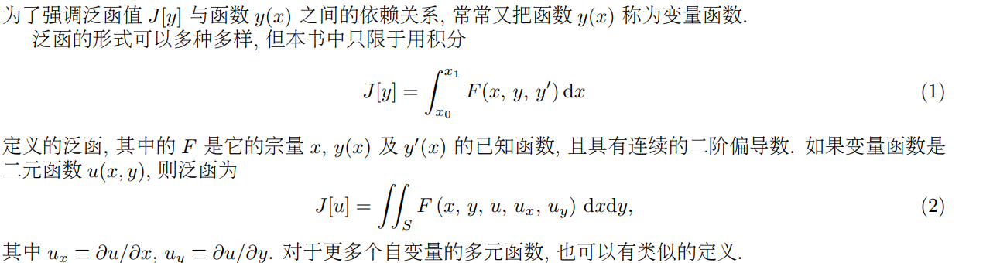
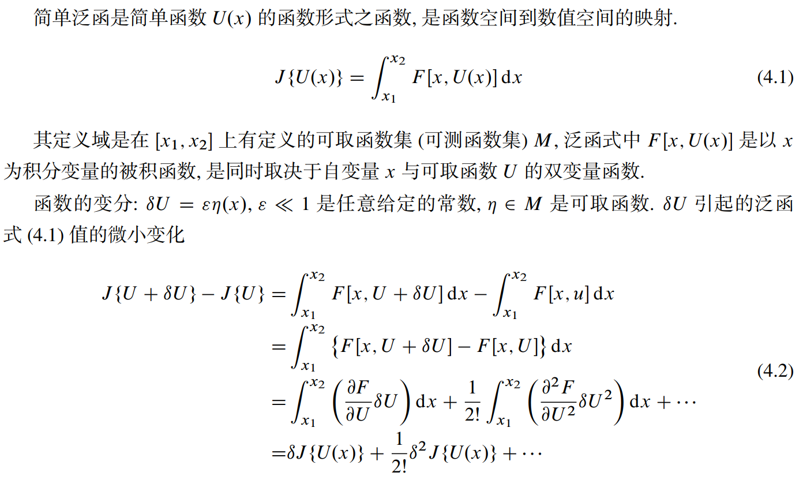
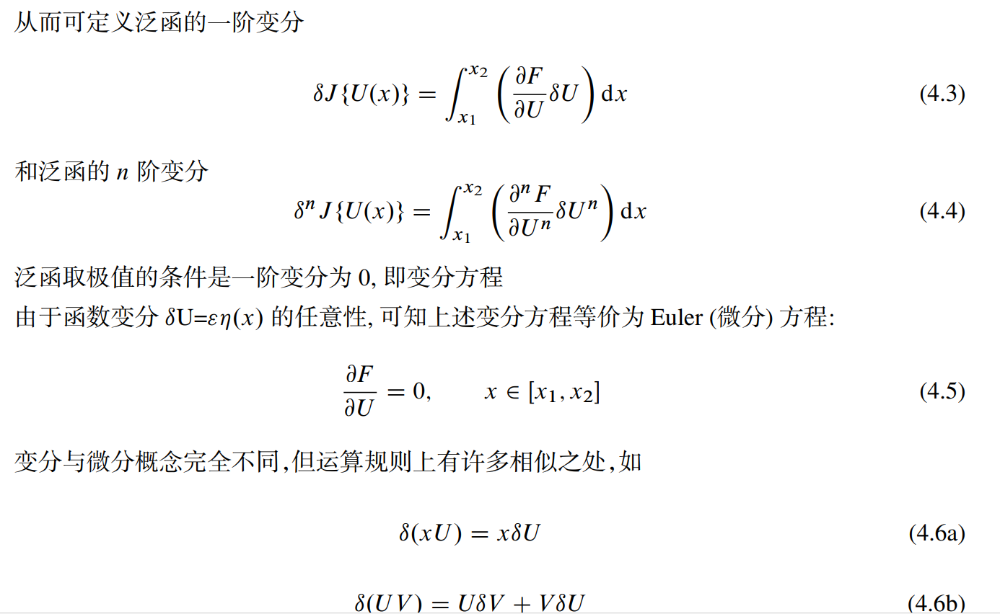

#### 1. 泛函的概念

泛函与复合函数不同，对复合函数g(f(x))来说，给定一个x，仍然有一个g与之对应。

泛函则必须给出某一区间上的函数y(x)，才能得到一个泛函值J[y]。**定义在同一区间上的函数值不同，泛函值当然不同。**

#### 2. 泛函极值

#### 

#### 3. 变分与欧拉边值问题

## 附录

#### 本征值

https://www.zhihu.com/question/52992219

参考：https://astrojacobli.github.io/Homepage/doc/Mathematical_Method/chpp21.pdf

[Chap4.pdf (jlao.net)](https://www.jlao.net/wp-content/uploads/2012/05/Chap4.pdf)