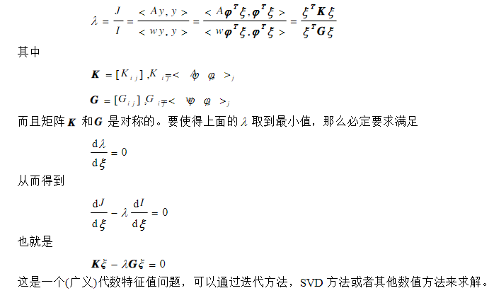
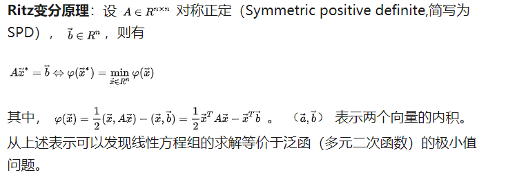

**PDE的解是能将原泛函数最小化的函数**

两个思路：

1. 直接从泛函数出发，寻找最小化其函数
2. 通过变分法得到PDE，然后求PDE的解（近似解）

## sturm-liouville微分方程与特征值

$$
Ay(x)=-\frac{d}{dx}[p(x)\frac{dy(x)}{dx}]+q(x)y(x),x\in(x_0,x_1)
$$

其中，p(x),q(x)都是已知函数，且p(x)!=0,那么
$$
Ay(x)=\lambda w(x)y(x)
$$

这就是sturm-liouville微分方程，其中权函数$w(x)\geq 0$，当给定了齐次边界条件后，只有一些特定的$\lambda$才有非零解。使得该丰城由非零解的$\lambda$称为特征值，相应的解为特征函数。

#### Rayleigh原理
对于任意函数y(x)，定义
$$
\frac{<Ay,y>}{<wy,y>}=\frac{x^*Ax}{x^*\omega x}
$$
我们称该泛函为算子A的Rayleigh 商（quotient）

基于以上定义, 有:

$$
\lambda=st._{y=0}\frac{<Ay,y>}{<wy,y>}
$$

####  Rayleigh-Ritz法

首先法特征值问题(2)转化为变分问题,然后用数值方法求解该变分问题:

$$y(x)=\varphi^T\xi$$
$$\varphi=[\varphi_1(x),\varphi_1(x),\varphi_2(x),...\varphi_n(x)]^T$$
$$\xi=[\xi_1(x),\xi_2(x),...\xi_n(x)]$$

其中,$\xi$是待定常数,$\varphi$是基函数,他们满足边界条件.实际应用中,最好从一组完备的函数系中选取基函数,如幂函数,三角函数等.将y(x)的表达式嵌入$\lambda$的定义中,得到:

#### 举例说明

$$ Ax = \lambda x$$

~~瑞利商则是~~：

$$ R(A,x)=\frac{x\cdot Ax}{x\cdot x} = \frac{x^HAx}{x^Hx}$$

$x^H$denotes the Hermitian (complex conjugate transpose) of x。

#### **Ritz变分原理**

那么由Ritz定理如何去求线性方程组呢？由上述定理知道，线性方程组的解等价于去寻找泛函的极小值。

1. 最速下降法
2. 共轭梯度法

参考：http://www.math.pitt.edu/~sussmanm/2071Spring08/lab08/index.html

http://people.inf.ethz.ch/arbenz/ewp/Lnotes/2010/chapter12.pdf