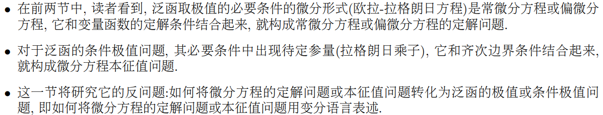
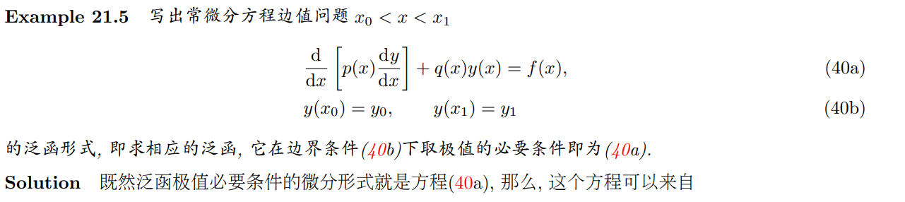
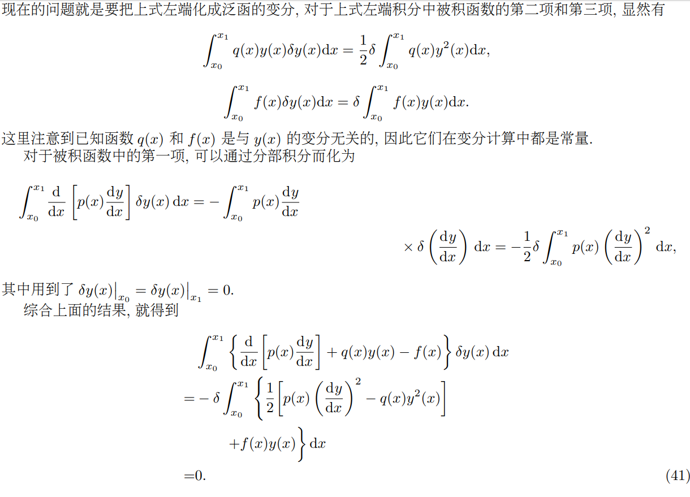
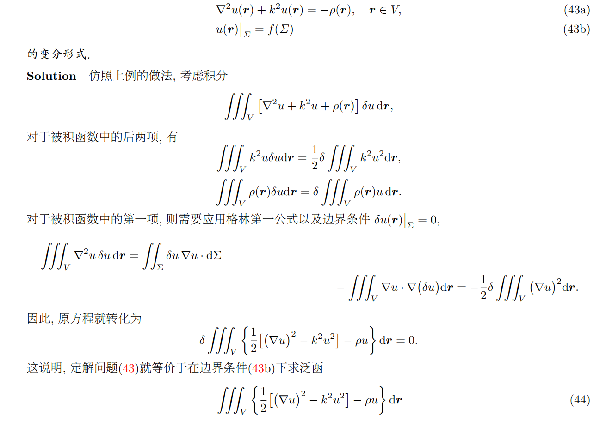
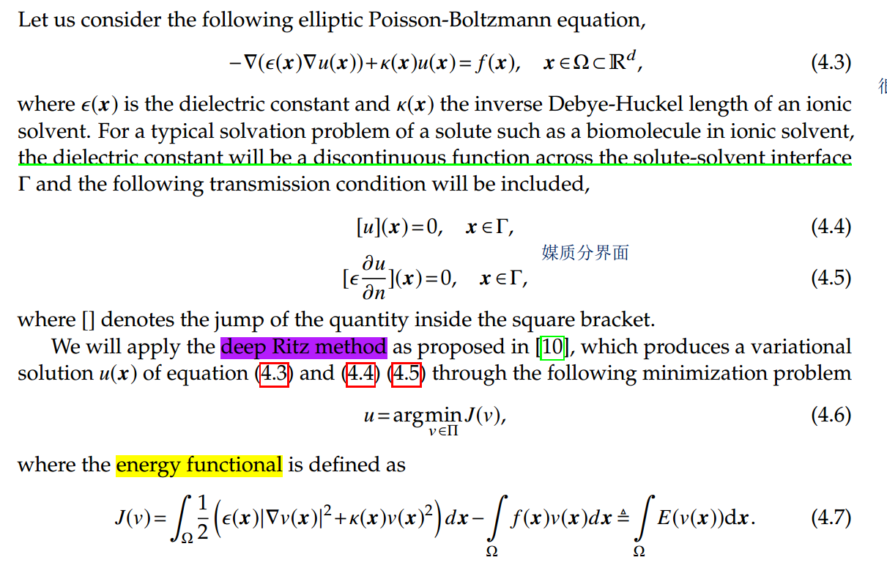
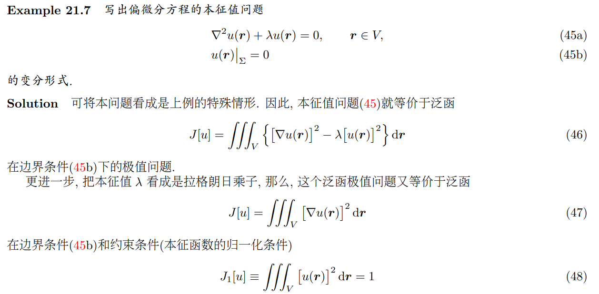
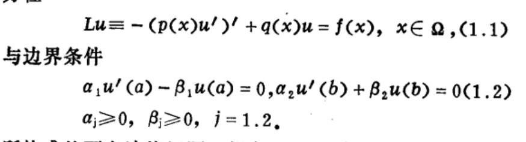
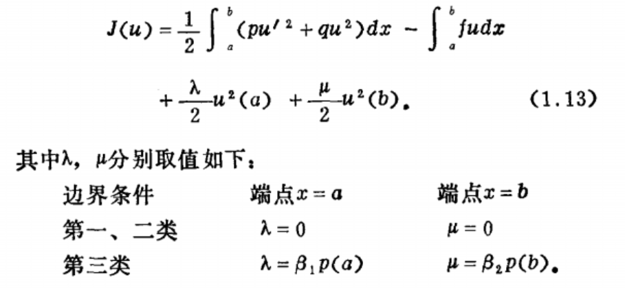

### 微分方程转化为变分问题

#### 4.1 example 1

$$ \int^{x_1}_{x_0}\{\frac{d}{dx}[p(x)\frac{dy}{dx}] + q(x)y(x)-f(x) \}\delta y(x)dx=0$$

说明，方程(40a)是泛函

$$
J[y]=\int^{x_1}_{x_0}\{ \frac{1}{2} [p(x)(\frac{dy}{dx})^2-q(x)y^2(x)]+f(x)y(x)\}dx
$$
取得极值的必要条件。

#### 4.2 example 2

#### 4.3 Sturm-Liouville 本征值问题

## 椭圆方程
$$
\frac{\partial}{\partial x}\beta\frac{\partial u}{\partial x}+\frac{\partial}{\partial y}\beta\frac{\partial u}{\partial y}=-f
$$

在边界上满足以下条件：
$$
\begin{cases}
   u&=g_0,\quad 在\Gamma_D上 \\
  \partial_n u&=g_1 ,\quad 在\Gamma_N上
\end{cases}
$$

#### 能量方程

能量方程就是对应的泛函J。
$$
J(u)=\iint_\Omega(\frac{1}{2}(\beta(\frac{\partial u}{\partial x})^2+\beta(\frac{\partial u}{\partial y})^2)-fu)dxdy
$$
变分法思想：$J(u)$取极值的时候，就是原问题的解，极值等价与它的变分为$\delta J(u)=0$:
$$
\delta J(u)=\iint_\Omega(\beta\frac{\partial u}{\partial x}\frac{\partial \delta u}{\partial x}+\beta\frac{\partial u}{\partial y}\frac{\partial \delta u}{\partial y}-f\delta u)dxdy
$$
用格林恒等式：
$$
\delta J(u)=-\iint_\Omega(\frac{\partial }{\partial x}\beta\frac{\partial  u}{\partial x}+\frac{\partial }{\partial y}\beta\frac{\partial  u}{\partial y}+f)\delta udxdy+\int_{\Gamma_N}\beta \frac{\partial u}{\partial \nu}\delta uds+\int_{\Gamma_D}\beta \frac{\partial u}{\partial \nu}\delta uds
$$
在边界$\Gamma_D$上，有$\delta u=0$，
$$
\delta J(u)=-\iint_\Omega(\frac{\partial }{\partial x}\beta\frac{\partial  u}{\partial x}+\frac{\partial }{\partial y}\beta\frac{\partial  u}{\partial y}+f)\delta udxdy+\int_{\Gamma_N}\beta \frac{\partial u}{\partial \nu}\delta uds
$$
要让$\delta J(u)$对所有$\delta u$恒等于0，只有积分号中$\delta u$的系数恒等于零即：
$$
\begin{cases}
   \frac{\partial }{\partial x}\beta\frac{\partial  u}{\partial x}+\frac{\partial }{\partial y}\beta\frac{\partial  u}{\partial y}&=-f\quad在\Omega中 \\
  \beta \frac{\partial u}{\partial \nu}&=0\quad在\Gamma_N上
\end{cases}
$$

可见，使用变分问题，$$自动包含了诺依曼边界条件$$。（因此它被称作自然边界条件），而Dirichlet边界条件没有包含在内，需单独列出。也被称作实质边界条件（Essential Boundary Condition）

### 总结

对于如下问题：
$$
\begin{cases}
\frac{\partial}{\partial x}\beta\frac{\partial u}{\partial x}+\frac{\partial}{\partial y}\beta\frac{\partial u}{\partial y}&=-f,\quad在\Omega上 \\
   u&=g_0,\quad 在\Gamma_D上 \\
  \partial_n u&=g_1 ,\quad 在\Gamma_N上
\end{cases}
$$

与泛函极值问题：
$$
\{ \begin{cases}
J(u)&=\iint_\Omega(\frac{1}{2}(\beta(\frac{\partial u}{\partial x})^2+\beta(\frac{\partial u}{\partial y})^2)-fu)dxdy,\quad在\Omega上取极值 \\
   u&=g_0,\quad 在\Gamma_D上
\end{cases}
$$
等价（这里存疑）

## 有限元分析

#### 边界条件

第一类：$\alpha=0,\quad \beta=1$，

第二类：$\alpha=1,\quad \beta=0$，

第三类：$\alpha=1,\quad \beta\neq 0$，

#### 注意

边界条件右端不等于0时，第一第二类边界条件可以转化为第三类边界条件。

参考：

http://fuzihao.org/blog/2014/03/15/%E5%81%8F%E5%BE%AE%E5%88%86%E6%96%B9%E7%A8%8B%E5%8F%98%E5%88%86%E9%97%AE%E9%A2%98%E4%B8%8E%E5%8E%9F%E9%97%AE%E9%A2%98%E7%AD%89%E4%BB%B7%E6%80%A7%E7%9A%84%E6%8E%A2%E8%AE%A8/