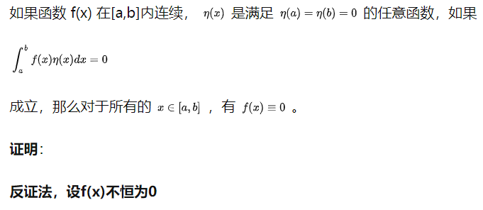
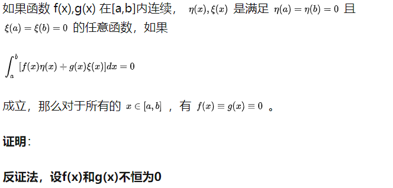
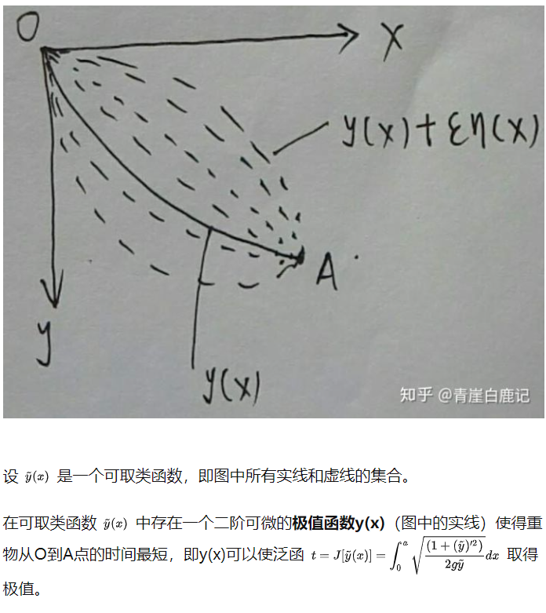
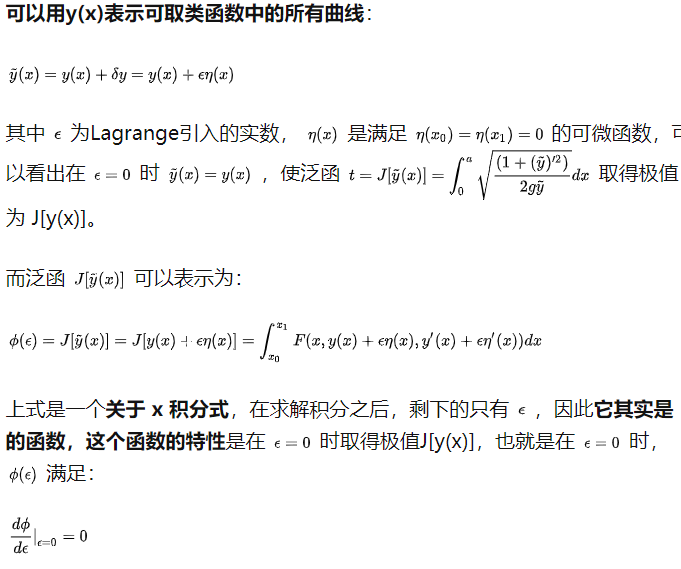
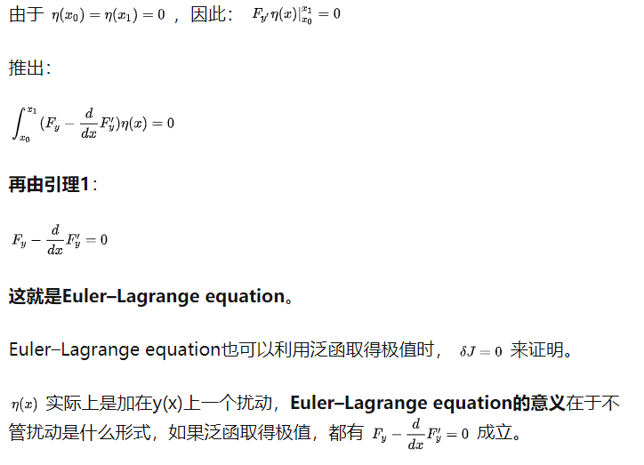

### 引理

#### 引理1

#### 引理2

### 函数的变分

对于任意定值 $x\in[x_0,x_1]$，可取函数 $y(x)$ 与另一可取函数 $y_0(x)$ 之差 称为函数y(x) 在 ![[公式]](https://www.zhihu.com/equation?tex=y_0%28x%29) 处的**变分或者叫函数的变分**，记作 $\delta y$ ，其中 $\delta$称为变分算子，那么

$$\delta y = y(x)-y_0(x)=\epsilon \eta(x)$$

这里注意一下**函数的变分**与**函数的增量** 之间的区别，如图所示：

- 变分是不同函数在自变量x固定时的差，是因为函数发生了改变；
- 函数增量是函数的自变量x增加导致函数的增加。

### 欧拉-拉格朗日方程

意义在于泛函取得极值的必要条件。

参考资料：https://zhuanlan.zhihu.com/p/41810184