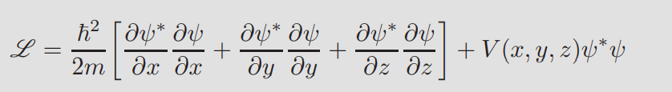
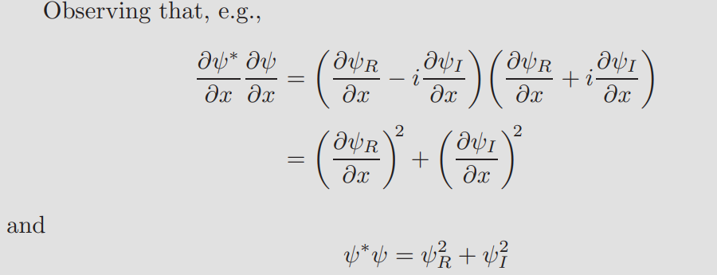
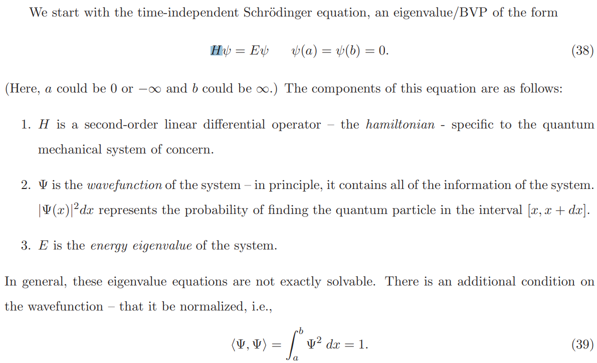
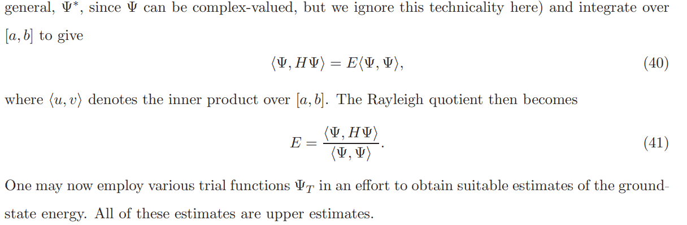

含时间项的薛定谔方程（ Schr¨odinger equation）：
$$
-\frac{h^2}{2m}\nabla^2\psi + V\psi = E\psi
$$
其中$\psi$是复数；V是实数；$E=-\lambda$；

其复数变分形式为：

具体过程见参考文献

参考：

https://courses.physics.ucsd.edu/2009/Fall/physics130b/Calc_Var.pdf

### 不含时间项的薛定谔方程

特征值方法？？ 

参考：[lect21exam2.ps (uwaterloo.ca)](http://links.uwaterloo.ca/amath353docs/set7.pdf)

