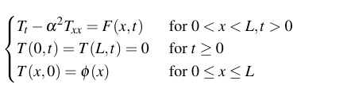
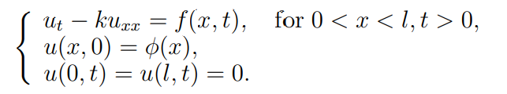
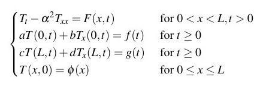
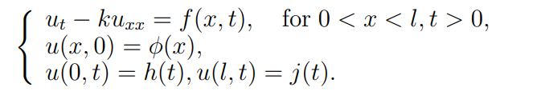

## 1. 边界条件

### homogeneous boundary conditions  

#### example

inhomogeneous heat equation with homogeneous Dirichlet conditions.

### inhomogeneous

g和f都是光滑函数，即是连续且有连续导数。

#### example

inhomogeneous heat equation with inhomogeneous Dirichlet conditions.

## 2. solution

#### trivial solution

So the **constant function u = 0** is a solution to every homogeneous linear partial differential equation. This not-so-exciting solution is often called the **trivial solution**. Our main interest, of course, will be in the nontrivial solutions.

参考：http://web.math.ucsb.edu/~grigoryan/124B/lecs/lec7.pdf

https://medium.com/cantors-paradise/the-heat-equation-nonhomogeneous-boundary-conditions-eea5910d777c

http://howellkb.uah.edu/MathPhysicsText/PDEs/PDE1.pdf