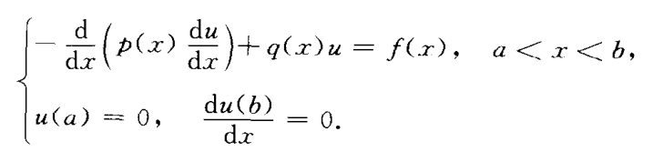
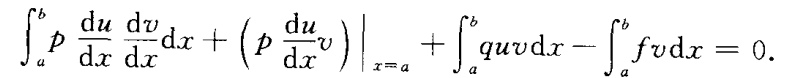
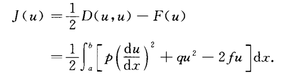

### 1. 偏微分形式

### 2. 等效积分弱形式（Galerkin变分）

### 3. Ritz变分

参考：《微分方程数值解法》陆金甫，关治。195页

### 1. 古典解

若某函数具有偏微分方程中所出现的各阶**连续偏导数**，且代入方程后成为一个恒 等式，则称此函数为该偏微分方程的一个解（古典解）

### 2. 广义解

广义解是一个完全具有物理意义的解

比如对于二阶椭圆方程，其等效弱积分形式只需要**一阶偏导数可积**就行。