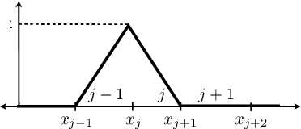

### 1. 形函数

假定solution T可以用多项式来表示：：

$$\tilde{T}(x) = \sum _{j=1}^{N+1} a_ j \phi _ j(x)$$

$\phi(x)$即为形函数。$\alpha$为自由度，选择：$a_ j = \tilde{T}(x_ j)$

$$\tilde{T}(x) = \sum _{j=1}^{N+1} \tilde{T}(x_ j) \phi _ j(x).$$

那么多项式在任意一个节点i则为：

$$\displaystyle  \sum _{j=1}^{N+1} \tilde{T}(x_ j) \phi _ j(x_ i),$$

$$\displaystyle \Rightarrow \phi _ j(x_ i) \quad = \quad \left\{  \begin{array}{cl} 1, &  \mbox{if } i = j, \\ 0, &  \mbox{if } i \neq j. \end{array}\right.$$

因为在单元内，**solution是线性变化的，在单元以外的区域形函数植为0**，其方程式为：

$$\phi _ j(x) = \left\{  \begin{array}{cl} 0, &  \mbox{for } x < x_{j-1}, \\[0.1in] \frac{x-x_{j-1}}{\Delta x_{j-1}}, &  \mbox{for } x_{j-1} < x < x_{j},\\[0.1in] \frac{x_{j+1} -x}{\Delta x_{j}}, &  \mbox{for } x_{j} < x < x_{j+1},\\[0.1in] 0, &  \mbox{for } x > x_{j+1}. \end{array}\right. $$




代码：

```matlab
% FEM solver for d2T/dx2 + f = 0 where f = 50 exp(x)
%
% BC's: T(-1) = 100 and T(1) = 100.
%
% Gaussian quadrature is used in evaluating the forcing integral.
%
% Note: the finite element degrees of freedom are
%       stored in the vector T.

% Number of elements
nElem = 5;
x = linspace(-1,1,nElem+1);

% Set quadrature rule
Nq = 2;
if (Nq == 1),
  alphaq(1) = 2.0; xiq(1) = 0.0;
elseif (Nq == 2),
  alphaq(1) = 1.0; xiq(1) = -1/sqrt(3);
  alphaq(2) = 1.0; xiq(2) =  1/sqrt(3);
else
  fprintf('Error: Unknown quadrature rule (Nq = %i)\n',Nq);

  return;
end

% Zero stiffness matrix
K = zeros(nElem+1, nElem+1);
F = zeros(nElem+1, 1);

% Loop over all elements and calculate stiffness and residuals
for elem = 1:nElem,

  n1 = elem;
  n2 = elem+1;

  x1 = x(n1);
  x2 = x(n2);

  dx = x2 - x1;

  % Add contribution to n1 weighted residual due to n1 function
  K(n1, n1) = K(n1, n1) - (1/dx);

  % Add contribution to n1 weighted residual due to n2 function
  K(n1, n2) = K(n1, n2) + (1/dx);

  % Add contribution to n2 weighted residual due to n1 function
  K(n2, n1) = K(n2, n1) + (1/dx);

  % Add contribution to n2 weighted residual due to n2 function
  K(n2, n2) = K(n2, n2) - (1/dx);

  % Evaluate forcing term using quadrature
  for nn = 1:Nq,

    % Get xi location of quadrature point
    xi = xiq(nn);

    % Calculate x location of quadrature point
    xq = x1 + 0.5*(1+xi)*dx;

    % Calculate f
    f = 50*exp(xq);

    % Calculate phi1 and phi2
    phi1 = 0.5*(1-xi);
    phi2 = 0.5*(1+xi);

    % Add forcing term to n1 weighted residual
    F(n1) = F(n1) - alphaq(nn)*0.5*phi1*f*dx;

    % Add forcing term to n2 weighted residual
    F(n2) = F(n2) - alphaq(nn)*0.5*phi2*f*dx;

  end

end

% Set Dirichlet conditions at x=-1
n1 = 1;
K(n1,:)    = zeros(size(1,nElem+1));
K(n1, n1)  = 1.0;
F(n1)      = 100.0;

% Set Dirichlet conditions at x=1
n1 = nElem+1;
K(n1,:)    = zeros(size(1,nElem+1));
K(n1, n1)  = 1.0;
F(n1)      = 100.0;

% Solve for solution
T = K\F;


% Plot solution
figure(1);
plot(x,T,'*-');
xlabel('x');
ylabel('T');

% For the exact solution, we need to use finer spacing to plot
% it correctly.  If we only plot it at the nodes of the FEM mesh,
% the exact solution would also look linear between the nodes.  To
% make sure there is always enough resolution relative to the FEM
% nodes, the size of the vector for plotting the exact solution is
% set to be 20 times the number of FEM nodes.
Npt = 20*nElem+1;
xe = linspace(-1,1,Npt);
Te = -50*exp(xe) + 50*xe*sinh(1) + 100 + 50*cosh(1);
hold on; plot(xe,Te); hold off;

% Plot the error.  To do this, calculate the error on the same
% set of points in which the exact solution was plot.  This
% requires that the location of the point xx(i) be found in the
% FEM mesh to construct the true solution at this point by linearly
% interpolating between the two nodes of the FEM mesh.

Terr(1) = T(1) - Te(1);
h = x(2)-x(1);
for i = 2:Npt-1,
  xxi = xe(i);
  Tei = Te(i);
  j = floor((xxi-xe(1))/h) + 1;
  x0 = x(j);
  x1 = x(j+1);
  T0 = T(j);
  T1 = T(j+1);
  xi = 2*(xxi - x0)/(x1-x0)-1;  % This gives xi between +/-1
  Ti = 0.5*(1-xi)*T0 + 0.5*(1+xi)*T1;
  Terr(i) = Ti - Tei;
end
Terr(Npt) = T(nElem+1) - Te(Npt);

figure(2);
plot(xe,Terr);
xlabel('x');
ylabel('Error');

```


参考：

[2.9 Introduction to Finite Elements | 2.9 Introduction to Finite Elements | Unit 2: Numerical Methods for Partial Differential Equations | Computational Methods in Aerospace Engineering | Aeronautics and Astronautics | MIT OpenCourseWare](https://ocw.mit.edu/courses/aeronautics-and-astronautics/16-90-computational-methods-in-aerospace-engineering-spring-2014/numerical-methods-for-partial-differential-equations/introduction-to-finite-elements/1690r-1-d-linear-elements-and-the-nodal-basis/)

