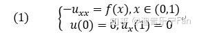
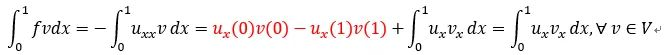
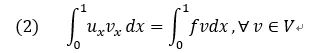
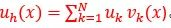
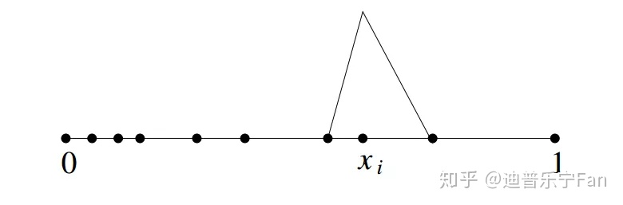

#### 有限元思想

对于一个定义在(a,b)的复杂的函数f(x)，要得到精确的插值，一般先把大区间(a,b)分解为若干个小区间进行插值，最后将每个小区间上的插值函数加起来得到整个区间的插值函数。

对一维函数，是基于小区间，二维三维则是网格。

有限元也借助这个思想，首先我们将求解区域划分成有限个不同的网格（或者单元，finite element），接着在每个小网格（单元）上把解表示出来，最后将每个单元上的解加起来就得到了整个区域上的解。

#### 划分网格

在精度要求高（有奇异值附近）需要加密网格

自适应有限元方法（adaptive FEM）

## 如何表示解

#### 基函数逼近。

1.多项式
插值最常见的有多项式插值，即用一个简单的多项式p(x)来近似复杂函数f(x)。这个多项式要满足在插值节点$x_k$上的值与f(x)相等：$p(x_k)=f(x_k)，k=0,1,2…N$，通过这个条件就能唯一确定系数$c_k$，从而得到相应的插值函数。
2.三角函数
这其实就是傅里叶级数了。如果用三角函数去近似，发展的就是另一套数值方法了，即谱方法（spectral method）。

经典有限元方法采用的就是多项式插值，只是多项式的表达式要稍微变化一下。定义一个函数空间$W={1,x,x^2…x^k…x^N}$，W是由N+1个线性无关的基${1,x,x^2…x^k…x^N}$张成的，**寻找满足条件的p(x)其实就是相当于在函数空间W中寻找满足条件的解**。

#### 解的弱形式

PDE是强形式，对解要求太高了，引入弱形式（weak form），降低对解的光滑性要求。
方法：对PDE两端乘上一个充分光滑的函数v（test function），然后再区域上分部积分。

#### 最终求解：

还是以上面的例子为例，这里的V是某个函数空间，由一些特殊光滑函数构成的空间，显然满足条件的函数是无穷多的，也就是说函数空间是无穷维的。对于一个无穷维的空间，我们是无法投入计算的。怎么办?近似呗！我们可以找一个V的有限维子空间，用这个子空间去近似V。既然这个子空间是有限维的，我们就可以找这个空间的一组基${v_k,k=1,2,..N}$，然后用这组基来线性表示所要找的解u。

将这个表达式带入到弱形式中，并让v取遍函数空间，我们就得到一个关于未知系数的线性方程组，从而可以求解u了。

#### 单元解的叠加等于全局的解

基函数的构造决定了每个单元上的数值解之和就是所求的数值解

我们希望解：（1）连续（2）局部紧凑compact，即每个单元单独计算。

如果一个函数在整个区域中连续，怎么又能和其他单元没关系呢? 这就是基函数构造的trick了。为了方便阐述，列举如下简单的线性基函数：

这个基函数其实是这样构造的：

1. 在(0,1)上连续；
2. 在$x_i $处为1，在其他点处为0;
3. 在区间$[x_{i-1},x_i]$上是线性函数

首先我们可以简单地证明这样定义的是唯一存在的，而且彼此是线性无关的。再者，我们可以看到，只有在第i个单元上函数值不为零，其它地方都为零。这样构造的基函数就使得，都是连续的，而且每个基函数只与相邻单元的基函数有关系，和其他单元没有关系，这样就达到了我们想要的连续性和紧凑性。

#### 总结

相信大家也体会到了，在有限元中，精髓在于基函数的构造，它决定了数值解的性质。在实际问题中，我们可能遇到各种问题，真实解有不同的性质。比如，在求解maxwell方程时，我们知道电场切向分量是连续的，但法向分量是不连续的，而磁场则相反，如果我们仍然用连续的基函数去近似这些不连续的分量，即使算的”再好”，也是差的。针对这个问题，Nedelec就分别构造了满足切向连续和法向连续的有限元（Nedelec elements）。再如（插个广告），我自己目前做的针对双曲守恒律方程发展的间断有限元方法，前面提到，这类方程是有可能产生间断解的，要求解这类方程，我们需要使用间断的有限元来进行近似。

参考：https://zhuanlan.zhihu.com/p/59196290