### 1. 什么是有限元

有限元方法是一类数值方法，还有很多subclass：Galerkin mixed，collocation finite element methods。

有限元的特点：联合了

1）variational method（结合了pde和calculus of variations）

和

2）piece-wise polynomial approximation（具有局部紧凑性，locally supported）

### 2. 简单例子

如下列PDE：

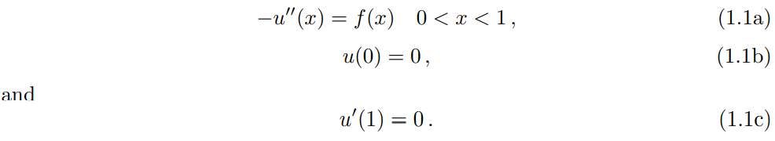

注意这里是个稳态函数，不包括时间项。

$u^h(x)$是element finite approximation to solution $u(x)$，

$V^h$is a finite dimensional set (more precisely, a linear space，且在x=0处值为0；

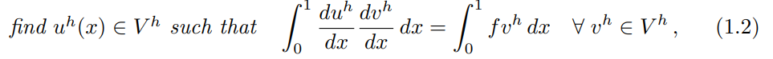

上面是有限单元里的，下面是全域的？？

V: infinite dimensional vector space（注意与$V^h$的不同）

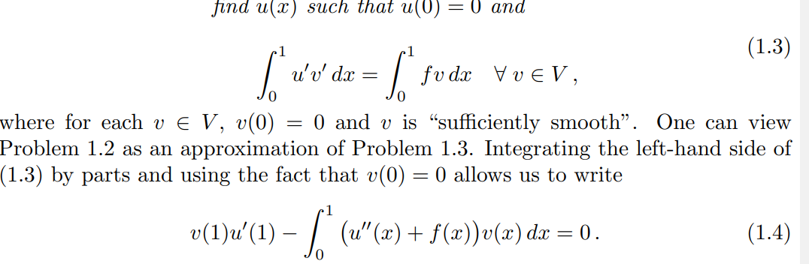

我选择一个arbitrary $v(x)$在$x=1 and x=0$的值都为0；那么对所有的$v(x)$，都有：

$$\int^1_0(u''(x)+f(x))v(x)dx=0$$

反过来；

可以从1.1 得到 1.3 。这种反过来也是正确的only if 1.3的解是足够differentiable，即$u(x)$必须二阶连续可导，f在（0,1）也必须是连续的

#### 2.1 Terminology

$u(x)$: a classical solution 如果在1.1和1.3中处处等价

如果只是1.3的解则称为weak solution

1.3叫1.1的weak formulation

1.2 叫discrete weak problem

$v^h$: test function

$u^h$: trial function

natural boundary conditions: 如果$u(x)$是1.3的解，那么纽曼边界条件是indeed satisfied，即自然满足的

essential boundary conditions: 从1.3到1.1可以知道狄利克里条件是满足的

#### 2.2 多项式近似

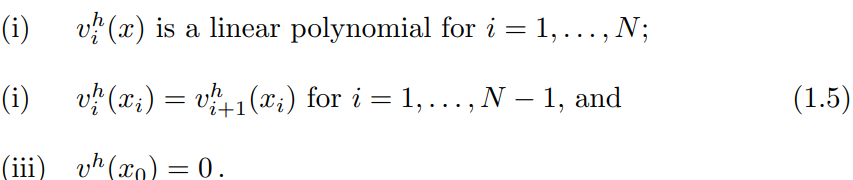

#### 2.3 connection with optimization problem

optimization problem：

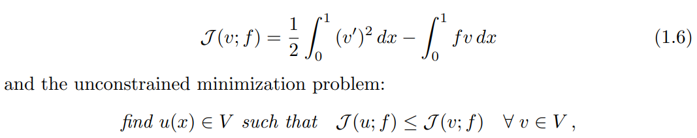

1.3和1.6是等价的。工程上物理意义则是最小能量.

### 3. 如何使用有限元

$\{\phi_i(x)\}^N_{i=1}$为$V^h$的基，是一组线性独立函数，对任意一个$w^h\in V^h$,存在实数$w_i$,:

$$w^h(x)=\sum_{i=1}^N w_i\phi(x)$$

即$V^h$集中任意一个子集都可以用这组基来表达。设置$u^h=\sum^N_{j=1}\mu_j\phi_j$

代入：

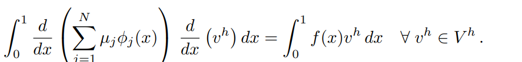

得到：

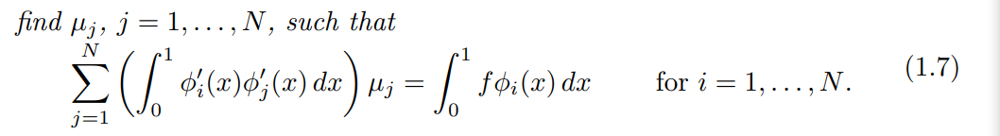

写成矩阵形式：

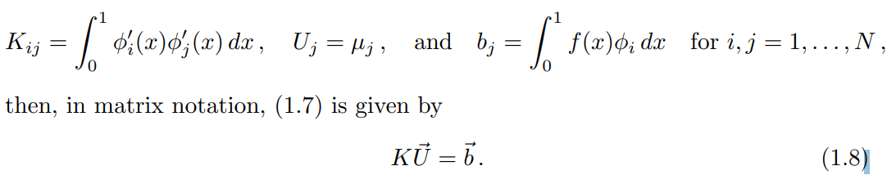

使用中值积分：

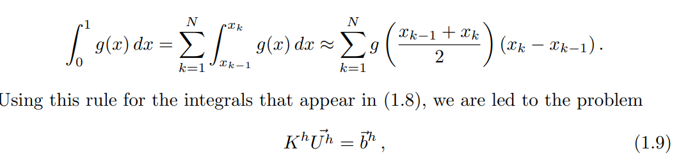

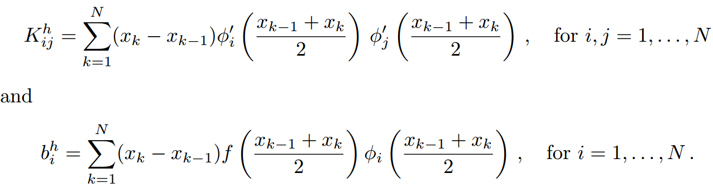

$K^h = K$，因为$V^h$是(0,1)区间上的连续分段线性函数，所有K的积分在任意一个element $T_i$都是相等的；

但是$b_h\neq b$

**K的结构：**

如果基函数有global support，比如在(0,1)真个区间上都是非零的，那么1.8和1.9就是full matrices，全是非零项。

因此为了稀疏性，基函数需要保证local support，即只在少数portion上为0；即compact support；hat function：

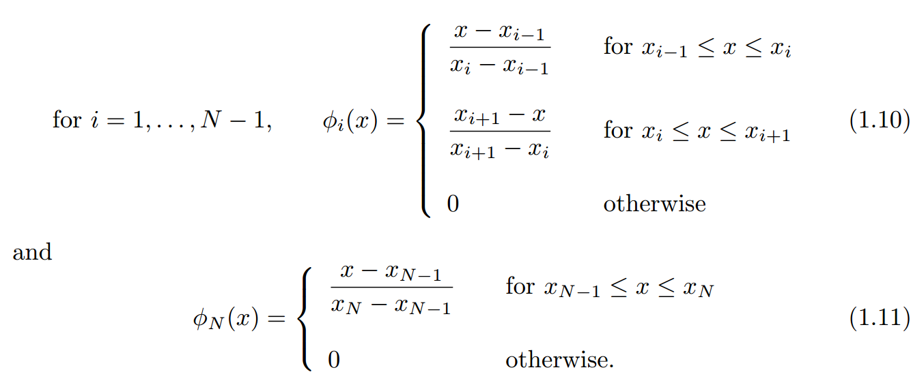

这样的结果就是$K_{ij}=0\quad and\quad K_{ij}^h=0,\quad uless |i-j|\le 1$；所以只在对角线上有值。三角矩阵

### 4. 分析

误差分析

### 5. 对比

与有限差分对比

参考：

https://people.sc.fsu.edu/~jpeterson/FEMbook.pdf