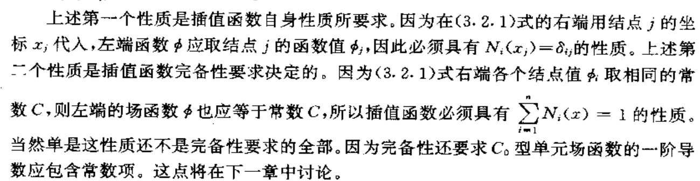
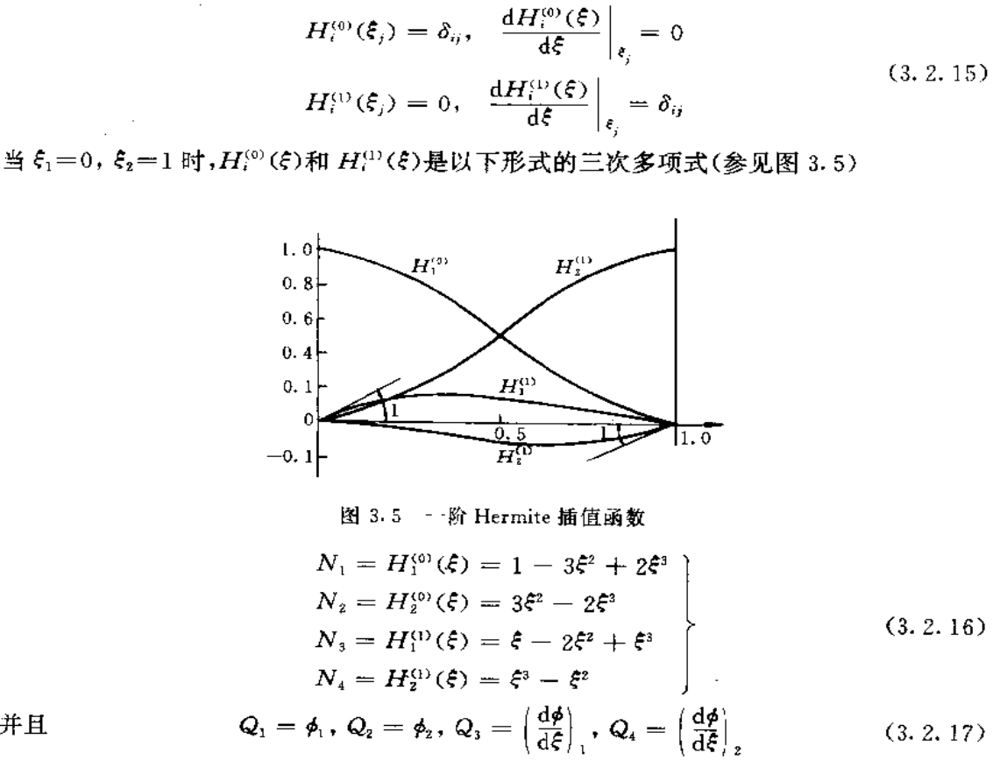

## 0. 插值函数与单元类型

1. 有限元方法的基本思想是将场函数的总体泛函或者说总体求解区域上的弱形式积分看成
   是由所有子区域(单元)的泛函或弱形式积分的集合  （分片）

2. 首先利用自然坐标系建立起单元的插值函数，将场函数表示成单元节点的插值形式  

3. 再利用数值积分计算出单元的泛函或弱形式积分；
4. 通过单元集合形成以节点场函数值为未知量的代数方程组，求解该代数方程组即可得到
   求解域上场函数的数值近似解  

关于单元插值函数的形式， 有限元方法采用不同阶次幂函数所构成的多项式，因为它们便于运算并且容易满足收敛性。  

一维单元可以分为两类

1. 结点参数只包含场函数$\phi$的结点值
2. 除场函数的结点值外，还包含导数的结点值

## 1. Lagrange单元

结点参数只有场函数的结点值。
$$
\phi = \sum^n_{i=1}N_i\phi_i\\
$$

插值函数要求的性质：
$$
N_i(x_i)=\delta_{ij},\quad \sum^n_{i=1}N_i(x)=1
$$

$\delta_{ij}$ 是 Kronecker 函数  

对于n个节点的一维单元，$N_i(x)$可以采用n-1次lagrange插值多项式$l^{n-1}_i(x)$：
$$
N_i(x)=l^{n-1}_i(x)=\Pi^n_{j=1,j\neq i}\frac{x-x_j}{x_i-x_j}
$$
若采用无量纲坐标：
$$
\xi=2\frac{x-x_c}{x_n-x_1}=\frac{2x-(x_1+x_n)}{x_n-x_1}\\
l^{n-1}_i(\xi)=\Pi^n_{j=1,j\neq i}\frac{\xi-\xi_j}{\xi_i-\xi_j}
$$

对于n=3
$$
l^{(2)}_1=\frac{1}{2}\xi(\xi-1);l^{(2)}_2=\frac{1}{2}(1-\xi)(1+\xi);l^{(2)}_3=\frac{1}{2}\xi(\xi+1);
$$
上式表示一维二次 Lagrange 单元。上述无量纲表达式即为今后常用的自然坐标。这样做 的目的可使单元的构造标准化，即插值函数和一维单元的尺寸无关，从而大大方便有限元软 件的编制和应用。

## 2. Hermite单元

**如果要在单元间的公共结点上保持场函数导数的连续性**，那么结点参数中还应该包含场函数导数的结点值

对于只有两个端结点的一维单元：
$$
\phi(\xi)=\sum_{i=1}^2 H_i^{(0)}(\xi)\phi_i +\sum_{i=1}^2 H_i^{(1)}(\xi)(\frac{d\phi}{d\xi})_i
$$
或者：
$$
\phi(\xi)=\sum^4_{i=1}N_i(\xi)Q_i
$$

Hermite多项式有一下性质：

