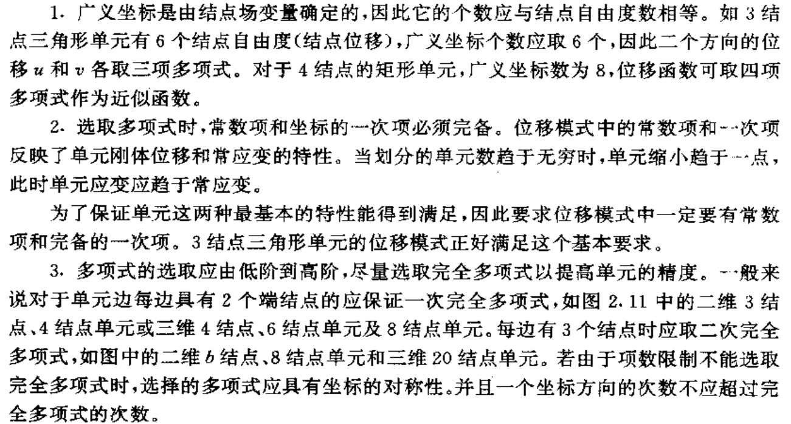
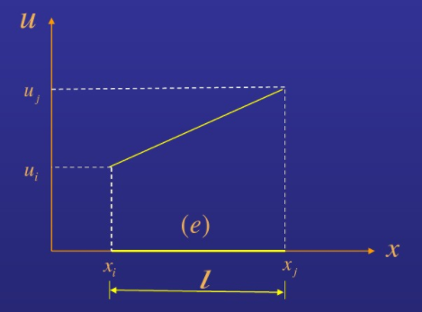
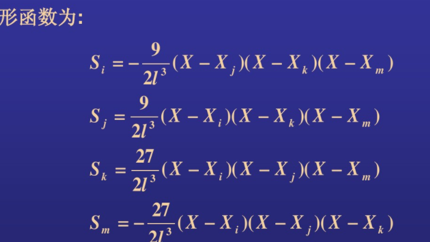
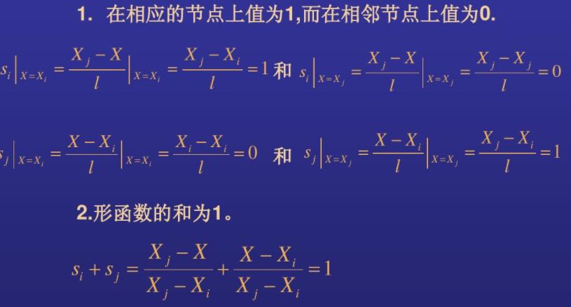
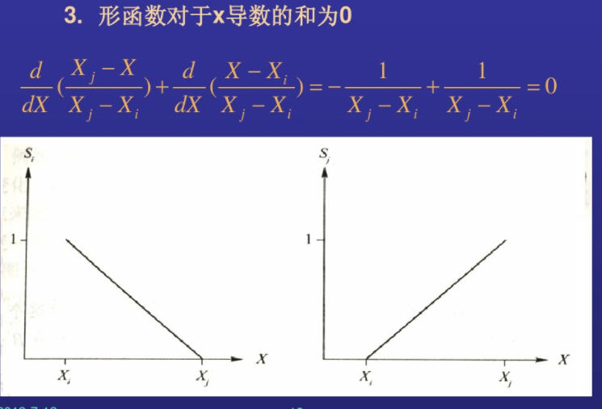

## 0 单元

把所研究的连续介质表示为一些单元(称为有限元)的集合  。这些单元可认为是一些称为节点的指定结合点处彼此连接的[8]。这些节点通常是置于单元的边界上， 并认为相邻单元就是在这些边界上与它相连接的 。

由于不知道连续介质内部的场变量(在固体力学中如位移、应力，在渗流问题中如压力、饱和度)真实的变化，因此，我们假设有限元内场变量的变化可以用一种简单的函数来近似。这些近似函数(也称为插值模式)可由场变量在节点处的值确定  

当对整个连续介质写出场方程组(如平衡方程组)时，新的未知量就是场变
量的节点值。求解场方程组(通常以矩阵方程形式表示)，即得到场变量的节点值。一旦知道
了这些节点值，则可由近似函数确定整个单元集合体的场变量。  

#### 选择单元位移函数的原则

 

## 1. 形函数构造

除作为元素的内插函数外，在余量法的伽辽金法中，也作为加权函数来用。

可分为一次，二次，三次与高次等。

#### 1.1 一次函数

$$
u = a_1+a_2 x
$$
假设在i、j结点处位移u分别为ui,uj，：
$$
u_i = a_1+a_2Xi\\
u_j = a_1+a_2X_j
$$
求解a1，a2得到：
$$
a_1=\frac{u_iX_j-u_jX_i}{X_j-X_i}\\
a_2=\frac{u_j-u_i}{X_j-X_i}
$$
由结点值表示的单元的位移为：
$$
u^{(e)}=\frac{u_iX_j-u_jX_i}{X_j-X_i}+\frac{u_j-u_i}{X_j-X_i}X\\
= \frac{X_j-X}{X_j-X_i}u_i+\frac{X-X_j}{X_j-X_i}u_j
$$
定义形函数：
$$
s_i=\frac{X_j-X}{X_j-X_i}=\frac{X_j-X}{l}\\
s_j=\frac{X-X_i}{X_j-X_i}=\frac{X-X_i}{l}
$$
由形函数表示的单元位移是：
$$
u^{(e)}=s_iu_i+s_ju_j
$$
**所以可以用形函数和相应的结点值表示给定单元上任意未知量的变化**。

#### 1.2 三次函数

#### 1.3 拉格朗日插值

当阶数增加时，可以用拉格朗日插值来代替以上方法得到形函数。

## 2. 形函数的性质

**形函数只与坐标相关，与节点的物理量无关**。

所以根据网格节点划分，形函数也就确定了。

3. 在每条边上只与构成边的节点有关，与另外一个节点无关；
4. 对于现在的单元，插值函数是线性的，在单元内部及边界上位移也是线性的，可由结点上位移值唯一地确定。由于相邻单元公共结点的结点位移是相等的，因此保证了相邻单元在公共边界上位移的连续性。（注意没有说一阶导数也连续）

