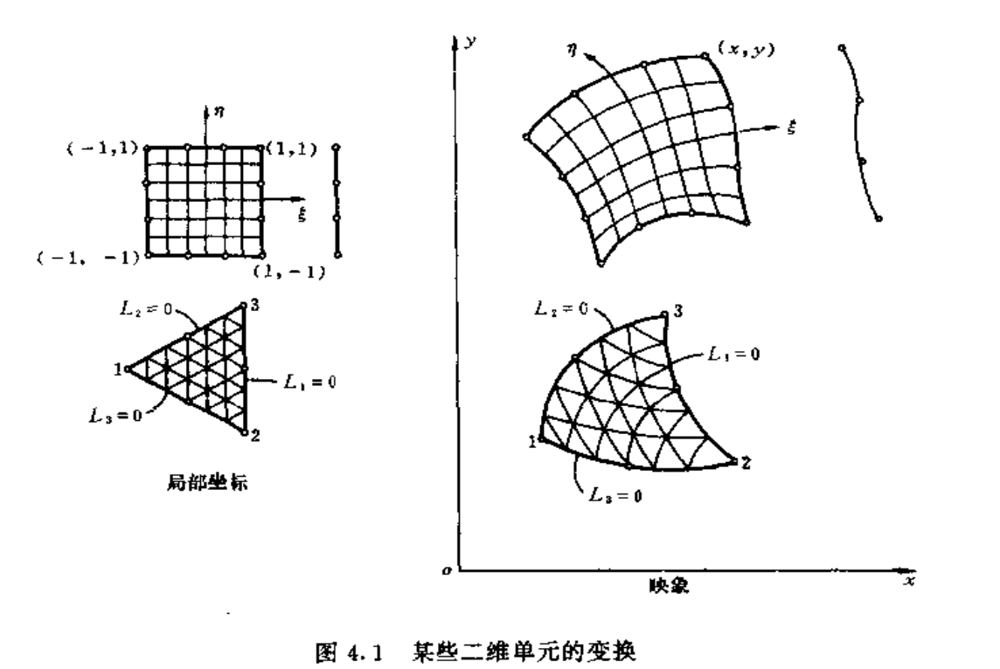

上一节讨论了经常应用的一些单元形式，这些单元的几何形状是规则的。**但是用形状规**
**则的单元对几何形状比较复杂的求解域进行离散化时，在边界上并不能保证吻合**，因此对于与边界相邻的单元，就需要寻找适当的方法，将上一节所讨论的规则单元中的相应的边或面可用表达式描绘的曲线或曲面逼近于边界的形状，然后通过某种变换方式将这种并不规则的单元变形成规则的单元进行计算。在有限元中最普遍采用的变换方法是等参变换，即**单元几何形状的变换和单元内场函数采用相同数目的节点参数，以及相同的插值函数来进行变换**  

### 1. 等参变换

将局部坐标中几何形状规则的单元转换为总体坐标中集合形状扭曲的单元，**需要进阿里一个坐标变换**。

最方便的变换时表示成插值函数的形式：
$$
x=\sum^m_{i=1}N'_ix_i
$$
m是坐标变换的单元结点树；xi时总体坐标的坐标值，Ni'时形状函数，实际上也是局部坐标表示的插值函数。

由于上式和插值表示式在形式上是相同的，如果坐标变换和插值函数使用相同的结点和相同的插值函数，m=n，Ni'=Ni，那么就称为等参变换。