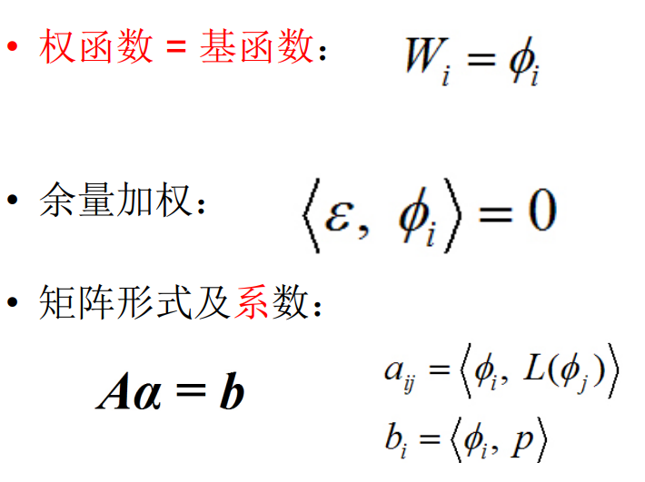
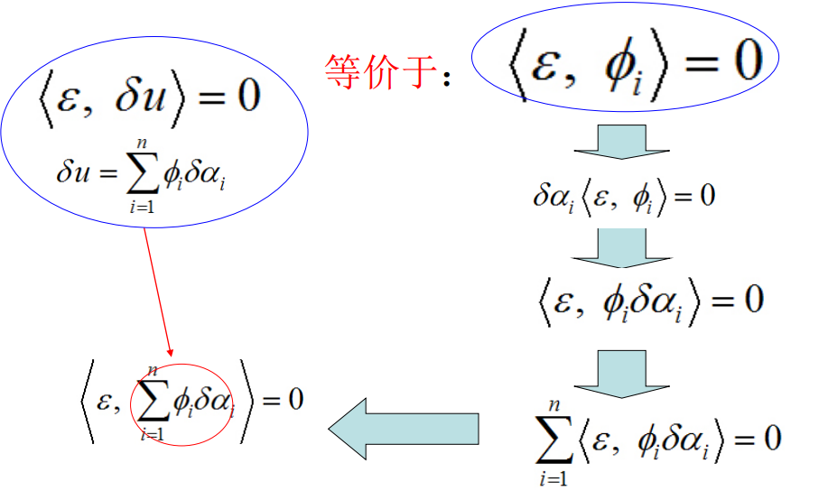
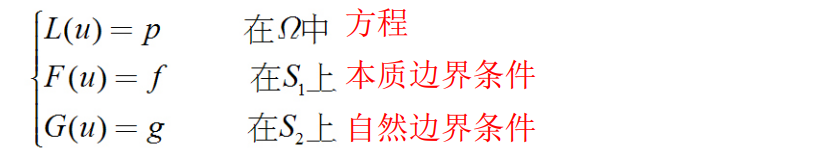
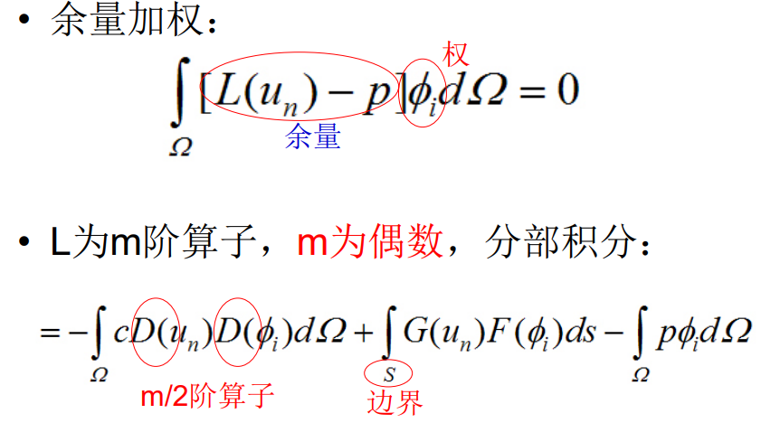
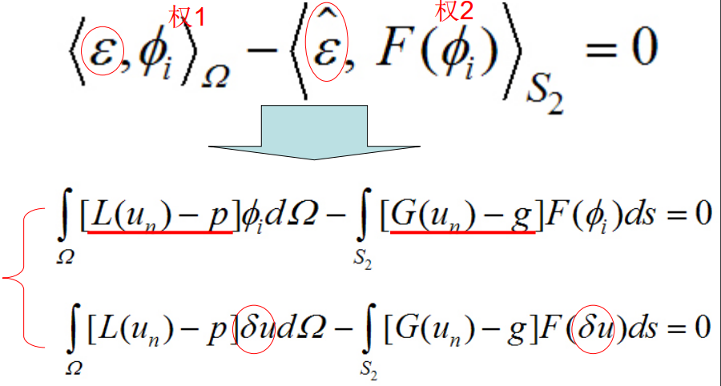

要点：权函数=基函数

#### 等价形式

#### 积分表达形式

1. 一般积分表达：只满足方程的要求1，即方程余量最小
2. 弱解积分表达：降低u的连续性而提高v的连续性为代价。虽然弱形式对函数u的连续性加ing第了，但对实际的物理问题却比原始的微分方程更逼近真实解，因为原始的微分方程对解提出了过分平滑的要求。
3. 强解积分表达

### 实际问题

**要求：**

1. 方程余量最小，$$\epsilon=L(u_n)-p$$
2. 本质边界条件余量最小
3. 自然边界条件余量最小，$$\hat{\epsilon}=G(u_n)-g$$

### 弱解形式

#### L为偶数阶算子

#### L为奇数阶算子

### 强解形式

### 彼得罗夫-伽辽金法

试探函数(trial function)和检验函数(test function)取自不同的函数空间.

参考：

http://staff.ustc.edu.cn/~minglichn/teaching/c10_2.pdf