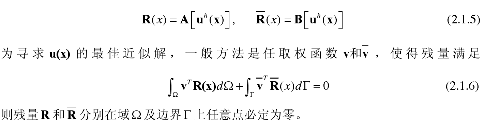
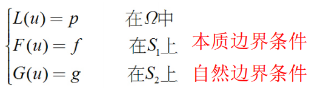
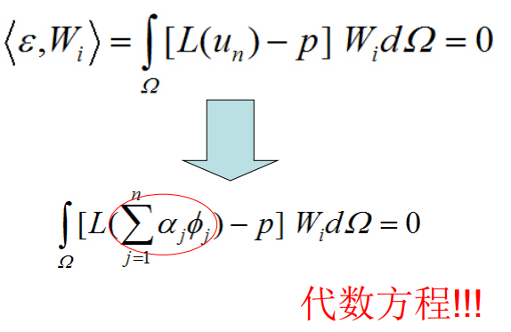
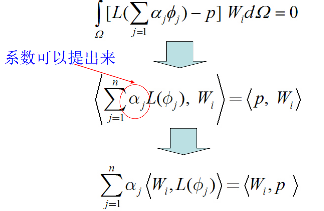
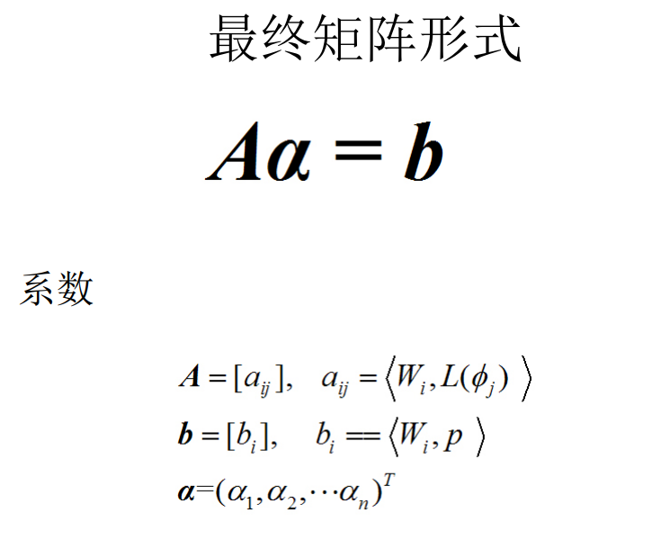

使余量的加权积分为0，这叫加权余量法。

把近似解代入原方程,得到:

加权余量法和Galerkin法是**没有相应的 变分原理 时 的近似解法**。

其基本原理是等效积分法。

#### 0. 基本思想

上述方程没有变分原理，无法直接转化为变分方程

#### 1. 基本步骤

1）选定线性无关的完备的**基函数**序列：$$\{\phi_j\}(j=1,2,...,n)$$

2）构造**近似解**：$$u_n=\sum^n_{j=1}\alpha_j\phi_j$$

3）确定**方程余量**：$$\epsilon=L(u_n)-p$$

4）选定线性无关的完备的**权函数**序列：$$W_i(i=1,2,...,n)$$

#### 2. 令余量和权函数正交

#### 3. 求解待定系数

#### 4. 常见的几种加权余量法

点配置法，最小二乘法，矩量法，Galerkiln法

