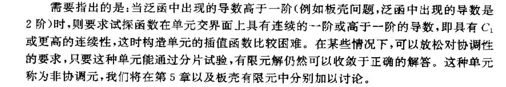
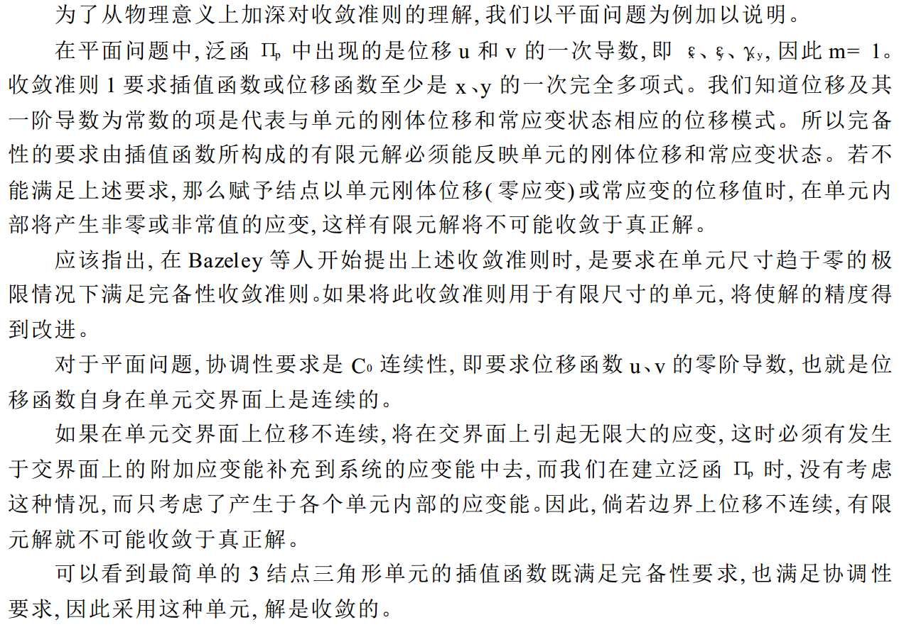

#### 问题

在什么条件下，当单元尺寸趋于0时，有限元的解趋于真实解

#### 泛函

PDE:
$$
A(\phi)=L(\phi)+b=0
$$

$$
J=\int_\Omega[\frac{1}{2}C(\phi)C(\phi)+\phi b]d\Omega+b.t
$$

假定$J$包含了$\phi$及其到m阶的导数，且m阶导数非零；则近似函数$\tilde{\phi}$至少是m阶多项式。

如果取p次完全多项式为试探函数，那么$p\geq m$:
$$
\tilde{\phi}=\beta_0+\beta_1x+\beta_2x^2+...+\beta_px^p\\
\frac{d\tilde{\phi}}{dx}=\beta_1+2\beta_2x^1+...+p\beta_px^p\\
...\\
\frac{d^m\tilde{\phi}}{dx^m}=m!\beta_m+(m+1)!\beta_{m+1}x^1+...+\frac{p!}{(p-m)!}\beta_px^{p-m}
$$

所以：

1. 当单元尺寸趋于零时  ，每一单元内$\tilde{\phi}$及其m阶导数都趋于其精确值，也就是常数项。
2. 如果试探函数还满足连续性要求，那么整个系统的泛函将趋于它的精确值。

所以可以导出试探函数准则：

#### 试探函数准则

**准则 1** 

完备性要求。如果出现在泛函中场函数的最高阶导数是 m 阶, 则有限元解收敛的条件之一是单元内场函数的试探函数至少是 m 次完全多项式。 或者说试探函数中必须包括本身和直至 m 阶导数为常数的项。    

至于连续性的要求, 当试探函数是多项式的情况下, 单元内部函数的连续性显然是满足的, 如试探函数是 m 次多项式, 则单元内部满足 Cm- 1连续性要求。 因此需要特别注意的是**单元交界面上的连续性, 这就提出另一个收敛准则**。  

**准则 2**

协调性要求。 , 则试探函数在单元交界面上必须具 有 Cm- 1连续性, 即在相邻单元的交界面上 应有函数 直至 m-1 阶的连续导数。  

简单地说, 当选取的单元 既完备又协 调时, 有限元 解是收敛 的, 即当单元 尺寸趋于 零时, 有限元解趋于真正解。 我们称这种单元为协调单元  

**注意对于C1收敛性问题：**

#### 收敛准则的物理意义  

