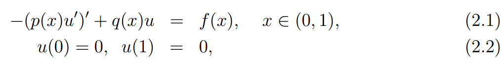
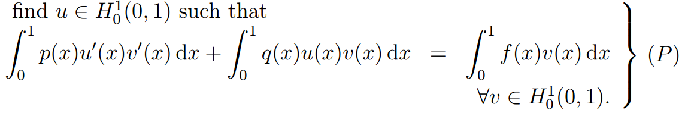
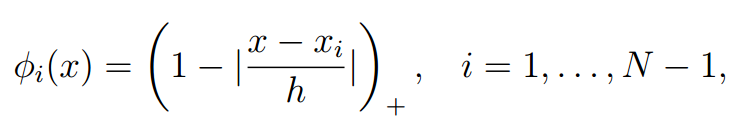
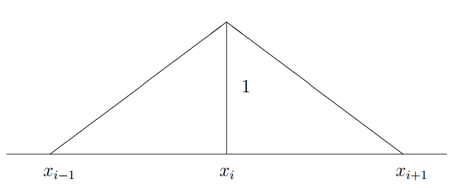
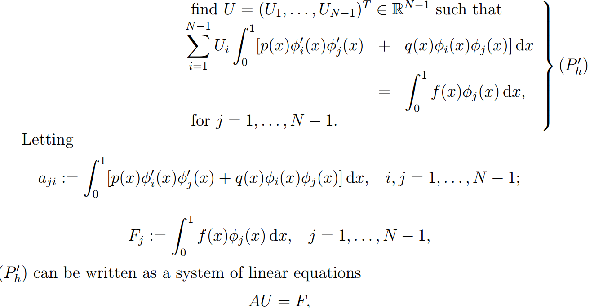
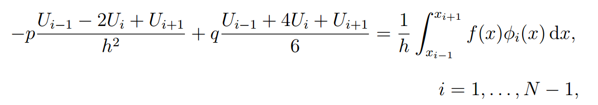

## 1. 一维例子1

弱形式为：

#### 1. 分区

把[0,1]区间分为N个子区间；$x_i = ih;\quad i=0,1...N,\quad h=1/N$；$(x_i, x_{i+1)})$称为element domains。

#### 2. basis functions

一阶多项式近似
$$
u_h(x)= \sum^{N(h)}_{i=1} U_i\phi_i(x)
$$

$$
V_h:=span\{\phi_1,...,\phi_{N-1}\}
$$

**上式可以用数值积分求解**

如果p和q都是常数的话，上式可以简化为：

最终得到：

边界条件

$U_0=0;U_N=0$

**This is a three-point finite difference scheme ** 