### 1. 等效积分

对于如下微分方程：

以二维稳态热传导方程为例：

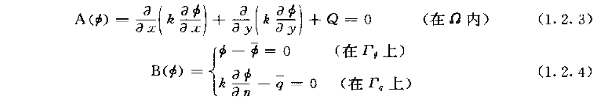

由于微分方程为域中每一点都是0，所以可以写成其完全等效的**积分形式**：

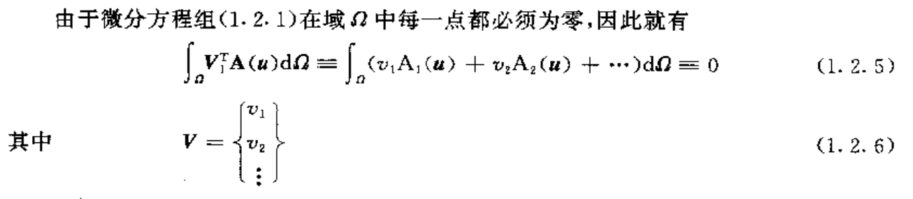

V是任意的。

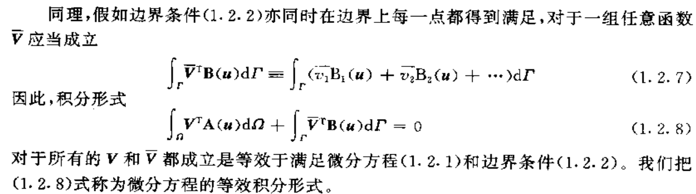

#### 1.2 等效积分弱形式

对（1.2.8）分部积分得到另一种形式：

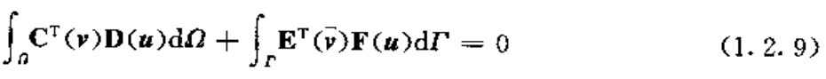

这样，降低了u的连续性要求（以提高v和V_的连续性要求为代价）。但v的连续性可以在选择（试探函数）时容易满足。

**从结果来看，这样更逼近真实解，因为原始微分方程对解提出了过分“平滑”的要求。**

二维稳态热传导方程的等效积分形式：

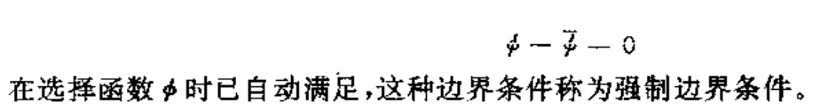

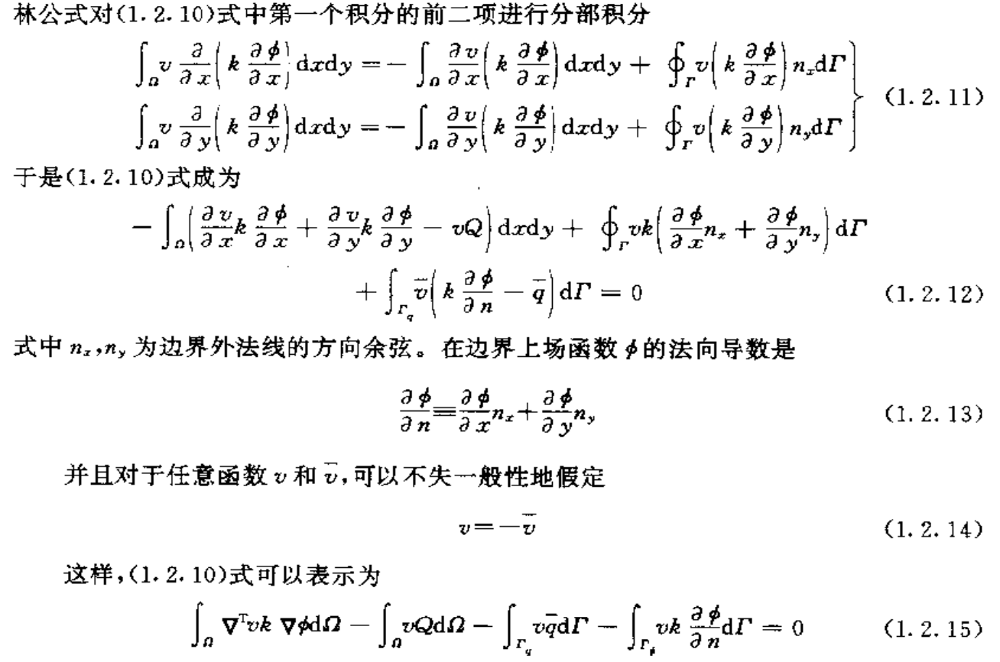

**注意:**

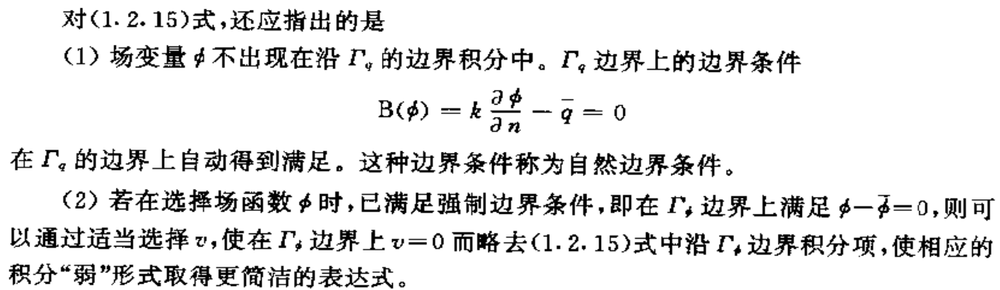

就是说trial function满足边界条件时,test function不一定需要完全满足边界条件.

#### 1.3 加权余量法

对于未知场u可以使用如下近似函数:

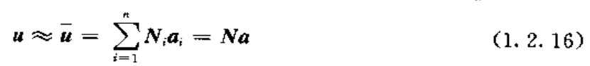

a是待定系数,N是试探函数;

由于u采用了近似解,通常余量不为0,因此对v,要使余量加权为0.

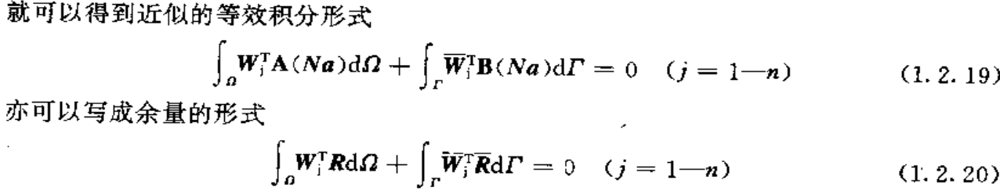

加权余量法包括: 配点法(collocation points);

### 2. 变分

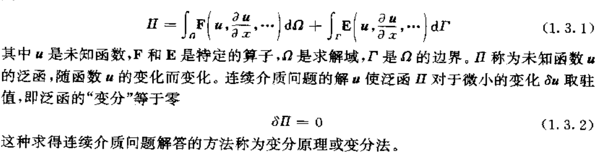

变分与积分:在微分公式表达时,问题的求解是对具有已知边界条件的微分方程(组)进行积分;在经典的变分原理中,问题的求解是寻求使具有一定已知边界条件的泛函取驻值的未知**函数**. 这两种表达使等价的．

#### 2.1 里兹法

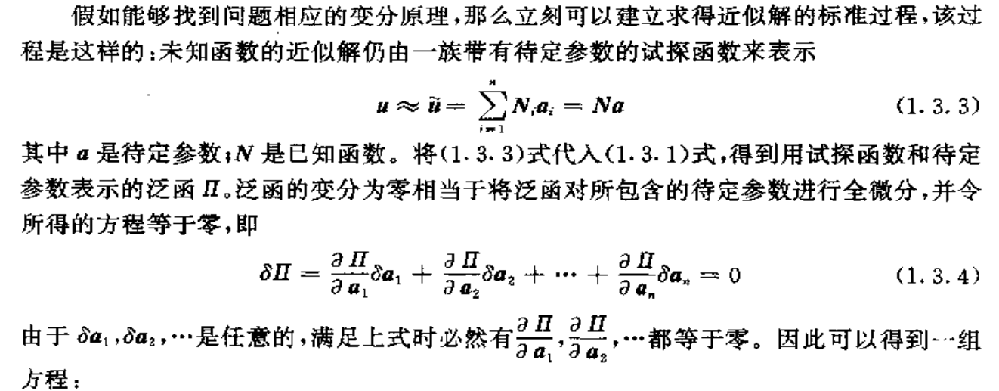

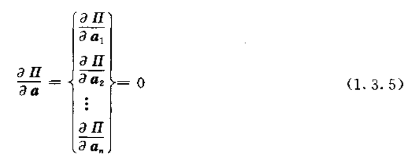

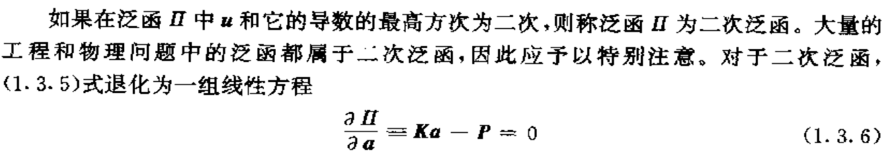

这里，K是对称的．

**系数矩阵的对称性为有限元算法带来很大的方便．**

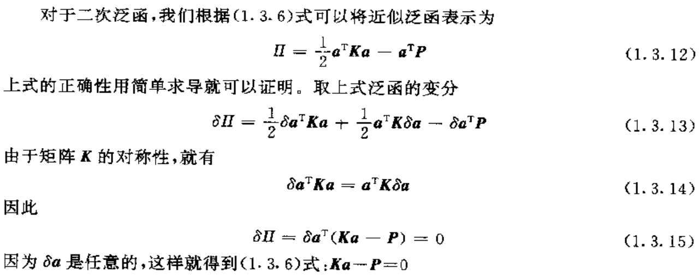

并非所有的微分方程都可以建立变分形式

#### 2.2 变分原理的建立

以之前的二维热传导方程为例:

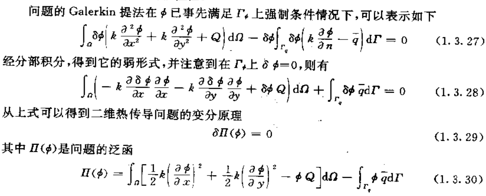

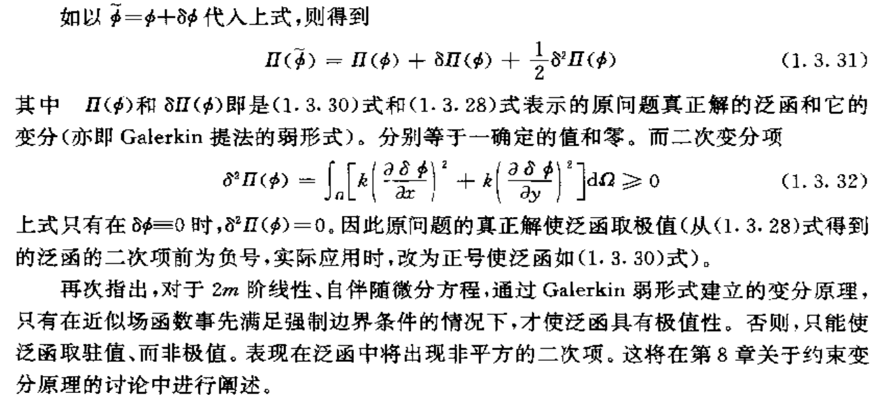