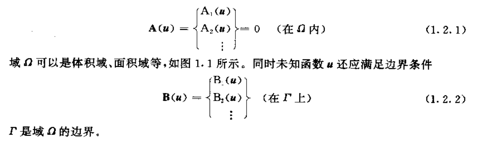
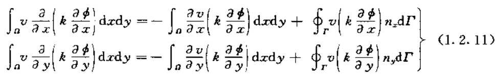
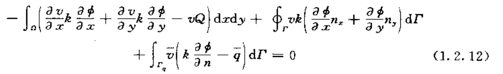
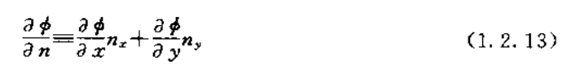
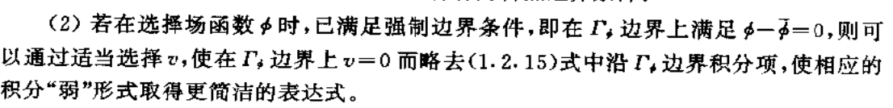

### 1. 等效积分

对于如下微分方程：

以二维稳态热传导方程为例：

由于微分方程为域中每一点都是0，所以可以写成其完全等效的**积分形式**：

V是任意的。

#### 1.2 等效积分弱形式

对（1.2.8）分部积分得到另一种形式：

这样，降低了u的连续性要求（以提高v和V_的连续性要求为代价）。但v的连续性可以在选择（试探函数）时容易满足。

**从结果来看，这样更逼近真实解，因为原始微分方程对解提出了过分“平滑”的要求。**

二维稳态热传导方程的等效积分形式：

**注意:**

就是说trial function满足边界条件时,test function不一定需要完全满足边界条件.

#### 1.3 加权余量法

对于未知场u可以使用如下近似函数:

a是待定系数,N是试探函数;

由于u采用了近似解,通常余量不为0,因此对v,要使余量加权为0.

加权余量法包括: 配点法(collocation points);

### 2. 变分

变分与积分:在微分公式表达时,问题的求解是对具有已知边界条件的微分方程(组)进行积分;在经典的变分原理中,问题的求解是寻求使具有一定已知边界条件的泛函取驻值的未知**函数**. 这两种表达使等价的．

#### 2.1 里兹法

这里，K是对称的．

**系数矩阵的对称性为有限元算法带来很大的方便．**

并非所有的微分方程都可以建立变分形式

#### 2.2 变分原理的建立

以之前的二维热传导方程为例:

## 等效积分弱形式

#### 1. 等效积分

等效积分可以弱化解的光滑性，要求：

1. V在$\Omega$上可积

2. $\phi$只需要**n-1阶导数连续即**可，也就是n阶存在（而无需连续）（古典解需要n阶连续），

因为对于积分，只要n阶导数存在，且只有有限个尖端点即可以积分。

以二维稳态热传导方程为例：

上述两式可以写为以下等效积分形式：

其中，$v$和$\overline{v}$是任意的标量函数，并假设$\Gamma_\phi$上的边界条件：

$$\phi - \overline{\phi}=0$$

在选择函数$\phi$时已经自动满足，这叫做强制边界条件

#### 2. 弱形式

这里进一步降低光滑性。**只需要n-1阶导数存在且只有有限个间断点**。这里的降低是以提高函数$v$的连续性为代价的。 

对积分第一项进行分部积分：

那么1.2.10式变成：

其中：

对于任意函数$v$和$\overline{v}$，可以不失一般性地假定：

$$v=-\overline{v}$$

注意：这里的边界$\Gamma=\Gamma_\phi+\Gamma_q$；所以边界的导数项可以正负约去；得到：

#### 3. 其他

1. 弱形式：
2. 自然边界条件是自动满足的（？？）
3. 

参考：

[有限元程序自动生成系统 (pudn.com)](http://read.pudn.com/downloads154/ebook/683455/%D3%D0%CF%DE%D4%AA%B7%BD%B7%A8(%D3%D0FORTRAN%B3%CC%D0%F2).pdf)

<<有限单元发基本原理和数值方法(第二版)>>