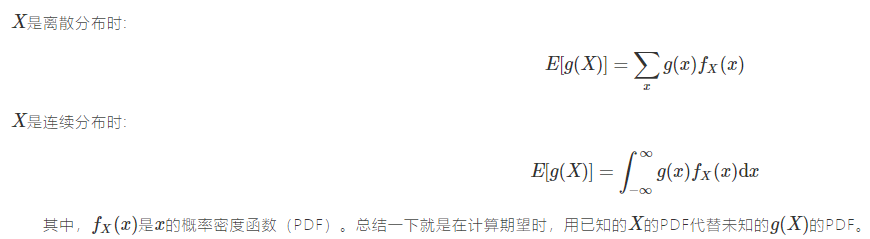
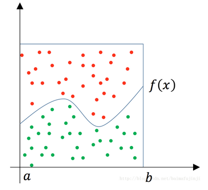
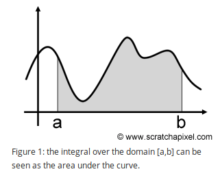
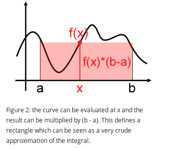
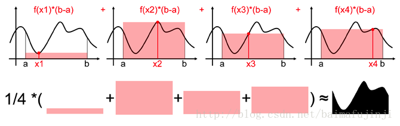

### 1. 背景知识

#### 无意识统计学家法则**（Law of the unconscious statistician）**

　　无意识统计学家法则（LOTUS），描述了已知随机变量XX的概率分布，但不知道g(X)的分布，如何求解g(X)的数学期望就是LOTUS的目的。 我想有一定概率论基础的同学都应该知道LOTUS的公式：

### 2. 蒙特卡洛

#### 2.1 投点法定积分

如求Π

#### 2.2 期望法

也就是平均值法。积分的几何意义就是阴影的面积：

当我们在[a,b]之间随机取一点xx时，它对应的函数值就是f(x)，然后便可以用f(x)×(b−a)来粗略估计曲线下方的面积（也就是积分）， 当然这种估计（或近似）是非常粗略的，过程如下图所示：

于是我们可以用一系列点xi（满足均匀分布），然后把估算出来的面积取平均作为积分估计的一个近似值。如果采样点数也多，那么积分估计也就也来越接近。

**平均法定量解释：**

见页面，全是概率推导。

参考：

[蒙特卡洛（Monte Carlo）法求定积分 | TwistedW's Home (twistedwg.com)](http://www.twistedwg.com/2018/05/29/MC-integral.html)