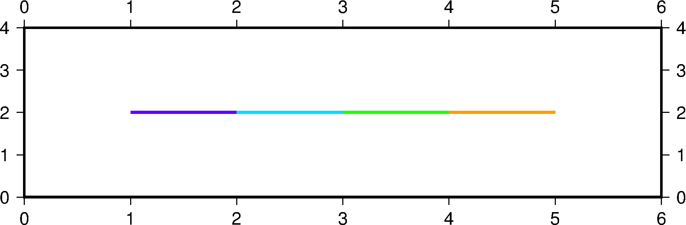

### 问题

如何绘制多种颜色的线段/符号？

关键是把cpt中Z值与颜色一一对应，而两种方式的差别就在于定义Z值的位置。

### 绘制线段

不加`-S`，直接绘制线段，则需要在表头定义Z值（即cpt颜色对应的值）

如：

```shell
#!/bin/bash
# GMT v5.2.1

gmt makecpt -Crainbow -T-2/2/1 > lines.cpt
gmt psxy -JX15c/4c -R0/6/0/4 -B1 -Clines.cpt -W2p > test.ps << EOF
> -Z-1.5
1 2
2 2
> -Z-0.5
2 2
3 2
> -Z0.5
3 2
4 2
> -Z1.5
4 2
5 2
EOF
```




参考：[绘制颜色渐变的线条 - SeisMan](https://blog.seisman.info/plot-lines-with-gradient-colors/)


### 绘制符号

符号包括圆、线条、矩形等其他形状

这里重点讨论可旋转矩形（还有直立/圆角矩形）

无论用何种符号，第三列都必须是Z值。

然后符号必须有可以填充的空间才能填色（比如线就没法填充，而是由画笔控制）