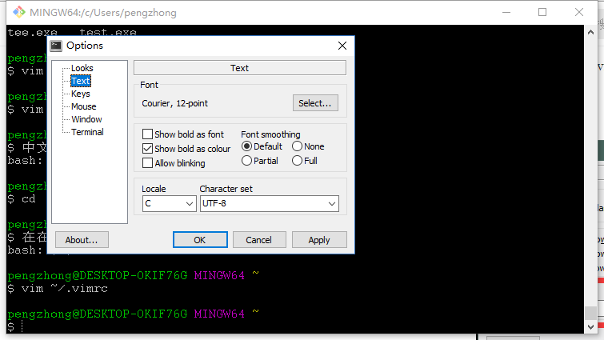

#### 问题描述
我安装了git，同时也安装了gvim，并且从网络下下载了vimrc配套的插件和配置，  
[vimrc配置下载](https://github.com/ma6174/vim-deprecated)  
一开始在git bash中用vim打开是正常的，但是今天用git建立库之后出现了中文乱码的问题。  
在命令行中文可以输入，但一用vim打开带中文的文件就乱码

#### 解决办法
在git界面右键设置编码，把locale设置为C  
问题解决，虽然我还没确定C是什么意思，

#### 另外一种可能的解决办法
正确的做法是到Git的安装目录下【 windows OS】找到vim配置文件：比如我的路径是E:\Program Files (x86)\Git\etc路径下vimrc文件，用vim打开，在文件头部添加一行配置项即可

> set fencs=utf-8,gbk,utf-16,utf-32,ucs-bom "编码配置

