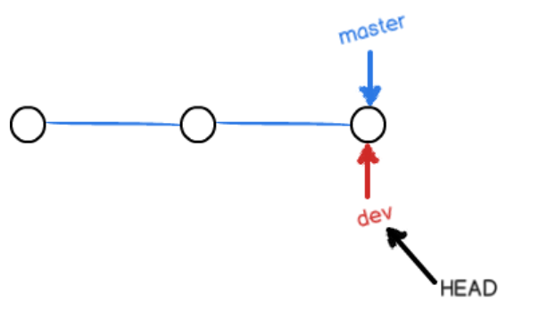
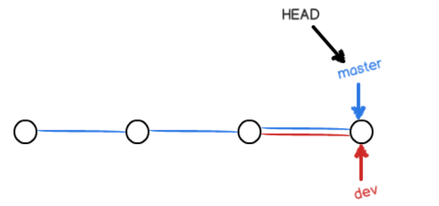

## 原理
#### 指针与提交
Git有一个主分支master，另外有一个指针HEAD，HEAD指向master，而master指向提交，每次commit（提交）master都会往前一步，随着提交次数增加，master的支线也越来越长。

### 分支
创建新的分支时，比如创建`dev`分支，Git新建一个指针叫`dev`，指向与master相同的提交，再把`HEAD`指向`dev`，就表示当前分支在`dev`上。  

不过，从现在开始，对工作区的修改和提交就是针对`dev`分支了，比如新提交一次后，`dev`指针往前移动一步，而`master`指针不变：

假如我们在`dev`上的工作完成了，就可以把`dev`合并到`master`上。Git怎么合并呢？最简单的方法，就是直接把`master`指向`dev`的当前提交，就完成了合并：

#### 创建分支

1. 
> $ git checkout -b dev
> Switched to a new branch 'dev'

`git checkout`命令加上`-b`参数表示创建并切换，相当于以下两条命令：

> $ git branch dev
> $ git checkout dev
> Switched to branch 'dev'

2. 然后，用`git branch`命令查看当前分支：
> $ git branch
> * dev
>  master

`git branch`命令会列出所有分支，当前分支前面会标一个\*号。
3. 然后，我们就可以在dev分支上正常提交，比如对readme.txt做个修改再提交
> $ git add readme.txt 
> $ git commit -m "branch test"
> [dev b17d20e] branch test
> 1 file changed, 1 insertion(+)

4. `dev`分支的工作完成，我们就可以切换回`master`分支（注意要先切换回去再合并）：
> $ git checkout master
> Switched to branch 'master'

但此时发现提交点并没有变，readme.txt还是没有改变
  
#### 示例
5. 把`dev`分支的工作成果合并到`master`分支上：
> $ git merge dev

`git merge`命令用于合并指定分支到当前分支。合并后，再查看readme.txt的内容，就可以看到，和`dev`分支的最新提交是完全一样的。
注意到上面的`Fast-forward`信息，Git告诉我们，这次合并是“快进模式”，也就是直接把master指向`dev`的当前提交，所以合并速度非常快。
注意，不是每次都是快进模式；

6. 删除`dev`分支
> $ git branch -d dev

### 合并
如果`dev`的工作完成了，打算把`dev`合并到`master`上，Git是直接把`master`指向`dev`的当前提交，就完成了合并。
  
最后在删除`dev`,那么就只剩下`master`一支主线了。

## 解决冲突
### 问题
如果分支`dev`和主分支`master`同时做了提交，在合并的时候就会有冲突:
> $ git merge dev
> Auto-merging readme.txt
> CONFLICT (content): Merge conflict in readme.txt
> Automatic merge failed; fix conflicts and then commit the result.

git status也可以告诉我们冲突的文件：
> $ git status
> On branch master
> Your branch is ahead of 'origin/master' by 2 commits.
>   (use "git push" to publish your local commits)
> 
> You have unmerged paths.
>   (fix conflicts and run "git commit")
>   (use "git merge --abort" to abort the merge)

> Unmerged paths:
>  (use "git add <file>..." to mark resolution)
> 
>    both modified:   readme.txt
> no changes added to commit (use "git add" and/or "git commit -a")

Git用<<<<<<<，=======，>>>>>>>标记出不同分支的内容，

### 解决办法
手动吧冲突的文件修改为不冲突。

### 其他命令
- 查看分支：git branch
- 创建分支：git branch <name>
- 切换分支：git checkout <name>
- 创建+切换分支：git checkout -b <name>
- 合并某分支到当前分支：git merge <name>
- 删除分支：git branch -d <name>
- 分支合并图：git log --graph

## 团队合作分支管理

## bug分支
1. 先用`stash`把当前工作保存，再创建新分支修复bug，然后合并，删除bug分支，最后恢复保存的工作。

---

### 参考资料
[创建与合并分支——廖旭锋的博客](https://www.liaoxuefeng.com/wiki/0013739516305929606dd18361248578c67b8067c8c017b000/001375840038939c291467cc7c747b1810aab2fb8863508000)