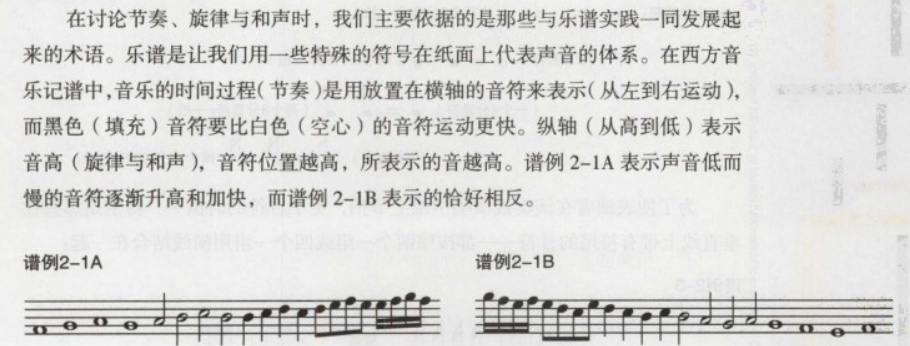
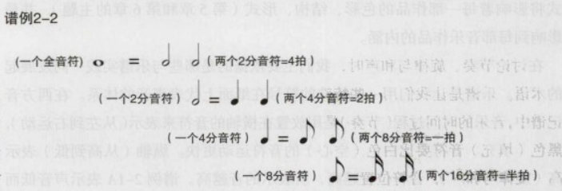

## 三要素

1. 节奏（时间）
2. 旋律（音高）
3. 和声（音高）
   

## 节奏

节奏将时间划分为长、短段，并由此形成旋律的音高，音乐的节奏是由拍子来支撑和区分的。

#### 拍子beat

是讲时间的过程划分为相等单元的均衡律动； 最常用的拍子单位是4分音符，与人的心跳频率相当；

#### 节拍measure或小节bar

许多拍子有规律的组合；

#### 强拍与弱拍

#### 切分音

通常，强音落在强拍的最重的音上，而切分音是讲强音放在一个弱拍上或拍子之间；

#### 速度

## 旋律

一系列音高的排雷所组成的一个有凝聚力和令人愉悦的音乐线条；或者称为曲调；
一般由四个因素构成：稳定的调式中心，向前运动，一个目标或高潮，最终有一种安定感；

#### 音高pitch

音响或高或低的位置，当音响**有规律地震动**时，就产生了乐音；

#### 八度

音高的反复；演唱连续的上行或下行的音时，旋律会达到一个声音像是较早唱过的一个音高的反复；八度距离的音高发出的声音是类似的，因为较高音高震动的频率恰好是较低音高的两倍；

#### 主音

旋律的中心音，旋律往往围着它进行；
围绕中心音的音乐组织结构被称为调性tonality。
一支旋律可以用C，D或F#，实际上可以用一个八度内的12个音中的任何一个作为它的主音。

#### 音阶scale

音高按照一个固定的形式上行或下行的排列；

- 大调：
- 小调：
- 转调

## 和声

给旋律**伴奏**；
多种因素的平静排列；

#### 聆听和弦

1. 将注意力集中在低音，使它与高声部的旋律分开
2. 听旋律很重要，第二重要的就是听低音，低音承载和决定和声的走向；