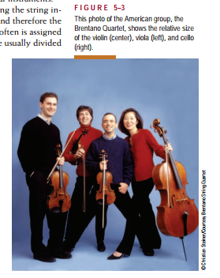
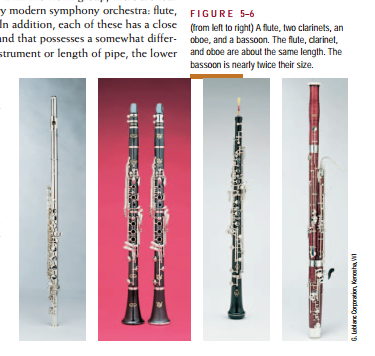
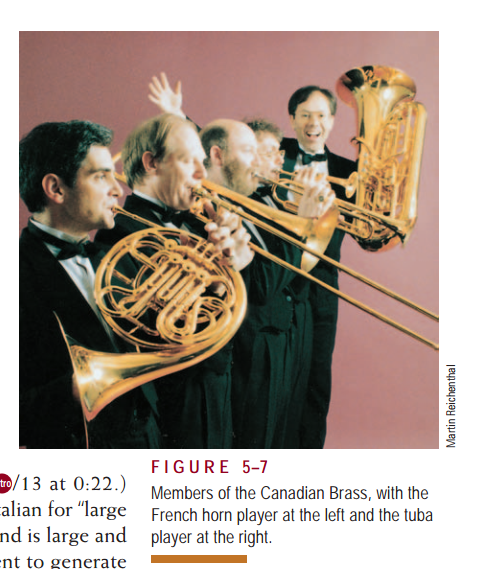
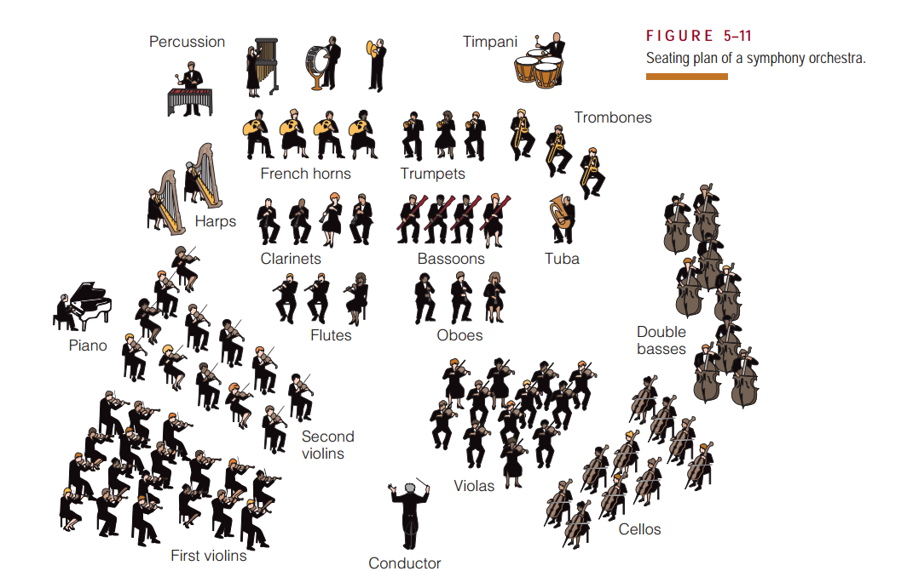

## 力度与色彩

虽然节奏、旋律与和声构成了音乐的主要因素，但为了是音乐作品能够传递给欣赏者，必须转化为具体的音乐声音。

### 力度

定义：音量的不同程度；包括强音和弱音；
力度的变化包括`渐强`和`渐弱`；就是声音强度逐渐变化的描述；

### 色彩

定义：人声或乐器发出的任何声音的音质；
音色：同样含义的另外一个术语；
器乐由于材料不同产生不同色彩的声音；

#### 乐器

传统交响乐队包括四个组：

1. 弦乐：通过拨奏或拉奏琴弦产生；包括：吉他、班卓琴、竖琴，以及小提琴、中提琴、大提琴和低音提琴等；注意**小提琴的声音不是来自琴弦，而是木质琴身，按压琴弦可以改变音高（琴弦越短，音高越高）**
   
   
   
2. 木管：现代不一定是用木，可能是金属制作；包括：长笛、单簧管、双簧管和大管；

   

3. 铜管：四个主要乐器，小号、长号、法国号、大号；

   

4. 打击乐器：敲击悬挂的膜（鼓）、一块木头或者一块金属产生；包括：定音鼓、

此外还有第五组乐器：键盘乐器；但通常不是交响乐队的组成部分，主要乐器有管风琴、羽管键琴和钢琴。管风琴通常是独奏，而钢琴常常是独奏或为其他乐器或人声伴奏。

## 交响乐团 The Symphony Orchestra

