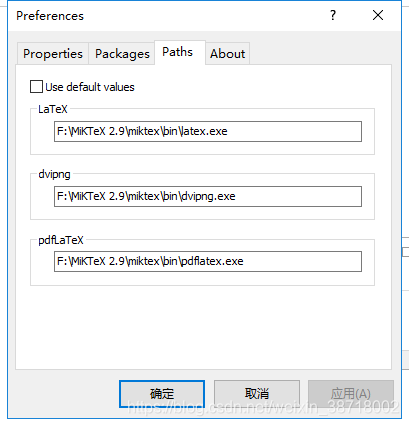

### 问题

1. 如果安装64位的word，没有Aurora菜单栏，无法统一修改公式格式
2. 如果miktex版本和路径不对，则只能使用raster模式，导出pdf时公式模糊，必须使用vector模式。

### word版本

目前已知word2013 32位可用，其余版本存在的问题：没有Aurora菜单栏，

miktex导致不能使用vector模式只能使用raster

### miktex版本

必须用2.9版本，不能用2.5版本

否则：无法使用vector模式

### 设置path

不设置也无法使用vector模式

### 安装

链接：https://pan.baidu.com/s/1QEsiYQcXu2qXrrCc7o_xJQ
提取码：5xm7

先安装MiKTeX 2.9 ，然后安装Aurora，安装时不要选miktex，再运行keygen进行破解。

### 其他插件：

Axmath

参考：[ office中的Aurora公式插件，超好用（含下载安装包）_window3cc的博客-CSDN博客_aurora插件下载](https://blog.csdn.net/weixin_38718002/article/details/100054953)