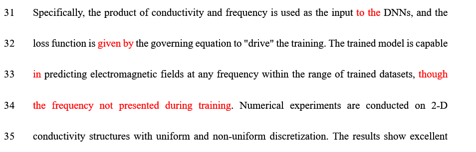

### 0.实现的功能

把修改的痕迹全部用某种颜色标记出来。



### 1.开启审阅模式

在审阅模式下修改Word文档

### 2.使用VBA

1. 按`Alt+F11`打开VBA界面。
2. 在左侧窗格中选中Normal后，点击`菜单栏-插入-模块`，在弹出的窗口中粘贴上述代码。
3. 


```vb
Sub Set_Revisions_Red()
'关闭修订模式
ActiveDocument.TrackRevisions = Flase
 
'迭代每一个修订，改为红色并接受修订
For n = 1 To ActiveDocument.Revisions.Count
    '移动至下一个修订
    Selection.NextRevision (True)
    '设置修订内容字体颜色为红色
    Selection.Font.Color = wdColorRed
    '接受当前修订
    Selection.Range.Revisions.AcceptAll
    Next n
End Sub
```


1. 按`F5`运行代码。


### 待测试

无法确定对图片是否有效果。

注意保留带有修改模式的文档，VBA似乎不方便保存


参考：[Word修订内容批量标红 - geoli91 - 博客园 (cnblogs.com)](https://www.cnblogs.com/geoli91/p/16618266.html)