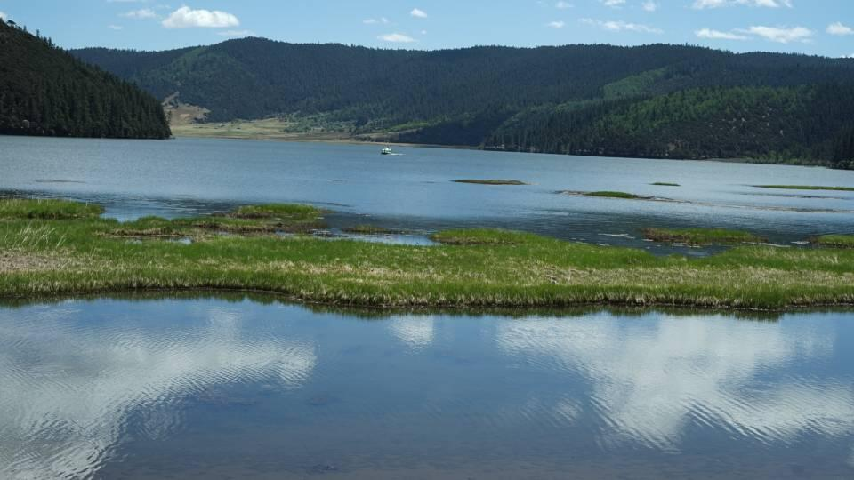

主要针对6月雨季前的云南旅游，偏向自由行。

路线：丽江--香格里拉--大理

#### tips

- 天气很热，夏装加一件春秋外套足够（雪山也不冷）；

- 很干，多喝水，注意防晒护肤，小心流鼻血；

- 鞋子易脏，带容易刷的（不推荐网面鞋）

- 可带无人机

（以下照片全是Sony直出）

# 1. 丽江

### 时间

建议古城半天，玉龙雪山一天。

### 住宿

不建议住在古城里，因为古城不能通车，只能走路，而且道路全是石板路，拖着行李极其难走（亲眼看到一个小姐姐下午2点在古城里拖着行李萎靡不振），建议住南门和北门附近的酒店，交通方便，去古城也不远。优先推荐南门，去雪山的公交起点就在南门。还有古城有酒吧，晚上比较吵。

### 交通：  

市内打车挺方便，也有哈啰单车  

## 丽江古城

古城适合早晨和傍晚及晚上游玩。 其他时间太热。

### 特色1：木府

40门票，历史爱好者可去  

### 特色2：拍照

古城里两类人最多，开民宿的和拍照片的。xhs说古城内有千家民宿，确实各个角落里都藏着一家民宿。第二类就是拍照的，大概6，7点开始大街小巷都是（我基本十步入一镜），各种纳西风格、藏族风格、旗袍风格都有，确实场景光线服妆造都很容易出片。尤其是**樱花餐厅**附近，xhs的照片基本在那拍的。

### 特色3：酒吧

夜晚则属于酒吧的，四方街附近大大小小几十家酒吧，各类表演，夜生活很丰富。  

此外还有四方街纳西族的篝火表演，一半演员穿纳西服装，剩下游客可以组成另一半，手拉手唱跳（个人觉得很一般）。  

### 吃喝  

古城内很多餐厅和小店，但价格偏高，城外周围其实也有同类型店（我没比较过价格）。就我买水果的体验，古城内价格畸高，存在砍价空间；忠义市场价格更友好（不排除给了我游客价），和超市差不太多。这里推荐美团作为价格基准，贵了一般就是游客价。个人体验是，古城外很多当地餐馆不错，如果有时间可以漫步街头，看看哪家餐馆当地顾客多，大概率不会踩雷。

### 观景台  

文昌宫最佳，而且free

## 玉龙雪山  

- 丽江买好氧气瓶，20左右（美团价），以防高反（我没用上）

- 进山费100，学生半价  

- 有三类索道（丽江旅游集体公众号抢票）

- 大索道：可达到玉龙雪山海拔4680高度，早上的极其难抢  

- 云杉坪索道：玉龙雪山不远的一个景点，以云杉和草甸为主  

- 牦牛评索道：更远，但风景更好，雪山背景更雄伟  

- 蓝月谷：中间一个免费景点。注意一个坑点，坐观光大巴要坐到水月阁站而不是前面的蓝月谷站，否则让你花50租电瓶车骑

本次只去了牦牛坪和蓝月谷。

### 玉龙雪山观景

在忠义广场坐101路公交车可直达游客中心（15元），注意：

- 坐车的左边，没太阳，可欣赏雪山风光  

- 最佳日照金山观测点：东巴谷景区附近，以及甘海子。如果个人驾车或租车，可去这两个点。

- 如果直接去云杉坪和牦牛坪（而不是雪山索道），候车点在游客中心（下车点）往回走到3号停车场，再往对面走大概500m到达观光大巴发车点。

### 牦牛坪  

大巴沿山路大概40分钟。盘山公路还好，我提前吃了晕车药，完全没感觉。索道也不是非常高，最开始索道沿着斜坡，高不到十米，不恐高，离山顶最后一段突然离地面有点高，易恐慌。建议刷手机，或闭眼，不看外面就好了。

牦牛坪，听名字就知道是一个草场，非常适合拍照。有一个栈道环着整个牦牛坪。在栈道的最远端就是离玉龙最近的地方，在那边拍玉龙雪山的话特别出片。6月份草还没绿，少数花开了，在等半个一个月估计会非常漂亮。晴天穿一件防晒衣足够了。然后穿耐脏的鞋，很容易脏

### 蓝月谷

蓝月亮人太多，影响体验，拍人像非常好看（有点像大号的之江情人桥风景，然后这里坐车回游客中心的人很多

# 2. 香格里拉

丽江-香格里拉：大巴2.5h，建议买右边的票，可以看雪山。

### 时间

纳帕海半天，普达措一天，松赞林寺半天。

时间短也可以在3点从普达措回来后立刻赶末班公交环纳帕海一圈。

### 住宿

同丽江一样，建议古城外，需要考虑距离月光广场（去普达措）和北门（去纳帕海）的距离。

### 交通

靠走路或打车  

### tips  

建议下午去，如果有高反不舒服，就不活动直接休息一晚上第二天就会好很多。  

## 独宗克古城 

月光广场附近的大佛寺不错，位于龟山山顶，有一个很大的转经筒，大家可以去试试；同时，寺庙顶上视角也很不错。  

古城里主要是藏式餐厅和摄影工作室（以及民宿），感觉很多是本地人开的。晚上6点多开始在四方楼有当地人自行跳的藏式集体舞蹈，很有民族特色。

## 普达措

可在 “游云南”小程序上买票，说是9点半出发，但8点50就可能发第一辆车（坐满就发车），所以建议9点前去旅游中心，返回时还是同一辆车，3点回（跟出发时间有关，早去早回好像） 

三个景点：幽游步道，属都湖，碧塔海。  

注意此时正是香格里拉的春天。

- 幽游步道：徒步相当不错，有在原始森林踏春的感觉，流水潺潺，树木刚抽新枝，路上有很多小花，鸟语阵阵，凉风习习，全程大概1公里多，要走一个多小时，终点有车去属都湖  

- 属都湖：普达措最佳景点，春天正是好季节，湖畔栈道两边开满了（杜鹃）花，非常好看，很适合拍照打卡。

- 碧塔海：不建议，只有一段很短的栈道，其他因事故被封闭。有闲也没必要去。

## 纳帕海

可租电动车，或坐公交。  

推荐12路环湖公交（坐右边），上下午各4趟。因为适合骑马拍照的点就那么几个，你可以中途下车玩半个小时，再坐下一班车去下一个点。每趟公交在中途（开车40分钟时）还会休息十多分钟，也可拍照打卡。  

tips：下午去，纳帕海主要景色在西半段，下午顺光，好看，也容易拍照，上午则逊色非常多。（亲身体验）    

注意：目前纳帕海在维修建设，水不多，近期可能不适合去游玩。 

## 其他

- 松赞林寺：没去过，对寺庙有兴趣的推荐去看看  

- 巴拉格宗：据说很坑，没去过。  

总结：香格里拉开发程度较低（比如普达措其实可以更好玩），容易踩坑，建议用公共交通，期待以后更多开发。

坑点：  从香格里拉到大理（或丽江），司机拉到一个中途的地方，上厕所一元，而且是那种老式厕所，水果通通10元一斤，让我大倒胃口。希望铁路尽快开通。  

# 3. 大理  

### 时间

古城玩一个晚上，其他时间去洱海。

### 住宿

- 感觉古城内外差别不大，古城也可以开车进去，比较堵就是，然后古城周边路也很窄 。

- 洱海边：交通和吃饭不太方便，龙龛码头和才村可能繁华一些  

建议：古城住一天，剩下洱海附近  

## 古城游玩

感觉大理古城就是一个小城镇，有医院有学校有公园，当然，餐厅和酒吧也不少，但不是很有特点。路比较宽，晚上很热闹。

## 洱海

洱海距古城大约4公里，基本没有公共交通，打车去最方便。

目前只去过洱海西边（简称海西）。这边基本都是村庄，靠近洱海边才开始有民宿和饭店，建议住在龙龛码头、才村和网红s弯附近，吃饭方便（其他地方的民宿可能附近没有好的饭店）。

海西建议下午5点或6点去，景色超级棒，湛蓝的水，凉凉的微风，河边的石头和树，构成一幅绝美的画面。晚上，还可以在海边看看下关的夜景和天上的星辰，但是蚊虫多，且路灯不太亮。非常适合拍照散步和骑行。但是不建议上午去，天空和海水因为逆光而发白。

洱海适合骑行，单车有的民宿免费骑，也可以附近租；也可以租环湖路里面的电动车，据说15元/小时。

tips：买东西（水零食之类）可以多往村里走个十来米，价格恢复市场价。

## 小结

大理古城可以去常常当地美食，体验一下夜生活，其他时间可以去洱海边吹风拍照。

# 对比  

#### 三个古城比较  

- 丽江最商业化，基本无本地人，纯为消费  

- 独克宗古城保留了藏族文化，本地人很多  

- 大理古城糅合了商业区和居民区，更接地气。  

#### 自然风光比较  

- 洱海风光最佳，可看碧海蓝天，可观星辰。

- 普达措次之，原始森林和属都湖很适合徒步和拍照

- 玉龙雪山夏天雪不多，牦牛坪和蓝月谷风光不错

# 总结  

云南独具特色，既有自然风光，又有人文景观，很适合5，6月份淡季旅游。

- 论风光云南的雪山草原远远比不上北疆独库，论人文三个古城都比不上南疆喀什，但胜在景点距离近（大理到香格里拉不过250公里），价格更低（5月底6月初是云南的淡季，此时风光刚刚好）  

- 景点基本围绕在几个城市周边，适合单人或小团队自由行，不包车不自驾也可玩到大部分景点。  

- 最具特色的应该是云南的旅拍了，大理丽江迪庆都有独特的民族服饰和古城，非常适合打卡拍照，尤其是女生和情侣，从每个古城里有大量写真馆可知。

花销：大概4300左右，其中往返机票一千。