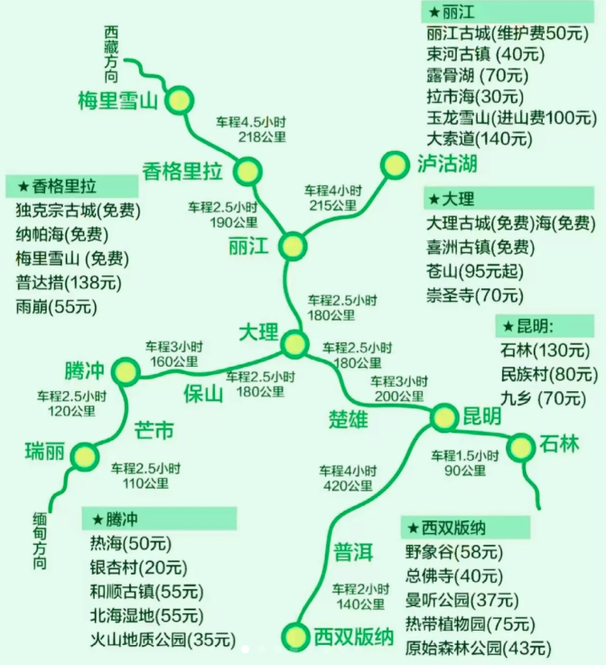

## 0. 基本信息

### Tips

- 唇膏、防晒
- 消炎药、吗丁啉等，因为菜式偏辣
- 登山鞋（如果徒步则需要），总体以运动鞋为主;普达措比较湿软，建议靴子
- 穿搭：穿夏装+春装外套；香格里拉比较冷，需要厚一点
- 云南的景点比较分散，如果要玩几个区域，建议玩到哪里住到哪里，这样不用来回赶，还可以多体验几家店

#### 路线

丽江——香格里拉——大理——昆明

飞机从杭州到昆明和丽江直飞比较便宜。

#### 城际交通

大理——丽江：火车(34元)汽车(50-80元)半小时一趟般选择乘坐火车方便快捷，大致2.5小时，汽车3.5小时

丽江一泸沽湖:汽车每天上午两趟(70元)需4-5小时车程

丽江一香格里拉:不直飞香格里拉，从丽江乘汽车和拼车需约3小时

丽江——虎跳峡——香格里拉：有客运汽车

昆明——大理：动车2h(145元)汽车5h（80-140元)建议乘坐动车时间快，费用也不高

#### 特产/伴手礼

- 鲜花饼（昆明）
- 玫瑰花茶
- 榴莲饼
- 咖啡
- 野生菌（昆明）
- 乳扇（大理）：可能不符合大众口味
- 甲马、瓦猫、东巴文、德钦手工玩偶（大理）

#### 美食

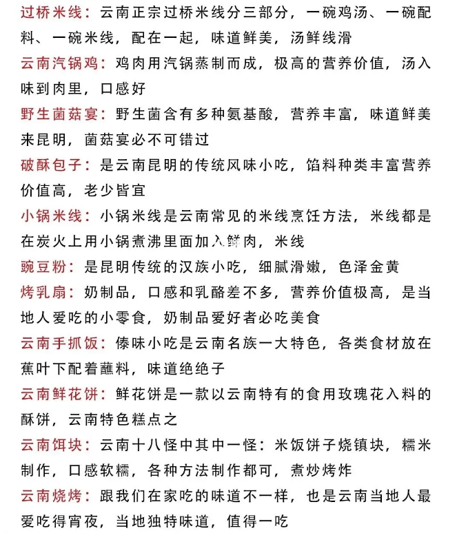

#### 价格

参考：两人八九千（九月份）；

## 1. 大理

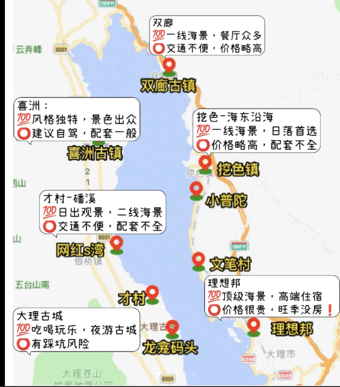

建议时间： 2天

### 住宿

- 生态走廊附近：安静，但是吃喝较少。（98推荐）“建议直接住洱海边哦，才村小邑庄下鸡邑的海边都不错”
- 大理古城及附近区域：有特色民宿也有酒店，去洱海很方便，比较热闹
- 苍山上：可俯瞰洱海，但交通要上山。

### 交通

- 包车： 250-360/车之间
- 电动自行车：据说可170km；可载人、比较晒；
- 早晚可飞无人机，白天有人阻止

### 美食

大理市区里的伊菠萝清真傣味手抓饭

大理古城内的云琴石板烧·烧烤

## 2. 丽江

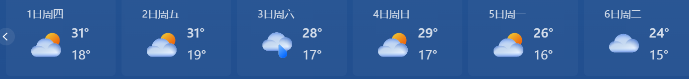

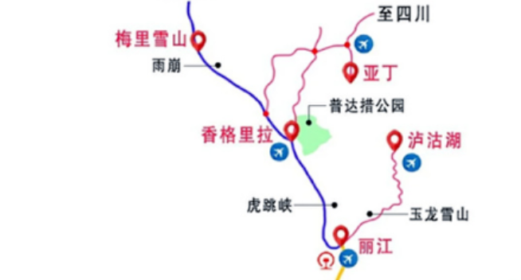

### 时间

建议时间：两天三晚（直飞丽江）；当天玩丽江古城，次日玩玉龙雪山一线。

> 10日中午飞机到达，机场到丽江古城打车大约80元。10日下午逛丽江古城，11日出发去玉龙雪山-牦牛坪-蓝月谷一条龙。

### 交通

机场大巴20元/人，打车约80元；

### 住宿

古城以木制为主，隔音不行。建议城外连锁

丽江晚上会比较热闹住古城边价格会便宜一些；

Tips：无需找观景好的民宿，因为基本出去看，hhh

### 古城

古城内不允许任何机动车辆运行；

#### 风景

观景台视野最佳：狮子山万古楼景区（18点禁入）、丽江之眼观夜景

#### 购物：

- 披肩价格在25-40之间，可以砍价，一定要记得货比三家；
- 鲜花饼比较出名的有两家，一个是嘉华一个是潘祥记，两者都有淘宝店，但是推荐买店内现烤的尝尝，每种口味的都可以买一个，味道不错！
- 粑粑算是云南特色小吃吧，可能是我们没吃到好吃的或者不太习惯，丽江古城的一家店不太行，双廊古镇的吃起来也很一般，勉强用作充饥。

### 玉龙雪山一线

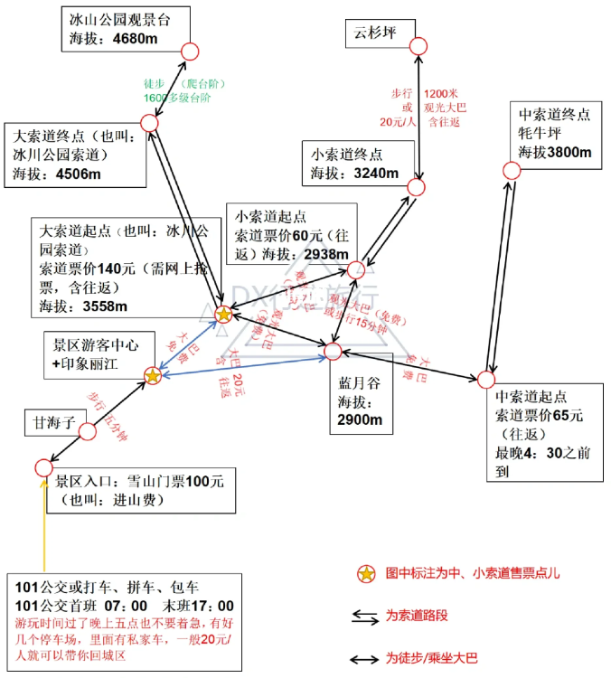

6-10月没雪，一般不需要羽绒服，但下雨会很冷。

景区6点上班；

玉龙雪山索道票有3种:冰川大索道、牦牛坪索道云杉坪索道，只有冰川索道才能到达冰川公园(4680米)其他都在半山腰.

> 蓝月谷没有单独的票，蓝月谷是在玉龙雪山景区内的，要买了玉龙雪山景区的套票，才能进蓝月谷

最好带氧气瓶；前一天别洗澡避免高反？

打车（70-80）或公交；

进山门票：100（学生证打折）

索道：140

蓝月谷：免费

*Tips：游云南小程序里买的套票150/人包含进山费100+景区观光车20+50蓝月谷电瓶车。最近云南在发旅游消费券（微信里的“游云南”小程序），满300-100，两个人只要200元，蓝月谷电瓶车说实话不值50，路程短有时间的朋友还是自己走走拍照吧。我们是想着买套票只要200，跟直接买进山费一样，不买白不买。*

或者提前在公众号“丽江玉龙雪山”购票；

### 虎跳峡（可选）

> 比雪山好？
>
> 收费点拍照很值
>
> 交通可以买客运站的票

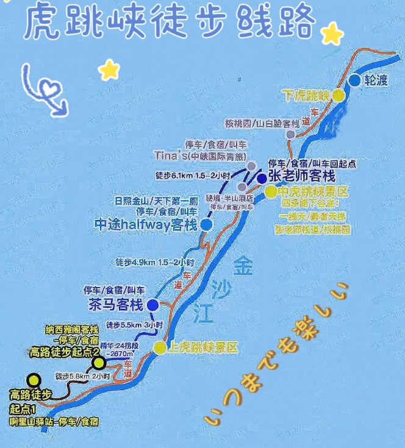

参考：

[云南12天（丽江-虎跳峡-香格里拉-梅里雪山-大理-昆明）攻略和碎碎念3楼 - CC98论坛](https://www.cc98.org/topic/5540141/1#3)

[虎跳峡高路徒步终于✅（事无巨细最全攻略） (xiaohongshu.com)](https://www.xiaohongshu.com/explore/6454ab9e000000001303d119)

### 泸沽湖（可选）

距离远，建议包车去；时间可能需要两天

参考[泸沽湖 vs 洱海](#泸沽湖 vs 洱海)

### 美食

> 在丽江吃了三顿正餐和两顿早饭。    
>
> （1）早饭推荐在忠义市场附近的“大锅牛肉米线”（7点开门），味道正宗价格实惠，关键是开门时间早，可以赶上较早的车去玉龙雪山；    
>
> （2）还一顿早饭吃的是古城内的“有家米线”（9点开门），这家店的米线配菜较多，味道也不错，价格相比忠义市场的略贵。      
>
> 三顿正餐分别是：    
>
> （1）阿婆岁月腊排骨——秉持着来了丽江咋能不吃腊排骨的理念，找了一家网上评论还不错的店，吃完也就觉得一般，就是普通腊排骨的味道（如果不是非要品尝当地特色，可以直接略过，价格不贵，但是吃的真一般）； 
>
>    （2）食全酒美——古城里一家吃野菌火锅的店，人均较高，在这里体会到了啥叫菜比肉贵，这家店肉不是特别好吃，炸虫子也没啥味道（之前说云南烧烤特色之一就是炸虫子，遂点来尝试，感觉这一道菜不太行），野菌汤很鲜美，可以见识到各种奇奇怪怪的云南菌子，比腊排骨稍微值得推荐一点；    
>
> （3）丽鹤饭店——一家苍蝇小馆，在某书上搜索的丽江美食推荐，价格实惠味道相对不错（是相对不是绝对，实在是因为在丽江没吃到特别好吃的餐厅），算是我们在丽江吃的最舒服的一顿正餐，就是排队时间有点久，最推荐他们家的水性杨花和包浆豆腐，这是一家素菜比荤菜好吃的店（猪耳朵和其他地区没有特别大的差别，油炸排骨我看好几桌的人都没特别动，有些肉可以选择双拼，都尝尝看，不过就是没有特别好吃的感觉）。

## 3. 香格里拉

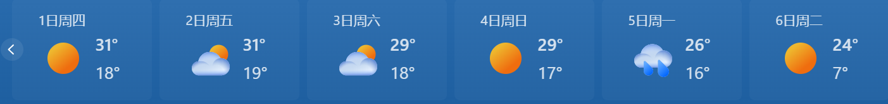

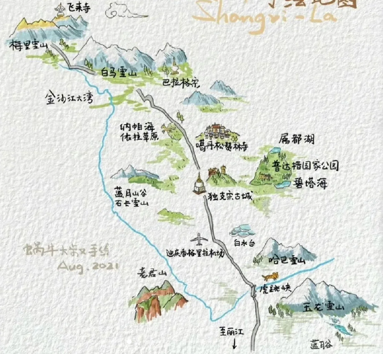

### 时间

住两晚，早上从丽江客运站，80元大巴（可现场买，网上购票另有3元服务费），3小时到香格里拉；（到达后可能需要买好氧气）

纳帕海：半天

普达措：一天

### 住宿美食

独克宗古城内：这个区域多为一些民居式客栈，价格比较便宜，住宿环境也好（隔音不太行、干湿未分离

香格里拉市内：中心区域，有很多的星级酒店住宿比其他地方的条件舒适得多，不过价位较高。

哈巴雪山酥油茶馆

### 交通

去普达措月光广场有大巴，巴拉格宗在北门有大巴

### 纳帕海

#### 交通

1）包车：没体验过，不过中途遇到2位小姐姐一起的反馈包车司机会引导你到收费的景区；    

（2）租车自驾：没体验过，不过可以考虑，毕竟有一条网红水上公路    

（3）租电动车：我们选择了租电动车（小龟），这边载人没人抓，也不拍，客栈附近的租车行60/天，电动车电量充足。但是过水上公路可能会有风险。同时比较晒，风可能比较大。    

（4）租另一种四轮无牌照车：是路上看到的一种车，不用机动车驾驶证，外观上和五菱mini有点像，这样也避免了风吹日晒的痛苦，感兴趣的到时候可以再网上看看或者咨询当地客栈老板。    

（5）公交车：2元

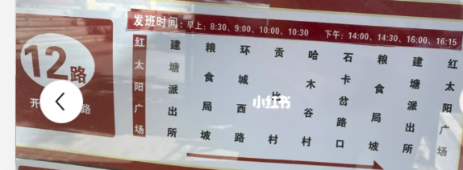

路线：导航到环湖路，跟着导航一直到看到一块石头上写着“纳帕海”，这个位置是在一个三岔路口，路口可停车拍照，比较容易出片，运气好的话可以看到附近机场降落的飞机，捕捉到飞机在高山草原间低飞的姿态。沿着环湖路一直走，一路的风景都很不错，沿途会有当地人吆喝骑马等，淡季骑马80/人，抱着羊羔拍照10-20/人。

#### 活动

骑马

### 普达措

月光广场服务中心：往返大巴+景区门票+景区内车票168/人，九点半出发，三点半返程

游玩时间在3-5小时，建议自带干粮（景区贵）

#### 路线

分3个区块，1）悠幽庄园2.2km原生态步道，2）属都湖3.3km栈道，3）碧塔海1km栈道。

**可以带无人机**

### 梅里雪山（不推荐）

## 4. 昆明（备选）

大概率从昆明飞回杭州，有空有兴趣可以看看斗南花市

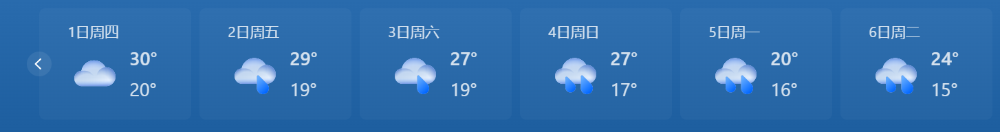

### 交通

长水机场，去云南昆明机票最便宜(机场大巴25元，地铁6号线)可到市区，还可选择乘高铁到昆明站昆明南站

### 住宿

可以选择昆明老街或者翠湖公园、官渡古镇，周边是商圈，也可选择住市中心:五华区和盘龙区

## 景点对比选择

### 泸沽湖 vs 洱海

|      | 洱海           | 泸沽湖                    |
| ---- | -------------- | ------------------- |
| 交通 | 高铁2h直达大理 | 包车400，大巴80-100，单程4h（还要回丽江），山路易晕车 |
| 环游 | 打车、租电动车 | 只能包车，约250；需要门票                              |
|饮食 | 咖啡馆、|特色美食多|
|景色 |略逊一筹，但小景点多| 天气好非常棒（水更蓝更美），阴天一般；亲水步道多，离水更近|

总结：泸沽湖更美，洱海可玩性更高

还可以考虑抚仙湖；待搜集资料

### 梅里雪山 vs 玉龙雪山

|      | 梅里雪山    | 玉龙雪山                   |
| ---- | ----------- | -------------------------- |
| 交通 | 自驾5h      | 有索道和观光车，吃住方便   |
| 景色 | 夏天还有雪  | 夏季基本无雪（蓝月谷不错） |
| 温度 | 需要羽绒服  | 不一定                     |
| 费用 | 交通大约250 | 索道套票约200              |

总结：景色梅里雪山更好，徒步路线也不错；玉龙雪山开发程度高，吃住方便，但夏天无雪。

#### 参考

[蜜月之云南旅游分享（丽江-香格里拉-大理-昆明滇池） - CC98论坛](https://www.cc98.org/topic/5417362)

[2013春节回乡之旅——云南 - CC98论坛](https://www.cc98.org/topic/4113121)

[云南12天（丽江-虎跳峡-香格里拉-梅里雪山-大理-昆明）攻略和碎碎念 - CC98论坛](https://www.cc98.org/topic/5540141)

[刚从云南回来，真的太无语了😓 (xiaohongshu.com)](https://www.xiaohongshu.com/explore/645e2ab0000000000800f796)