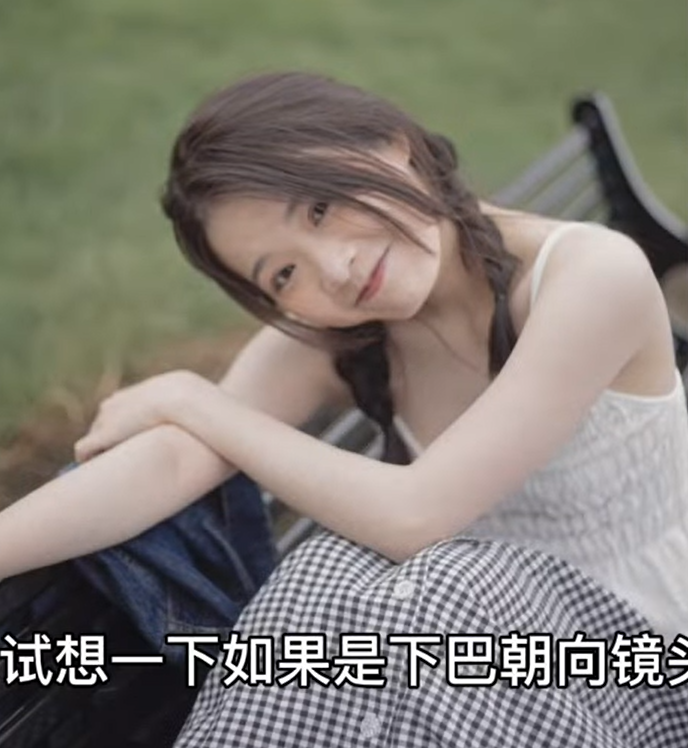

### 1. 简约风

场景：空旷，如草原、海边，**操场**

特点：凸显环境

远景：机位放低，天空占2/3；数量不要太多

中景：天空居中，人物可以居左右

近景：天空1/3；

服装：素色、裙子

动作：适合坐着

### 2、空间感

场景：街道：桥梁、靠墙、

空间透视感

人物靠左右

### 3、氛围感

服装：与环境风格一致，如汉服和桥亭

动作：与场景一致，如咖啡馆喝东西

### 4. 拍摄角度

- 仰拍容易双下巴：抬头侧拍

- 额头朝向镜头

  

- 正面拍摄导致下巴抬高不好看；