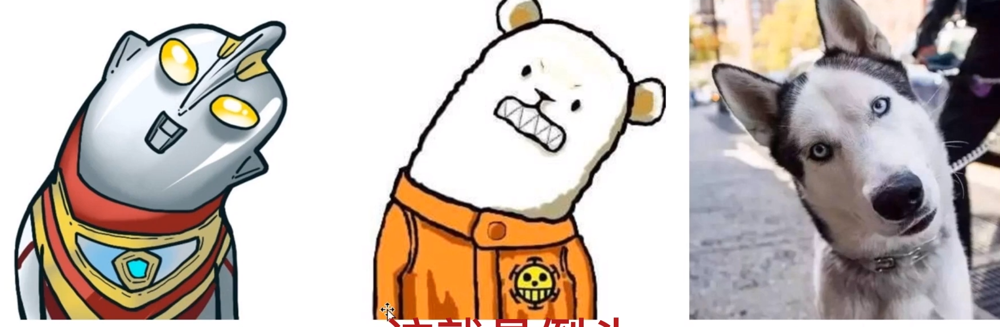
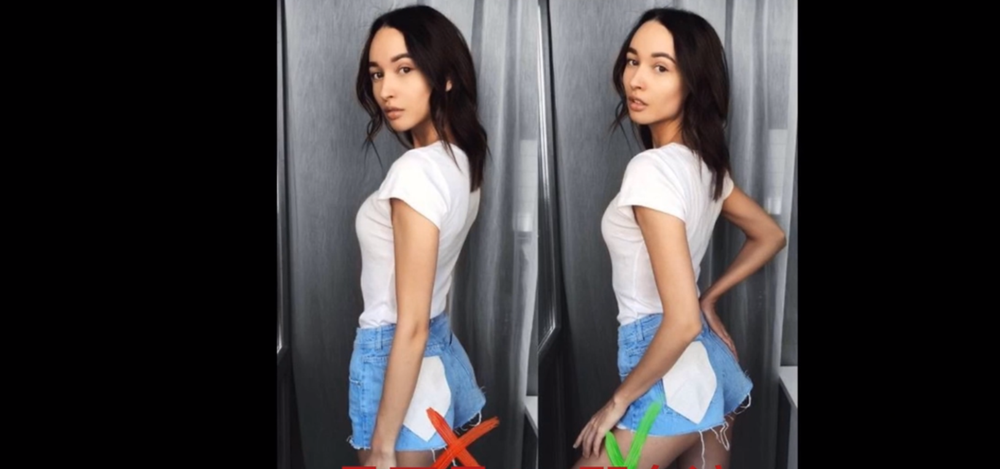

### 1. 头线

倒头（歪头）

### 2. 胸线

手部线条（侧拍）

转身、叉腰

### 3. 腿线

踮脚、脚交叉

不在同一条直线上

### 调整顺序

- 腿
- 胸
- 脸

#### 参考

[03人像美姿——线的学习_哔哩哔哩_bilibili](https://www.bilibili.com/video/BV1ze4y1u7mz/?p=3&spm_id_from=pageDriver&vd_source=51835ba198b79c5277a5fcadc11bd9ff)