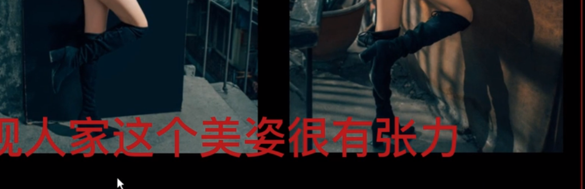

### 1. 面

- 脸面
- 胸面
- 腿面

#### 破面

- 不正对镜头：3/4方向，1/2方向（侧脸）

- 挡脸：道具挡脸、前景挡脸
- 光影对比：一半亮一半暗（不明显）

#### 破胸面

- 弯腰：腰部线条
- 叉腰扭胯、高低肩
- 转身

#### 破腿面

- 弯腿
- 叉腿
- 前后腿
- 踮脚

保证脸面、胸面、腿面不在同一个平面上；

#### 参考

[【摄影基础教学】拍照不会摆姿势？人像摄影应该懂得的人像美姿技巧_哔哩哔哩_bilibili](https://www.bilibili.com/video/BV1ze4y1u7mz/?spm_id_from=333.337.search-card.all.click&vd_source=51835ba198b79c5277a5fcadc11bd9ff)