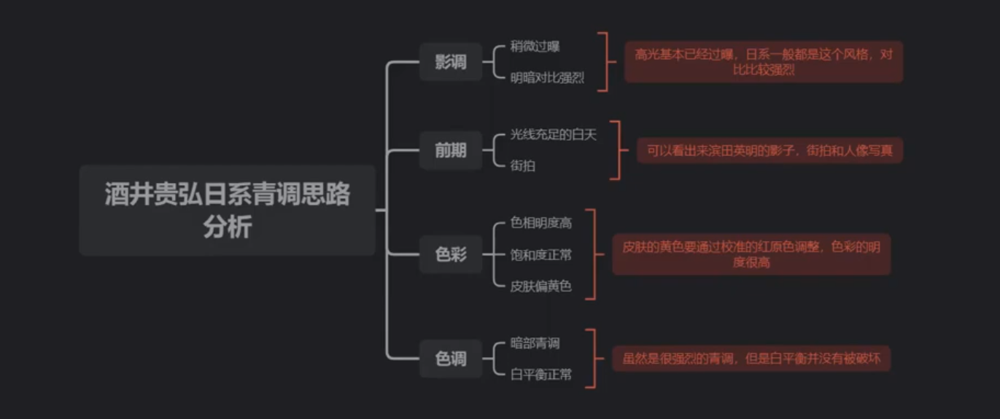

特点：偏青调

要点：大海天空偏青，人物肤色偏黄（正常偏红白）；对比度较高；过曝，投影很淡；明暗明确；黑色（暗部）偏青；饱和度正常，明度很高；绿色偏青

## 后期调整

### 1. 校准

**将红原色往右调（导致肤色变黄）**

#### 基准界面

**曝光：+2**

对比度和阴影略微降低

高光尽量去除（左调到底）

清晰度略增加

### 2. HSL调整

#### 色相

红色加深（左调），使得嘴唇更明显

橙色和黄色影响肤色，勿调

蓝色左调（青调）

其他看情况

#### 明亮度

红色加明度（不能太浅）

橙色加明度（肤色变亮）

绿色和蓝色可以适当加明度

### 3. 分离色调

为暗部增加青绿色

将色相移动到绿色，然后降低饱和度之类的

#### 参考

[酒井贵弘日系青调人像【第50期ps调色思路】INS日系人像/通透质感 - YouTube](https://www.youtube.com/watch?v=fcwoW3QHIZw)
