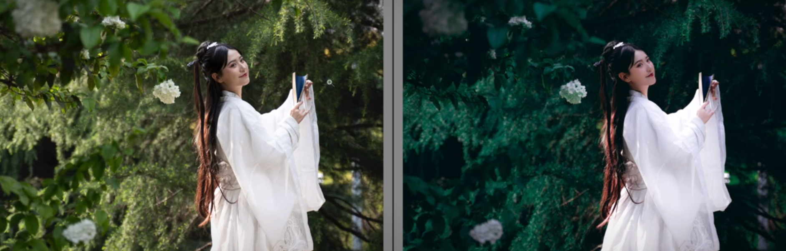

### 效果图

### 1. 色彩调整

- 色温降低（冷色调）
- 曝光度降低
- 增加高光和白色色阶，减少黑色色阶（增加了明暗对比）
- 清晰度降低一些
- 饱和度降低一些
- HSL
  - 色相：绿色右拉（偏蓝）；橙色左拉偏红（肤色）
  - 明度：绿色降低；橙色增加
  - 饱和度：绿色饱和度降低，橙色增加
- 分离色调
  - （肤色）阴影部分变暖，
- 降低锐度，降噪、细节减少
- 校准
  - 降低红色饱和度
  - 绿色右拉，并增加饱和度
  - 蓝色右拉并增加饱和度
- 曲线
  - RGB曲线：最后暗部增加（黑变灰）、阴影区降低、高光区增加
  - 红色：调整肤色，可以考虑最暗部去除红色
  - 绿色：最暗部增加（细节）
  - 蓝色：最暗部增加（细节）

### 2. 局部调整

问题：肤色不均匀，

局部调整画笔：增加曝光度

### 3. PS局部调整

使用黑白观察组（观察明暗关系）观察明暗对比关系

减淡工具：用于加亮？

修补工具：处理不均匀部分

平滑工具：磨皮