### 总结

- 对比度：明暗对比

- 清晰度：增加边缘附近的反差，使得轮廓更清晰。主要是增强**中间调**的对比，实际没有锐化图形
  - 想要细节多，右移
  - 柔化，如人脸，左移

- 锐度：通过在边缘两侧，增加黑白相间的高对比线条的方式，让边缘更锐利
  - 数量：决定锐利程度，高对比度线条数量
  - 半径：作用范围
  - 细节：阈值，决定多大的边缘参与锐化；数值小则细节少，只有大的边缘参与锐化

为了更好的解释对比度、清晰度和锐度的区别，我会使用下面一张放大20倍的纹理边缘为例子。

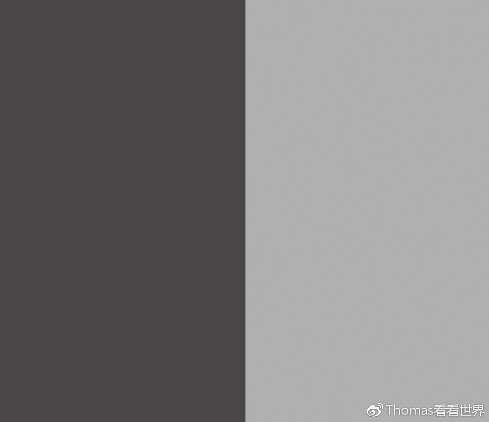

### 对比度

对比度是指的画面的明暗反差程度。增加对比度，画面中亮的地方会更亮，暗的地方会更暗，明暗反差增强。

下图就是增加对比度的结果。增加对比度之后，原来的两个物体反差扩大。

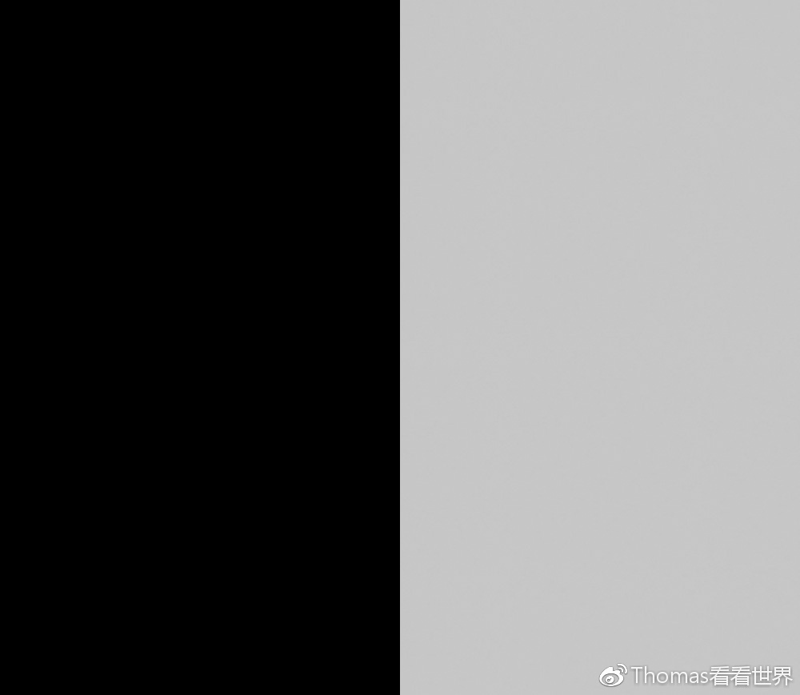

对比度是对全局作用的，**对照片整体的明暗有较大影响**。

比如下面这张照片。

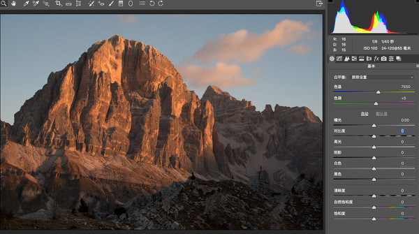

对比度增加之后，**照片亮的地方更亮，暗的地方更暗**，一下子反差就拉开了。

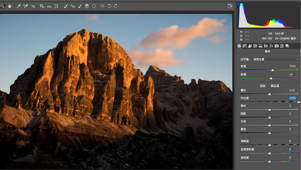

### 清晰度

在Photoshop以及众多软件中，都提供了清晰度的调整工具。但很多朋友都还不理解清晰度的原理。

当我们增加照片的清晰度，靠近边缘较暗的一侧会变得更暗，靠近边缘较亮的一侧会变得更亮，但这种亮度变化只局限在边缘周围几个像素。

因此增加清晰度，只会增加边缘附近的反差，让物体轮廓更清晰。对照片整体的对比度，影响较小。

  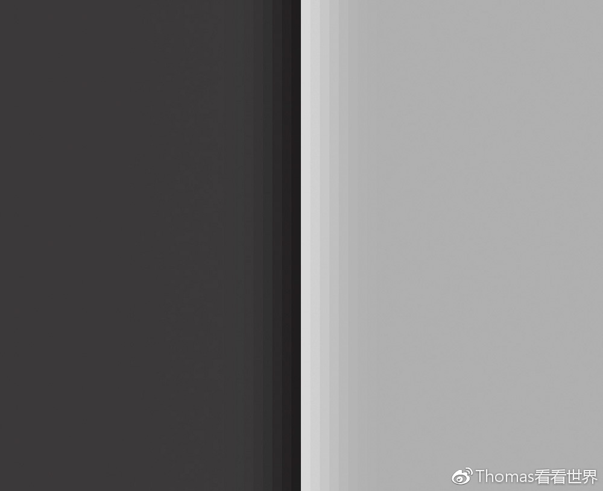

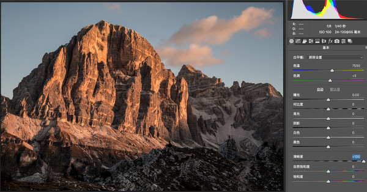

由于清晰度相当于让边缘亮的一边加上一根白条，暗的一边加上一根黑条，所以调整清晰度滑块时一定要注意幅度，不然照片中会出现可怕的Halo（晕影）现象。比如下图，狂增清晰度后山体交界处出现极不自然的白边和黑边。

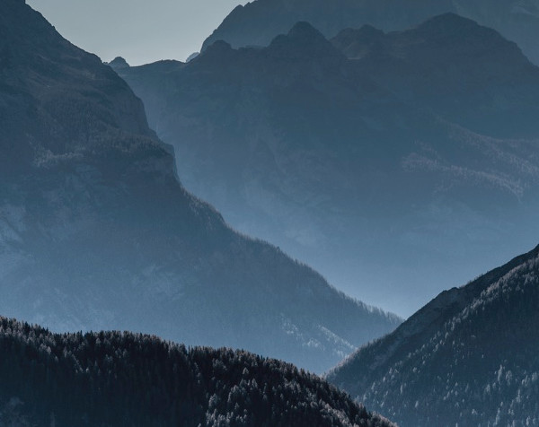

另外清晰度比较适合对画面中的局部应用，否则全图中会加入过量的黑色细节，黑色细节一多就会显得非常脏。

### 锐化

锐化的方式与对比度、清晰度有所差别。锐化主要是通过在边缘两侧，增加黑白相间的高对比线条的方式，让边缘看起来更加锐利。

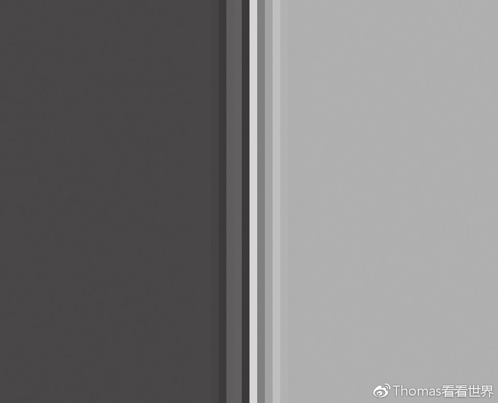

Adobe Camera Raw中，锐化工具在第三个面板 － 细节面板。

无论哪种软件，细节面板中的锐化工具，都有四个滑块：数量、半径、细节和蒙板。他们恰好对应了锐化中存在的三大问题。

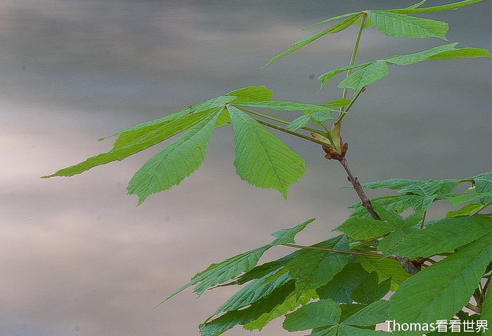

以上面这张锐化过度的照片为例，三个问题分别是：

1）叶片边缘锐化强度过大，显得很假。而锐化强度，是由“数量”滑块决定的。

2）叶片边缘出现了明显的白边和黑边，这是因为锐化作用的区域过大，本应很细微的边缘对比，一下子成了一大条白色和黑色色块。锐化区域，是由“半径”滑块控制。

3）水面内部本来不是边缘的区域也被锐化了，一下子多了很多噪点。而识别哪些是边缘，哪些不是边缘，由“细节”和“蒙板”滑块控制。

#### 数量

锐化数量决定了锐化的强度，也就是边缘的对比度，以及边缘和物体的隔离程度。下面是ACR默认的25数量时，边缘的锐化情况。

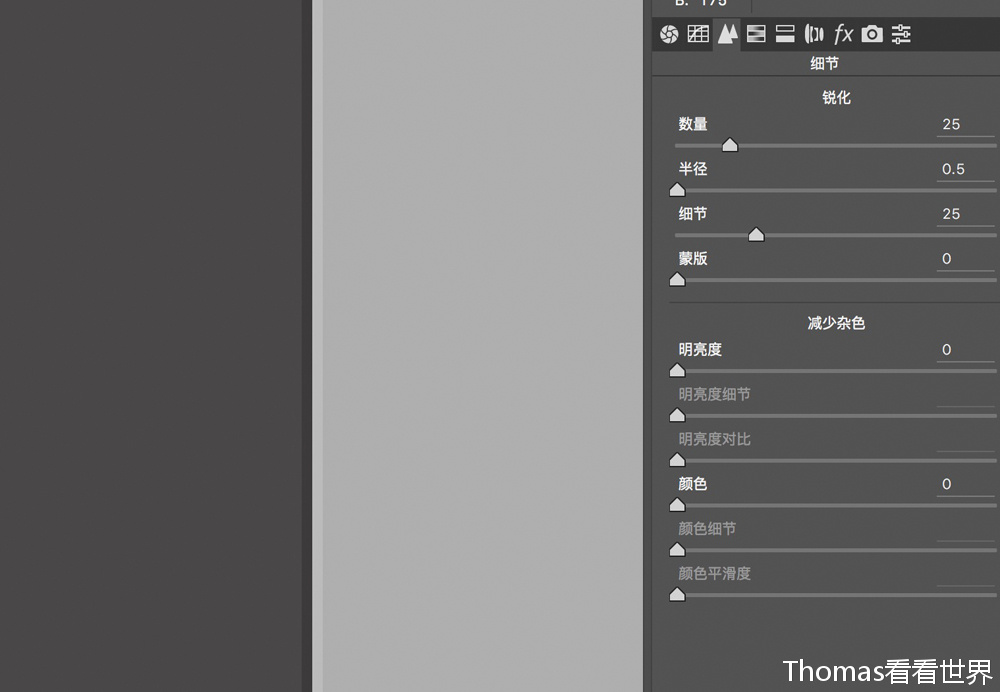

一旦把锐化数量提高到150，不仅边缘深浅两种颜色的反差更大，而且还出现了多条“隔离带”，让边缘更明显了。

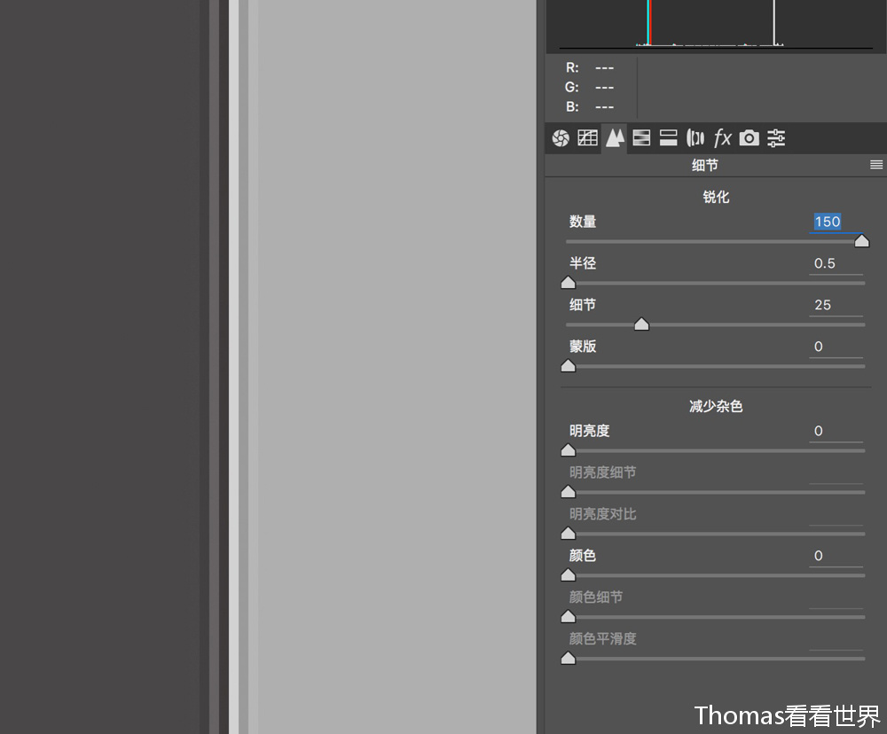

在具体的照片中，我们需要根据物体的特点决定锐化数量，比如人物照片可能20、30就够了，而建筑雕塑这类超过100也不觉得过。怎么观察呢，第一步，把照片放大到100%甚至更大，这样才能清楚的看到锐化效果。

第二步，拖动数量滑块，直到物体的边缘和细节凸显出来。（拖动数量滑块的时候，同时按住Alt键，可以把照片由彩色变成黑白，更加方便观察）

#### 半径

锐化半径决定了锐化作用的区域，半径越大，边缘会有更多区域成为反差隔离带。比如下面这张照片，半径设为默认的1.0时，边缘被锐化的区域只有3个像素。

​    

当半径增加到3.0时，边缘8-9个像素到区域都产生了锐化效果。

​    

半径太大，物体边缘会有黑边白边的出现，看起来有点恐怖。

​    

记住在细节面板中，键盘上的Alt键是一个非常有用的按键。在调整半径时，**按住Alt键**，可以看到物体边缘锐化的作用效果。按住Alt键，半径过大时，会有比较明显的黑白线条出现。一般照片，锐化半径都保持在默认的1或者更低，极少有超过1.5的情况。

​    

#### 细节

锐化细节就像“细节”字面本身提示的那样，这个滑块决定了多大的边缘才会被锐化。当细节值很小时，表示我们不需要多少细节，只有很大很明显的边缘才会被锐化。

同样调整细节的同时**按住Alt键**，会显示出一个中灰色图像，图像中50%灰的区域是不被锐化影响的细节，更深更浅的部分则是会被锐化的细节。比如这张建筑照片，按住Alt键同时细节滑到0，只有轮廓清晰的建筑边缘显示了出来。

​    

如果我把细节值提高到26，一些更小的边缘也会被锐化。比如箭头所指的建筑墙体的花纹，在细节为0时被直接忽略了，在细节26时则会被锐化。

​    

如果我进一步把细节提高到100，图像中大大小小的各种边缘都会被锐化，甚至纯色天空中的噪点也会被锐化，这显然不是我们想要的。一般来说，默认的25是一个对大部分照片适用的值。

​    

细节是一个加法，细节值越大，越细微的边缘也会被锐化。而蒙板则是一个减法，它会识别出照片中类似天空、水面、皮肤等大片纯色区域，让锐化不作用于这些区域。蒙板是锐化工具中，重要程度最高的一个滑块，它让我们实现了局部锐化。

蒙板为0的时候，大片天空也被锐化，本来应该纯蓝一片的天空却出现了许多颗粒。

​    

同样按住Alt键时移动蒙板滑块，图像中会显示出蒙板的作用情况，黑色表示完全不会被锐化，白色表示该部分会被锐化。蒙板提高到25，天空中仍然有大量白色线条，那些地方会被锐化，不好！

​    

蒙板直接升到100，天空中一片黑色，说明天空完全不会被锐化。不过这个时候建筑内部也是大片黑色，该被锐化的墙体细节没有锐化，蒙板拉的过了！

​    

对这张图而言，蒙板值在60左右时比较平衡。天空几乎一片黑色，不会被锐化。同时建筑中的纹理仍然是白色蒙板，会被锐化。

​    

再来看看蒙板为0和蒙板为60时，天空的“颗粒噪点”情况。左边是蒙板为0，右边蒙板拉到了60，保护纯色区域的效果立竿见影。