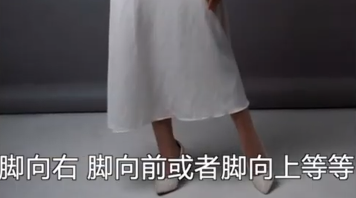

### 1. 脚

脚向右，向前等

### 2. 嘴唇

### 3. 方向旋转

### 4. 亲自演示

### 5. 视线方向

3/4侧面，1/2侧面

### 6. 手的位置

摸脸，提裙这些。

避免拍摄手背；

尽量不挤脸

#### 参考

[7个很有用的引导模特摆姿提示 - YouTube](https://www.youtube.com/watch?v=qydh9n4qGYA)