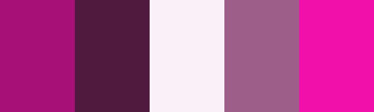

 

原则1：单色系，加入黑色或白色等中性色彩

范例：第一列会用来做标题，2,3列为内容或背景色，后两列作为强调或图名。

 

 

原则2：相近色

由三个在色轮上的颜色组成，但他们的对比度不足，不适合用来做网站设计

相比而言，这里的色相和上面是一样的额，但调整了浓度差异，更适合。

原则3：补色

通常是由两种相反的色相构成，但用不同色调的补色组成；

注意不要用相同浓度（饱和度？）的补色，非常难看！

 