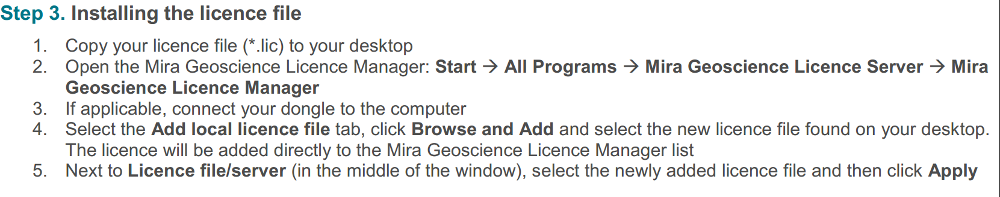

#### 安装要求

1. 没有安装过低版本的软件
2. UBC-GIF Suite 5.exe
3. licence file（bind with your PC mac）

### 1. 安装UBC-GIF Suite 5  

里面包含数个软件：

1. 许可证管理
2. GRV3d+MAG3D: mag、grv三维反演
3. meshtool：构建三维模型
4. EM1DTM: electromagnetics  1D time-domain observations (“T”), and magnetic sources and receivers (“M”)  
5. dataviewer：3D结果查阅（也可以转换为VTK文件，用paraview查看，更灵活）
6. 配套pdf文档

安装完记得加入PATH

### 2. 安装许可证
有两种安装方式：
1. 本机安装许可证，本机使用
2. 本机安装许可证，局域网使用（局域网同时也只有一台可以使用）

#### 安装许可证

参见：Standalone and Network Server Installation Instructions.pdf

