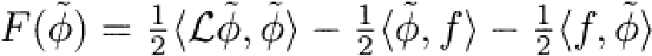
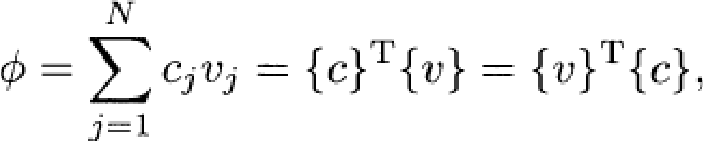
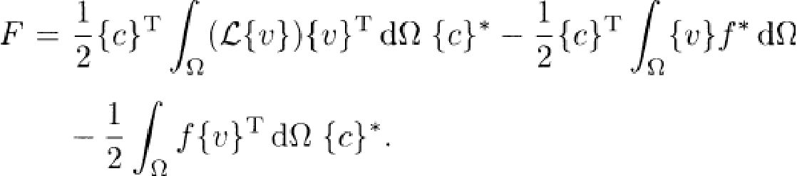
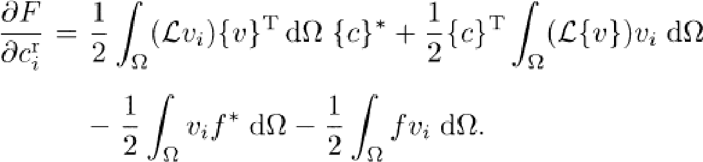
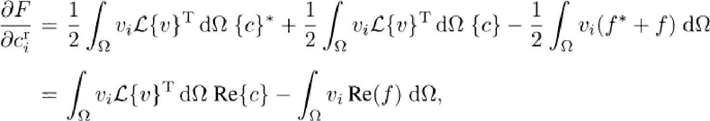
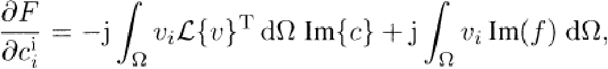
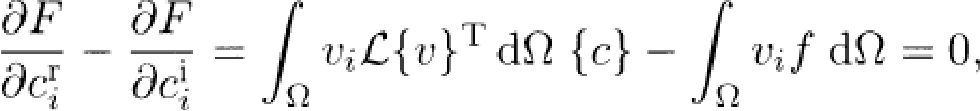

如果未知函数$\phi$时复数；，那么上述实数泛函也可以写成复数形式：

trial function则写成：

$c_j$是复数，$v_j$是实数；将上式代入泛函中：

我们要对c的实部和虚部分别求偏导：

因为L是自伴随矩阵，上式可以写成：

同样的，虚部偏导为：

上述两式要为0，得到：

写成矩阵形式：

参考：《The Finite Element Method in Electromagnetics ：Third edition》 